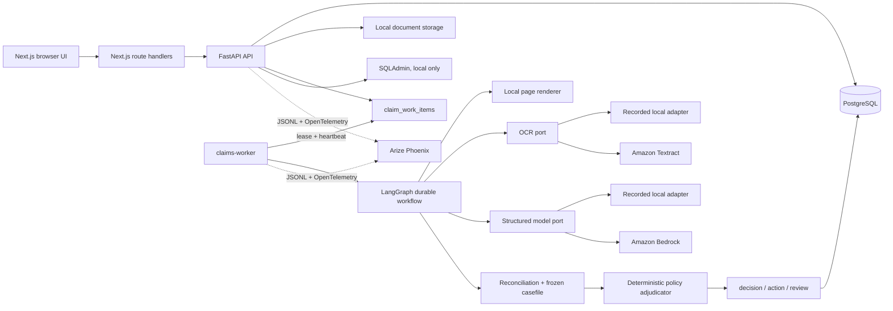
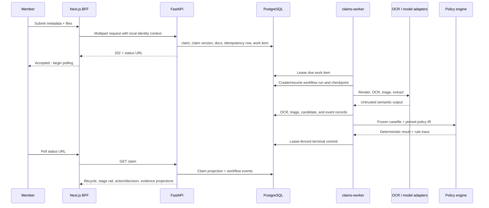
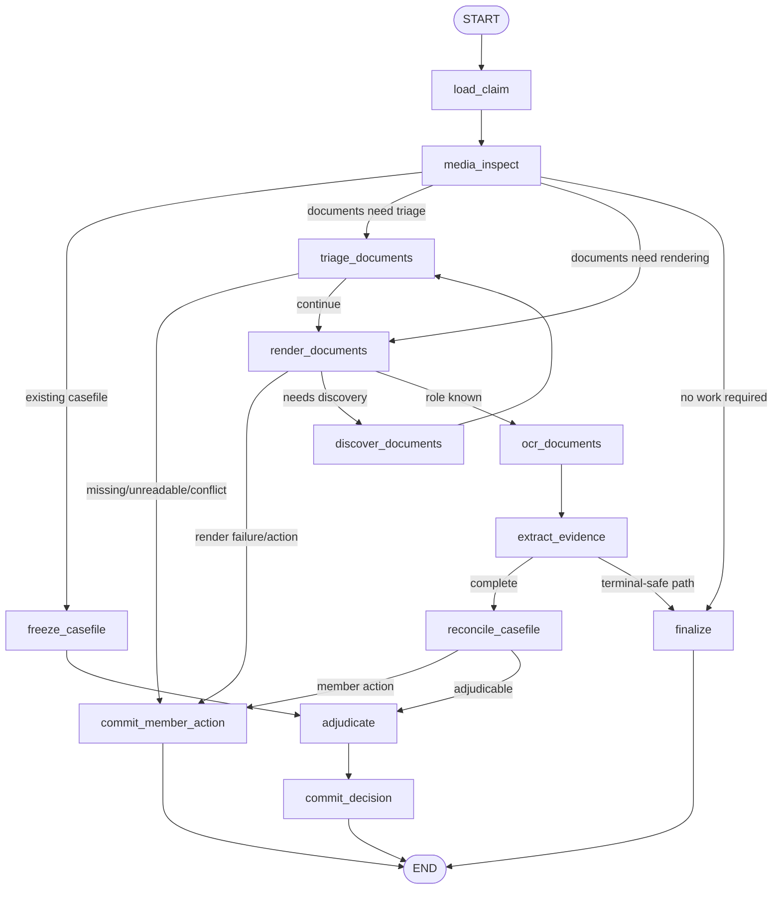
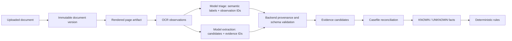
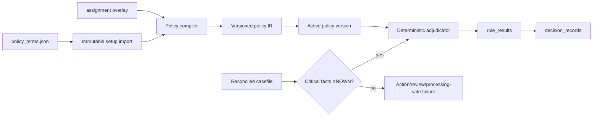
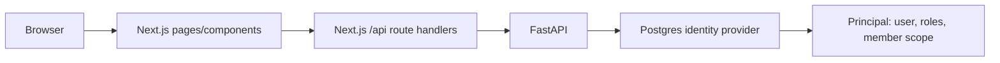
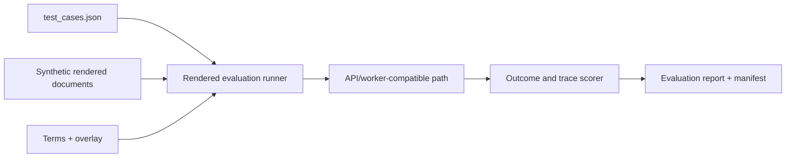
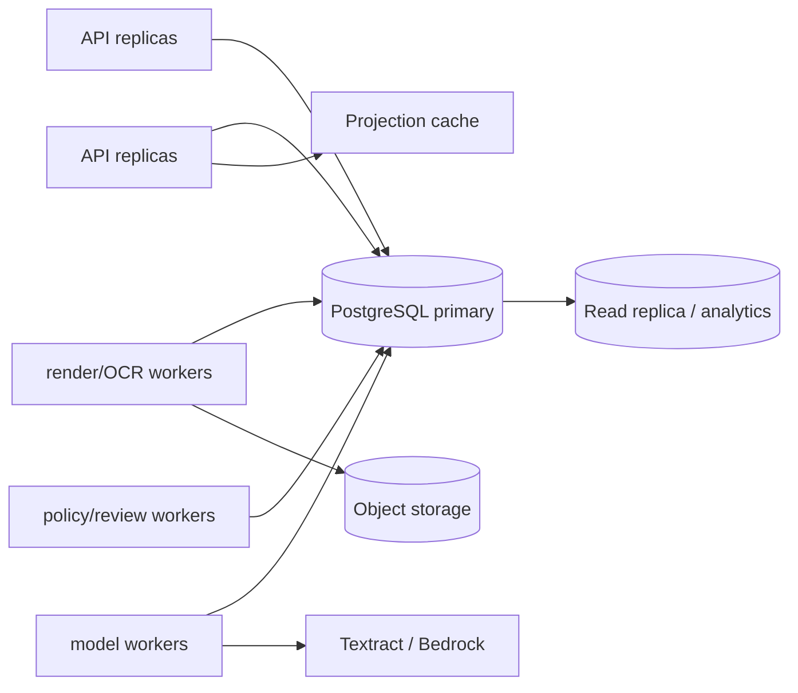

# Plum Claims — Architecture and Decision Record

## 1. What was built

Plum Claims is a local-first, explainable health-insurance claim-processing system. A member submits medical documents; the backend processes them asynchronously, extracts document-grounded facts, evaluates a versioned policy deterministically, and either records a decision, asks for corrected documents, or routes the claim to a reviewer.

The system is deliberately designed around a single rule:

```text
Providers and models can interpret documents.
The application owns provenance, canonical facts, money, and outcomes.
```

An LLM is therefore not a claims adjudicator. It may classify a document, select OCR observation IDs, or propose evidence candidates. The backend verifies those references against stored OCR, creates the casefile, and passes only that casefile to deterministic policy code. A review task handles ambiguity rather than allowing an unsupported automated decision.

This document describes the code in this checkout, the decisions that produced it, rejected alternatives, remaining limitations, and a credible path to roughly ten times the current local workload. It intentionally distinguishes the current assignment/local implementation from a future production design.

## 2. Goals, scope, and quality bar

### Goals

- Accept PDF/JPEG/PNG medical-claim submissions through FastAPI and the Next.js UI.
- Process claims through a standalone durable worker, not inside the HTTP request.
- Reconstruct why an outcome occurred using PostgreSQL alone.
- Keep live OCR/model calls optional, while retaining a deterministic recorded path for tests and evaluation.
- Make model-produced facts attributable to immutable OCR observations.
- Keep policy, monetary calculations, and final outcomes deterministic and versioned.
- Support member action-required and human-review outcomes in addition to automated decisions.
- Give the frontend a backend-owned progress rail instead of asking it to interpret trace infrastructure.

### Explicit non-goals in this version

- Production identity, OAuth/OIDC, public registration, tenant isolation, or a hardened admin plane.
- Cloud deployment infrastructure such as S3, SQS, CloudWatch, managed autoscaling, or a production secrets platform.
- Direct LLM-driven approval/rejection/payment decisions.
- A generic multi-agent framework or a microservice for every workflow capability.
- Proof that every hospital layout or every live provider/model combination works.

### Current operating modes

| Mode                | OCR/model implementation                                    | Intended use                                                          | Safety/cost property                                                 |
| ------------------- | ----------------------------------------------------------- | --------------------------------------------------------------------- | -------------------------------------------------------------------- |
| `RECORDED_LOCAL`    | Recorded discovery OCR and recorded structured model output | Default development, deterministic tests, 12-case rendered evaluation | No AWS construction or spend                                         |
| `LIVE_INTELLIGENCE` | Amazon Textract and Bedrock Converse                        | Explicit local live-document smoke/debugging                          | Requires `CLAIMS_RUN_LIVE_AWS=1`; may cost money and may safely fail |

The execution profile is persisted in each workflow run's execution contract. A resumed run cannot silently use a different provider/model contract than the one with which it started.

## 3. System at a glance



The deployment shape is a modular monolith with three local processes:

1. **FastAPI** owns HTTP validation, authorization resolution, claim intake, read projections, review endpoints, and SQLAdmin.
2. **`claims-worker`** owns durable work polling and workflow execution.
3. **Next.js** owns the browser experience and route-handler BFF boundary.

PostgreSQL is the system of record. Phoenix is diagnostic infrastructure, not decision authority. The local filesystem contains document bytes/page artifacts; PostgreSQL holds their hashes, metadata, provenance, and business meaning.

## 4. Component responsibilities and interactions

| Component                   | Code area                                    | Responsibility                                                             | Does not own                              |
| --------------------------- | -------------------------------------------- | -------------------------------------------------------------------------- | ----------------------------------------- |
| API                         | `api/`, `application/claims.py`              | Multipart validation, idempotent intake, claim/read/action/review routes   | Long-running OCR/model work               |
| Runtime composition         | `runtime/composition.py`                     | Builds profile-selected adapters and execution contract                    | Business policy decisions                 |
| Worker                      | `worker/`                                    | `run-once`/`run-loop`, lease-aware shutdown, lifecycle ownership           | HTTP concerns                             |
| Workflow                    | `infrastructure/langgraph_workflow/`         | Topology, durable checkpoint use, node events, retries/resume              | Provider-specific parsing or policy rules |
| Claim processor             | `infrastructure/postgres/claim_processor.py` | Persists documents, OCR, triage, evidence, casefiles, and terminal effects | Browser/API response shape                |
| Intelligence applications   | `application/intelligence.py`, `model/`      | OCR/model orchestration and structured-output validation                   | Claim payment decisions                   |
| Policy compiler/adjudicator | `policy/`                                    | Policy IR creation, deterministic rules, amount calculations, rule trace   | OCR or model inference                    |
| PostgreSQL repositories     | `infrastructure/postgres/`                   | Transactions, durable queue, reconstruction, identity/policy records       | Domain semantics hidden in route handlers |
| Observability               | `observability.py`                           | JSONL engineering logs and OpenTelemetry/Phoenix spans                     | Durable truth or member-facing status     |
| Frontend BFF                | `frontend/app/api/`                          | Same-origin proxy boundary for the frontend                                | Policy and evidence inference             |

The important interaction is asynchronous intake:



## 5. Durable workflow and failure model

### Actual graph topology

The graph is not a simple linear pipeline. Early gates can stop work before expensive OCR/extraction, and a previous casefile can skip document intelligence. The current graph is:



### Queue, checkpoint, and terminal authority

The queue and LangGraph checkpoint serve different purposes:

| Concern                                      | Authority                                        | Reason                                                |
| -------------------------------------------- | ------------------------------------------------ | ----------------------------------------------------- |
| Due work, lease owner/token/expiry, attempts | `claim_work_items` in PostgreSQL                 | Ephemeral execution ownership must be fenced          |
| Durable graph state and resume identity      | LangGraph checkpoint + `workflow_runs`           | Enables re-entry without replaying completed work     |
| Provider/model configuration                 | persisted `execution_contract`                   | A resumed run must use compatible adapters            |
| Node execution timeline                      | append-only `workflow_events`                    | Supports reconstruction and frontend stage projection |
| Terminal business effects                    | PostgreSQL transaction + active lease validation | Prevents stale workers from committing outcomes       |

Lease tokens are deliberately **not checkpointed as workflow state**. When a run resumes, the runtime supplies the current active lease. Terminal writes validate that lease in the same transaction as the decision/action/work-item update. An unexpected processor exception is translated into retry/failure handling so a claim is not left leased indefinitely.

This boundary emerged from an actual failure class: a workflow could resume with stale execution ownership after a retry, successfully reach a terminal node, then fail or risk committing under an old lease. The design now treats graph state as durable business progress and lease state as volatile runtime authority.

### Member-visible progress

`workflow_events` are persisted on node entry, exit, and error. `GET /v1/claims/{id}` projects them to a stable, frontend-safe seven-stage rail:

```text
ingest_claim → classify_documents → render_documents → read_documents
→ extract_evidence → check_policy → finalize_claim
```

Each stage has `PENDING`, `RUNNING`, `COMPLETED`, or `FAILED` state, a server-calculated percent, a summary, and where available an attempt count/duration/completion time. The frontend polls the claim endpoint; it does not derive customer state from Phoenix. This keeps the internal graph free to evolve while preserving a simple UI contract.

## 6. Evidence, OCR, and model boundary



### Why observation IDs instead of model-generated provenance

Earlier structured output asked models to return hashes, regions, page metadata, and source text provenance. Live models reliably understood the document but occasionally invented hash-like values or returned malformed structure. That made correct semantic output fail schema validation for the wrong reason.

The current V4 triage contract makes the model return only semantic predictions and backend-issued `observation_id` references. The resolver validates each reference against the same document version, then copies page, region, confidence, and `source_text_sha256` from stored OCR. It also verifies that a selected patient name is contained in the referenced OCR text.

This gives a clear responsibility split:

| Model may do                             | Backend must do                       |
| ---------------------------------------- | ------------------------------------- |
| document role/readability classification | create observation IDs and hashes     |
| select concise role/readability evidence | validate document/page ownership      |
| select a patient-name observation        | normalize/cap/deduplicate citations   |
| propose evidence fact/value              | resolve provenance and freeze facts   |
| never decide money/outcome               | run policy rules and terminal commits |

### Tolerant transport, strict semantics

Live Bedrock tool calls have produced two recoverable transport defects: the `documents` array encoded as a JSON string, and a string with one superfluous trailing brace. The adapter records a `wire_recovery` audit attribute and narrowly repairs only known safe forms before Pydantic validation. It does not silently coerce arbitrary malformed output.

Likewise, evidence-reference normalization tolerates over-citation by retaining a bounded, unique set and recording the normalization report. Unknown references, cross-document evidence, unsupported aliases, and ungrounded identity values still fail closed. This is deliberate: tolerate provider wire quirks, not unsupported business facts.

## 7. Policy, casefile, and decision architecture



Policy source, overlay, compiled IR, member version, and claim version are all pinned. The adjudicator receives a frozen casefile rather than raw OCR/model output. It uses integer paise for money and emits ordered rule results containing policy paths, inputs, evidence references, amounts before/after, and reason codes.

Critical facts include eligibility, document roles, billed amount, and annual utilization. If a fact is unknown, the adjudicator must not invent a value just to finish a decision. This is a safety property, not a rejection.

### Current utilization caveat

Seeded setup data can provide utilization snapshots. A missing snapshot leaves `ytd_used_paise` unknown and correctly prevents adjudication. The intended local-demo behavior is explicit zero utilization for a newly created local member, but this must remain verified in the active branch: the current local identity route's transaction should create the snapshot alongside the user/member/version. Do not weaken the adjudicator to treat a missing utilization record as zero; imported real members without utilization data must remain unknown.

## 8. Data and reconstruction model

PostgreSQL is the reconstruction authority. The major record families are:

| Family                  | Examples                                                                                                                 | Why it exists                                      |
| ----------------------- | ------------------------------------------------------------------------------------------------------------------------ | -------------------------------------------------- |
| Identity and setup      | `users`, `user_roles`, `user_member_links`, `members`, `member_versions`, `setup_imports`, utilization/history snapshots | Resolves actor/member and pins policy-period facts |
| Policy                  | `policy_sources`, `policy_overlays`, `policy_versions`, findings, activation events                                      | Replays the exact rule interpretation              |
| Claim intake            | `claims`, `claim_versions`, `documents`, `document_versions`, idempotency keys                                           | Preserves immutable submission/version history     |
| Document intelligence   | page artifacts, OCR page results/observations, triage results, model extractions, evidence candidates                    | Grounds facts to source material                   |
| Casefile and decisions  | identity reconciliations, casefiles, decision records, rule results, member actions                                      | Explains the business outcome                      |
| Workflow and operations | work items, workflow runs/events/effects, component failures, audit events                                               | Explains execution and recovery                    |
| Review                  | review tasks and resolutions                                                                                             | Gives humans controlled terminal authority         |

Replacement documents create new versions rather than overwriting input. Claim/review commands use versions and idempotency keys. Terminal effects are idempotent and lease-fenced. These choices make failures diagnosable and repeated requests safe without requiring a distributed transaction manager.

## 9. Identity and frontend boundary

The current checkout is local-demo oriented. FastAPI resolves a `Principal` using `X-Dev-Username` through PostgreSQL; seeded identities and `POST /v1/dev/identities` support demo/test flows. Next.js route handlers proxy browser traffic to FastAPI.



The durable domain boundary is already the right one: **User** is an actor; **Member** is an insured policy subject. They must not be collapsed merely because local usernames are convenient.

What is _not_ yet production-ready is the authentication adapter. Browser-controlled identity headers are acceptable only in this recorded-local assignment mode. A production migration should replace the header adapter with a verified OIDC/JWT/session adapter that produces the same trusted `Principal`, resolving role and member scope from PostgreSQL. The prior design work for signed, session-derived browser identity remains a suitable next step, but this document does not claim it is present unless the active checkout contains those routes and tests.

## 10. Observability, traces, and diagnostics

Two complementary records exist:

1. **PostgreSQL** reconstructs business facts, workflow events, effects, policy version, and terminal decision/action. It is authoritative.
2. **OpenTelemetry + Phoenix + JSONL** reconstructs execution behavior: API requests, workflow nodes, provider calls, model route/schema/prompt versions, retries, exceptions, token usage, and trace relationships.

Phoenix receives `claim.workflow`, node spans, and provider spans. `session.id` is the claim ID, so one claim's agent decisions can be followed across the API and worker trace. JSONL files (`api.jsonl`, `worker.jsonl`, evaluation logs) remain useful when Phoenix is unavailable.

For assignment debugging, detailed model/OCR input-output capture was intentionally enabled after early failures were impossible to diagnose from redacted spans. This is useful for tracing schema recovery and grounding bugs, but it is not a production privacy stance. Before real PHI use, restore a data-classification policy, redact/minimize span attributes, encrypt at rest, add access controls/retention, and keep PostgreSQL provenance separate from raw prompts.

## 11. Evaluation and verification strategy

The runtime never receives expected answers. Evaluation assets are outside the normal claim path:



Verification layers:

| Layer                  | Proof                                                                            |
| ---------------------- | -------------------------------------------------------------------------------- |
| Unit                   | Policy math, schema/grounding, retries, adapters, progress projection            |
| Contract               | HTTP payload and frontend-safe API shape                                         |
| Integration            | PostgreSQL, worker, workflow, policy, review, reconstruction                     |
| Rendered recorded gate | Main deterministic correctness gate for all 12 assignment cases                  |
| Live smoke             | Textract/Bedrock connectivity and safe failure behavior, not the acceptance gate |

The recorded rendered gate is intentionally the v1 acceptance criterion. Live provider output is non-deterministic and may fail closed when a model omits fields, returns unsupported aliases, or violates structured-output constraints. A live safe failure is preferable to an invented claim outcome.

## 12. Decision history: what was considered and why

| Decision                                                   | Why it was selected                                                                                                       | Considered and rejected/deferred                                                                                                                                                        |
| ---------------------------------------------------------- | ------------------------------------------------------------------------------------------------------------------------- | --------------------------------------------------------------------------------------------------------------------------------------------------------------------------------------- |
| FastAPI backend + Next.js frontend                         | Clear Python workflow/domain implementation with a familiar browser UI/BFF boundary                                       | Putting worker logic in Next.js or handling documents synchronously in the request                                                                                                      |
| PostgreSQL queue with leases                               | One inspectable local authority for claims, work, idempotency, policy, and audit; supports transactions and lease fencing | SQS for the assignment: adds a second operational system before it solves a demonstrated local problem                                                                                  |
| Local filesystem documents                                 | Fast, cheap, deterministic local work with hashes/metadata in PostgreSQL                                                  | S3 in v1: unnecessary for a local assignment; retained as a future storage-port replacement                                                                                             |
| LangGraph only for durable orchestration                   | Checkpointed graph/resume semantics fit multi-step processing                                                             | A generic agent framework or “agent per capability”: more abstraction than the single workflow needs                                                                                    |
| Textract + Bedrock behind ports                            | Meets real-document live capability while recorded adapters preserve deterministic correctness                            | Hard-coding provider calls into nodes or making live AWS the default                                                                                                                    |
| Phoenix/OpenTelemetry + JSONL                              | Captures agent/provider/node traces with standard trace propagation; JSONL remains inspectable locally                    | CloudWatch: unnecessary for the requested local-first environment; Langfuse was considered, but Phoenix better fits trace exploration and OpenInference-oriented agent diagnostics here |
| OCR observation IDs as model references                    | Removes model-generated hash/provenance hallucinations and preserves exact source evidence                                | Asking models to generate hashes/page/region metadata                                                                                                                                   |
| Tolerant provider transport with strict evidence semantics | Recovers known stringified-array/trailing-brace tool-call defects while still rejecting unsupported facts                 | Blind JSON repair or weakening Pydantic/grounding checks globally                                                                                                                       |
| Deterministic policy adjudicator                           | Repeatable policy/money calculations, auditable rules, easy regression tests                                              | LLM-generated approval/rejection/amounts                                                                                                                                                |
| Strict unknown casefile facts                              | Avoids approving against missing utilization/eligibility/billed data                                                      | Defaulting unknown annual utilization to zero everywhere                                                                                                                                |
| Explicit member action/review branches                     | Converts missing evidence or ambiguity into a recoverable user/human outcome                                              | Treating all non-happy paths as outright rejection                                                                                                                                      |
| Frontend progress projection from `workflow_events`        | Member UI can poll a stable contract without coupling to graph names or Phoenix                                           | Browser polling of Phoenix or frontend inference from lifecycle alone                                                                                                                   |
| Incremental refactoring                                    | Preserve checkpoints, graph identity, event meaning, effects, and tests while isolating hotspots                          | A full domain/infrastructure reorganization before v1 was operational                                                                                                                   |

Several decisions were consciously deferred, not rejected forever: OIDC/JWT authentication, object storage, an external broker, real-time progress streaming, provider worker pools, and broader insurer policy support.

## 13. Current limitations and honest gaps

1. **Local identity is not production authentication.** `X-Dev-Username`, local demo identity creation, and SQLAdmin belong only in trusted local development.
2. **Document storage is single-host.** Local filesystem paths cannot serve multiple workers/hosts safely.
3. **The PostgreSQL queue is local-scale.** It is durable and correct, but queue contention and table growth must be measured before claiming high throughput.
4. **Live intelligence remains variable.** Structured Bedrock outputs can still fail after narrowly scoped recovery; that produces safe processing failure rather than an unsafe decision.
5. **Observability currently favors debugging over privacy.** Detailed traces must be redacted and access-controlled before real PHI.
6. **The policy model is assignment-specific.** New products need richer benefits, exclusions, network, and member-history semantics.
7. **Evaluation corpus breadth is limited.** Synthetic/rendered cases prove expected behavior, not universal robustness across real hospital formats.
8. **Progress is polling-based.** It is simple and correct locally, but not the best experience for many concurrent clients.
9. **Some financial semantics need continued hardening.** Keep claimed, billed, payable, capped, discounted, and copay bases explicitly ordered and independently tested.
10. **Utilization lifecycle must be enforced.** A manual local member without an explicit current-period utilization snapshot cannot be safely adjudicated. The correct repair is snapshot creation/backfill, never relaxing the unknown-fact gate.

## 14. Ten-times-load plan

Ten times the current assignment load does not require discarding the domain model. It requires making the existing ports and append-only records operationally stronger.

### Phase A — measure before replacing

- Add dashboards/alerts for queue age, lease expiry/reclaims, node duration, provider latency/errors, token use, terminal failure rate, and DB connection-pool saturation.
- Define SLOs around accepted-to-terminal latency, duplicate terminal commits (must remain zero), and reconstruction completeness.
- Load test separate classes: upload/render, OCR, model extraction, and policy-only/review paths. They have very different bottlenecks.

### Phase B — scale the existing design horizontally



- Keep the lease-fenced terminal transaction and workflow/event contracts.
- Run more worker replicas first; use short, bounded database transactions and tune indexes for due work and claim-version reads.
- Separate rendering/OCR/model-heavy worker pools from policy/review workers so provider slowness cannot starve fast deterministic work.
- Add provider token buckets, concurrency budgets, circuit breakers, and backpressure based on queue age and quota errors.
- Cache OCR/model results by immutable document-version hash plus provider/model/prompt/schema version.

### Phase C — replace local-only infrastructure behind ports

| Current local choice            | 10× replacement                                                                                        | Invariant retained                                                                          |
| ------------------------------- | ------------------------------------------------------------------------------------------------------ | ------------------------------------------------------------------------------------------- |
| Local document/page files       | S3-compatible object storage, object keys in PostgreSQL                                                | Immutable version/hash/provenance model                                                     |
| API polling                     | SSE first; WebSocket only if bidirectional requirements emerge                                         | Progress derives from persisted workflow events                                             |
| Single PostgreSQL primary reads | Read replica/materialized member-safe projections                                                      | PostgreSQL remains business reconstruction authority                                        |
| PostgreSQL-only queue           | Keep it while measured capacity suffices; introduce SQS/Kafka only for external-work dispatch pressure | Work item, idempotency, and terminal outcome stay transactionally represented in PostgreSQL |
| Local JSONL/Phoenix             | Centralized OTLP collector plus controlled log store                                                   | Trace IDs link API, worker, provider, and DB events                                         |

### Phase D — security and data lifecycle

- Replace local-header identity with OIDC/JWT validation and server-resolved grants.
- Encrypt object storage and database backups; use per-environment secrets and least-privilege IAM.
- Add document malware scanning/quarantine before rendering.
- Define retention/archival for raw documents, OCR, prompt/response envelopes, audit events, and traces.
- Create member-safe, reviewer-safe, and operator/debug-safe projections instead of returning one increasingly large claim response.

The trigger for moving from PostgreSQL queueing to an external broker is not “10×” by itself. It is measured contention, sustained queue latency, cross-region needs, or an inability to isolate provider-heavy dispatch from transactional claim state. Keeping that boundary explicit prevents premature infrastructure sprawl.
