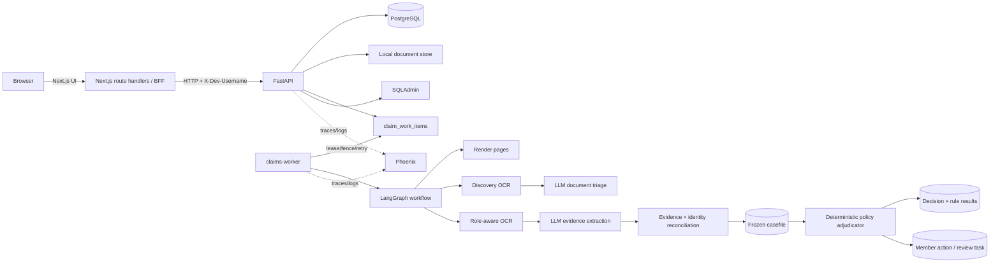
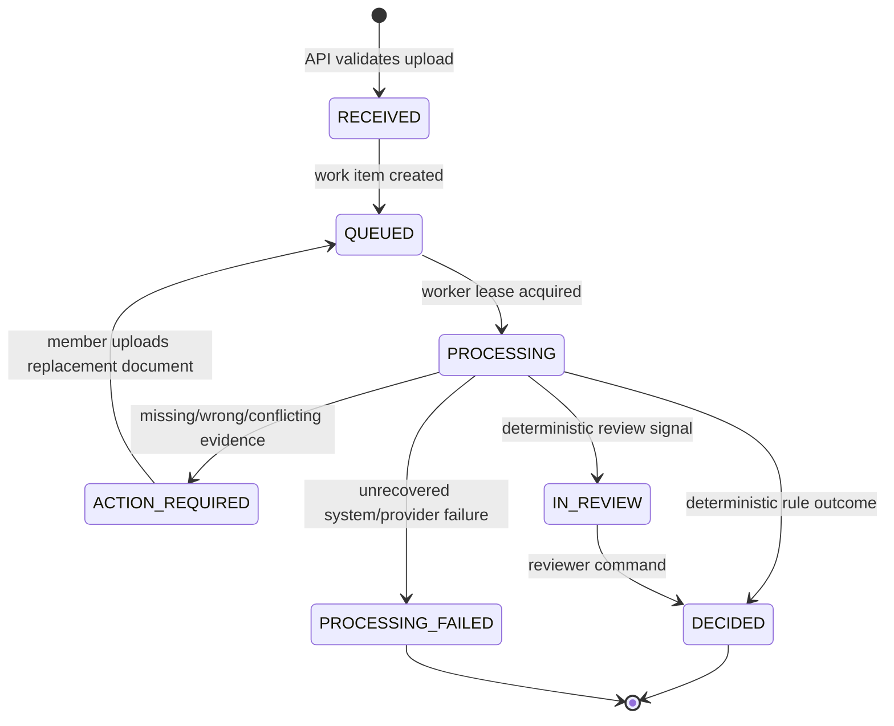
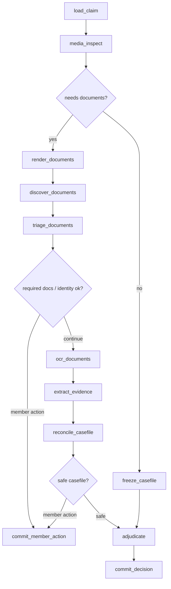
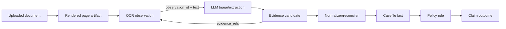
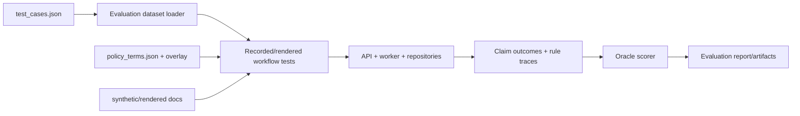

# Plum Claims Processing System

Plum Claims is an explainable health-insurance claim-processing system built for the Plum AI Engineer assignment. It accepts claim documents, extracts OCR-backed evidence, reconciles that evidence against member and policy data, then applies deterministic policy rules to decide whether a claim is approved, rejected, sent to review, or returned to the member for corrected documents.

The core safety boundary is intentional:

```text
OCR/model providers extract and classify evidence.
Backend validation owns provenance and canonical facts.
Deterministic policy code owns claim outcomes and money.
Reviewers resolve ambiguity.
```

A model can never directly approve a payment. Model output is treated as untrusted until it cites persisted OCR observation IDs that the backend can verify.

## What this project does

- Submits health claims with PDFs/images through FastAPI and a Next.js frontend.
- Stores every claim, document version, OCR observation, model extraction, workflow event, rule result, review task, and audit event in PostgreSQL.
- Runs asynchronous processing through a durable worker and LangGraph workflow.
- Supports local/no-cost recorded intelligence by default.
- Optionally runs live Amazon Textract OCR and Amazon Bedrock structured extraction.
- Uses a compiled, versioned Plum policy and deterministic integer-paise adjudication.
- Provides SQLAdmin back-office views for all PostgreSQL tables.
- Shows frontend evidence views: workflow progress, amount trail, OCR registry, rule trace, and evidence JSON.
- Includes an evaluation workbench for the supplied assignment cases.

## Quick start

Choose one path:

1. [Manual with `uv`](#manual-setup-with-uv)
2. [NPM workspace commands](#npm-workspace-setup)
3. [Docker Compose](#docker-compose-setup)

### Manual setup with `uv`

Use this if you want explicit control over every service.

#### 1. Configure environment

```bash
cp .env.example .env
```

For safe local development, keep:

```dotenv
CLAIMS_EXECUTION_PROFILE=RECORDED_LOCAL
CLAIMS_RUN_LIVE_AWS=0
CLAIMS_OBSERVABILITY_ENABLED=0
```

#### 2. Install dependencies

Backend:

```bash
uv sync --all-groups
```

Frontend:

```bash
cd frontend
npm ci
cd ..
```

#### 3. Start PostgreSQL

```bash
docker compose up -d postgres
```

#### 4. Apply migrations

```bash
uv run alembic upgrade head
```

#### 5. Import members/policy, compile, and activate policy

Import policy/member setup data:

```bash
uv run claimsctl setup import --policy problem_statement/policy_terms.json
```

Copy `policy_source_sha256` from that JSON output, then compile:

```bash
uv run claimsctl policy compile \
  --source-sha <policy_source_sha256> \
  --overlay config/policy/assignment-overlay-v1.json
```

Copy `policy_version_id` from the compile output, then activate:

```bash
uv run claimsctl policy activate \
  --policy-version-id <policy_version_id> \
  --actor operator.local
```

#### 6. Start services in separate terminals

Phoenix tracing UI:

```bash
uv run phoenix serve --host 127.0.0.1 --port 6006
```

FastAPI backend:

```bash
uv run uvicorn claims_backend.api.app:app --host 127.0.0.1 --port 8000 --reload
```

Claims worker:

```bash
uv run claims-worker run-loop
```

Next.js frontend:

```bash
cd frontend
npm run dev
```

Open:

```text
Frontend: http://127.0.0.1:3000
API docs: http://127.0.0.1:8000/docs
SQLAdmin: http://127.0.0.1:8000/admin  (if enabled)
Phoenix:  http://127.0.0.1:6006
```

### NPM workspace setup

Use this for local development with shorter commands.

#### 1. Configure environment

```bash
cp .env.example .env
```

#### 2. Install backend and frontend requirements

```bash
npm ci
```

The root `postinstall` runs:

```text
uv sync --all-groups
npm ci --prefix frontend
```

So one command installs both backend Python dependencies and frontend Node dependencies.

#### 3. Bootstrap the database

```bash
npm run dev:bootstrap
```

This starts Postgres, applies migrations, imports setup data, compiles the overlay, and activates `PLUM_GHI_2024` if no active policy exists.

#### 4. Run each service

Use separate terminals:

```bash
npm run phoenix
npm run api
npm run worker
npm run frontend
```

Other useful commands:

```bash
npm run setup:data    # idempotent policy/member setup + activation
npm run db:up         # start only postgres
npm run db:migrate    # run alembic migrations
npm run stop          # stop local API/worker/Phoenix/Next dev processes
npm run lint          # frontend typecheck
npm run lint:backend  # ruff over backend/tests
npm test              # pytest
```

### Docker Compose setup

Use this if you want a full containerized stack.

```bash
docker compose up --build
```

This starts:

- PostgreSQL on `127.0.0.1:55432`
- one-shot `setup` service that runs migrations and activates `PLUM_GHI_2024`
- FastAPI on `http://127.0.0.1:8000`
- claims worker
- Phoenix on `http://127.0.0.1:6006`
- Next.js frontend on `http://127.0.0.1:3000`

Stop containers:

```bash
docker compose down
```

Reset all Docker-managed data:

```bash
docker compose down -v
```

The Docker path defaults to `RECORDED_LOCAL`. To run live AWS in Docker, pass explicit env vars, for example:

```bash
CLAIMS_EXECUTION_PROFILE=LIVE_INTELLIGENCE \
CLAIMS_RUN_LIVE_AWS=1 \
CLAIMS_OBSERVABILITY_ENABLED=1 \
AWS_PROFILE=your-profile \
docker compose up --build
```

Depending on your Docker/AWS setup, you may need to mount or export AWS credentials into the containers. Do not commit credentials.

## Environment variables

The project reads `.env` through `claims_backend.config.Settings`. Start from:

```bash
cp .env.example .env
```

### PostgreSQL

| Variable | Purpose |
|---|---|
| `POSTGRES_DB` | Database created by the Postgres container. Default: `claims`. |
| `POSTGRES_USER` | Postgres user. Default: `claims`. |
| `POSTGRES_PASSWORD` | Postgres password. Default: `claims`. |
| `POSTGRES_PORT` | Host port mapped to container port `5432`. Default: `55432`. |
| `CLAIMS_DATABASE_URL` | SQLAlchemy URL for the application database. |
| `CLAIMS_TEST_DATABASE_URL` | SQLAlchemy URL for integration tests. Use a separate DB. |
| `CLAIMS_ALLOW_DESTRUCTIVE_TEST_DATABASE` | Set `1` only if you intentionally allow destructive tests against a DB. |

### Upload, rendering, and local storage

| Variable | Purpose |
|---|---|
| `CLAIMS_DATA_ROOT` | Local content-addressed document storage root. |
| `CLAIMS_MAX_DOCUMENTS` | Max files per claim. |
| `CLAIMS_MAX_FILE_BYTES` | Max size per uploaded file. |
| `CLAIMS_MAX_CLAIM_BYTES` | Max aggregate multipart claim size. |
| `CLAIMS_MAX_DOCUMENT_PAGES` | Max rendered/OCR pages per document. |
| `CLAIMS_UPLOAD_CHUNK_BYTES` | Streaming chunk size for upload persistence. |
| `CLAIMS_PAGE_RENDER_DPI` | PDF render DPI used before OCR. |
| `CLAIMS_MAX_TEXTRACT_PAGE_BYTES` | Max rendered page bytes sent to Textract. |

### Execution profile and provider gates

| Variable | Purpose |
|---|---|
| `CLAIMS_EXECUTION_PROFILE` | Runtime profile. Use `RECORDED_LOCAL` for safe local runs, `LIVE_INTELLIGENCE` for AWS. |
| `CLAIMS_RUN_LIVE_AWS` | Required second gate for live AWS. `LIVE_INTELLIGENCE` fails unless this is `1`. |
| `CLAIMS_INJECT_ANOMALY_ENRICHMENT_FAILURE` | Local-only synthetic failure injection for resilience tests. Keep `0` normally. |

Safe local default:

```dotenv
CLAIMS_EXECUTION_PROFILE=RECORDED_LOCAL
CLAIMS_RUN_LIVE_AWS=0
CLAIMS_OBSERVABILITY_ENABLED=0
CLAIMS_INJECT_ANOMALY_ENRICHMENT_FAILURE=0
```

Live synthetic/debug profile:

```dotenv
CLAIMS_EXECUTION_PROFILE=LIVE_INTELLIGENCE
CLAIMS_RUN_LIVE_AWS=1
CLAIMS_OBSERVABILITY_ENABLED=1
CLAIMS_INJECT_ANOMALY_ENRICHMENT_FAILURE=0
```

### Amazon Textract setup

Textract is used only on the live path.

| Variable | Purpose |
|---|---|
| `CLAIMS_AWS_REGION` | Region for Textract, usually `ap-south-1`. |
| `CLAIMS_TEXTRACT_TIMEOUT_SECONDS` | Per-request timeout. |
| `CLAIMS_TEXTRACT_CONCURRENCY_LIMIT` | Worker-side concurrency cap. |

Use the standard AWS SDK credential chain. Recommended local setup:

```bash
aws configure sso
# or configure a local profile with access to Textract + Bedrock
export AWS_PROFILE=your-profile-name
aws sts get-caller-identity
```

Required AWS permissions include Textract document text/expense analysis operations used by the configured adapter.

### Amazon Bedrock setup

Bedrock is used for live document triage/extraction.

| Variable | Purpose |
|---|---|
| `CLAIMS_BEDROCK_REGION` | Bedrock Runtime region. Default example: `us-west-2`. |
| `CLAIMS_BEDROCK_MODEL_ID` | Model ID used by the structured model adapter. |
| `CLAIMS_BEDROCK_TIMEOUT_SECONDS` | Per-request timeout. |
| `CLAIMS_BEDROCK_CONCURRENCY_LIMIT` | Worker-side concurrency cap. |
| `CLAIMS_PROVIDER_MAX_ATTEMPTS` | Provider attempts before durable workflow failure; capped at 3. |
| `CLAIMS_RETRY_BASE_SECONDS` | Durable retry backoff base. |
| `CLAIMS_RETRY_MAX_SECONDS` | Durable retry max delay. |
| `CLAIMS_RETRY_JITTER_RATIO` | Jitter ratio for retries. |

Before running live claims:

1. Enable the target Bedrock model in the AWS console for `CLAIMS_BEDROCK_REGION`.
2. Ensure your principal can call Bedrock Runtime converse/invoke APIs.
3. Verify credentials:

```bash
AWS_PROFILE=your-profile aws sts get-caller-identity
```

Live mode may incur AWS charges. Use only synthetic/de-identified documents.

### Observability and Phoenix

| Variable | Purpose |
|---|---|
| `CLAIMS_OBSERVABILITY_ENABLED` | Enables OpenTelemetry export and engineering logs. |
| `CLAIMS_PHOENIX_ENDPOINT` | OTLP HTTP endpoint, e.g. `http://127.0.0.1:6006/v1/traces`. |
| `CLAIMS_PHOENIX_PROJECT` | Phoenix project name. |
| `CLAIMS_LOG_ROOT` | JSONL engineering log directory. |
| `CLAIMS_LOG_MAX_BYTES` | Rotating log max bytes. |
| `CLAIMS_LOG_BACKUP_COUNT` | Rotating log backup count. |

Start Phoenix locally:

```bash
npm run phoenix
```

or:

```bash
uv run phoenix serve --host 127.0.0.1 --port 6006
```

### Worker

| Variable | Purpose |
|---|---|
| `CLAIMS_WORKER_ID` | Lease owner identifier for this worker process. |
| `CLAIMS_WORKER_POLL_SECONDS` | Poll interval for new work. |
| `CLAIMS_WORKER_LEASE_SECONDS` | Work lease duration. |
| `CLAIMS_WORKER_SHUTDOWN_SECONDS` | Graceful shutdown timeout. |

### SQLAdmin

SQLAdmin is a local/private admin UI at `/admin`.

| Variable | Purpose |
|---|---|
| `CLAIMS_SQLADMIN_ENABLED` | `1` enables SQLAdmin. Disabled by default. |
| `CLAIMS_SQLADMIN_USERNAME` | Admin username. |
| `CLAIMS_SQLADMIN_PASSWORD` | Admin password; must be at least 12 characters. |
| `CLAIMS_SQLADMIN_SECRET_KEY` | Session signing key; must be at least 32 characters. |

Example local values:

```dotenv
CLAIMS_SQLADMIN_ENABLED=1
CLAIMS_SQLADMIN_USERNAME=admin
CLAIMS_SQLADMIN_PASSWORD=admin-password-local
CLAIMS_SQLADMIN_SECRET_KEY=sqladmin-local-secret-with-at-least-32-chars
```

Do not expose SQLAdmin publicly.

## Architecture

### System overview



The browser never calls FastAPI directly in the frontend app. It calls Next.js route handlers, which proxy to FastAPI as a BFF.

### Workflow lifecycle



### LangGraph processing nodes



Node meanings:

| Node | What happens |
|---|---|
| `load_claim` | Loads claim/version/work context and records workflow start. |
| `media_inspect` | Determines whether documents need rendering/OCR/model processing. |
| `render_documents` | Converts PDFs/images into auditable page artifacts. |
| `discover_documents` | Runs discovery OCR and stores observations. |
| `triage_documents` | Classifies document role/readability/patient names from OCR observations. |
| `ocr_documents` | Runs role-aware OCR after document triage. |
| `extract_evidence` | Extracts structured facts like `billing.total` and `clinical.condition`. |
| `reconcile_casefile` | Normalizes, deduplicates, validates, and freezes evidence into a casefile. |
| `adjudicate` | Applies deterministic policy rules. No LLM is used here. |
| `commit_decision` | Atomically commits decision/rule results/work completion. |
| `commit_member_action` | Atomically records action-required branch and work completion. |

### Evidence and provenance model



Example chain:

```text
OCR observation:
  observation_id = abc123
  text = "Total Bill Amount: INR 1,350.00"

Evidence candidate:
  fact_path = billing.total
  value = 1350.00
  evidence_refs = [abc123]

Casefile fact:
  billing.total = 135000 paise

Rule result:
  amount.consultation.category_limit uses billing.total evidence refs
```

The backend rejects model output if it references an OCR observation ID that was not supplied to the model.

### Important directories

```text
src/claims_backend/api/                 FastAPI routes, schemas, SQLAdmin, progress projection
src/claims_backend/application/         Use-case layer
src/claims_backend/domain/              Domain models and invariants
src/claims_backend/infrastructure/      PostgreSQL, local storage, AWS, LangGraph adapters
src/claims_backend/model/               Prompt/schema validation and model boundary
src/claims_backend/policy/              Policy compiler and deterministic adjudicator
src/claims_backend/worker/              Worker loop and CLI
frontend/                               Next.js frontend and BFF route handlers
evaluation_workbench/                   Offline evaluation dataset/scoring helpers
problem_statement/                      Assignment policy/test-case sources
synthetic_uploads/                      Safe synthetic local test documents
```

## Submit a claim

Claims use multipart form data. The `documents[].upload_index` sequence must match the repeated `files` parts.

```bash
curl --fail-with-body \
  -X POST http://127.0.0.1:8000/v1/claims \
  -H 'X-Dev-Username: member.emp001' \
  -H 'Idempotency-Key: local-smoke-001' \
  -F 'metadata={"member_id":"EMP001","policy_id":"PLUM_GHI_2024","claim_category":"CONSULTATION","treatment_date":"2024-11-01","claimed_amount":"1500.00","currency":"INR","documents":[{"upload_index":0,"client_document_id":"rx-001"},{"upload_index":1,"client_document_id":"bill-001"}]}' \
  -F 'files=@synthetic_uploads/debug_docs/success_consultation_prescription_rajesh.jpg' \
  -F 'files=@synthetic_uploads/debug_docs/success_consultation_bill_rajesh.jpg'
```

Poll status:

```bash
curl --fail-with-body \
  -H 'X-Dev-Username: member.emp001' \
  http://127.0.0.1:8000/v1/claims/<claim_id>
```

Local identities are resolved through:

```text
X-Dev-Username -> PostgresIdentityProvider -> Principal
```

The frontend also includes a local demo identity selector/creator backed by the existing user/member tables.

## Evaluation

The assignment evaluation assets live under:

```text
problem_statement/policy_terms.json
problem_statement/test_cases.json
problem_statement/sample_documents_guide.md
```

The evaluation workbench under `evaluation_workbench/` is intentionally outside the backend runtime. It loads the assignment oracle inputs and scores outputs, but the API/worker never receives expected answers.

### How evaluation works



There are three useful levels:

1. **Unit/contract tests** verify schema, model-boundary, policy, and API behavior quickly.
2. **Recorded rendered evaluation** runs the worker path with deterministic recorded intelligence and rendered documents.
3. **Live AWS tests** explicitly call Textract/Bedrock and may incur cost.

### Run evaluation/tests

Fast core checks:

```bash
uv run pytest tests/unit tests/contract -q
```

Integration suite:

```bash
uv run pytest tests/integration -q
```

Recorded rendered assignment gate:

```bash
uv run pytest \
  tests/integration/test_rendered_evaluation_gate.py::test_all_twelve_cases_pass_the_recorded_rendered_evaluation_gate \
  -q
```

Full default suite, excluding live AWS unless explicitly enabled:

```bash
uv run pytest -q
```

Live AWS smoke tests:

```bash
CLAIMS_EXECUTION_PROFILE=LIVE_INTELLIGENCE \
CLAIMS_RUN_LIVE_AWS=1 \
uv run pytest tests/live -q
```

Use only synthetic/de-identified documents for live tests.

## Limitations

### Input limitations

- Supported uploads are PDFs and common image formats accepted by the backend validators/renderers.
- Default max documents per claim: `CLAIMS_MAX_DOCUMENTS=10`.
- Default max file size: `CLAIMS_MAX_FILE_BYTES=20971520` bytes.
- Default max total claim upload size: `CLAIMS_MAX_CLAIM_BYTES=52428800` bytes.
- Default max pages per document: `CLAIMS_MAX_DOCUMENT_PAGES=10`.
- Very long/noisy OCR output is bounded before model extraction; not every OCR token is sent to the LLM.
- Local document storage is filesystem-backed, not S3.

### Product limitations

- This is not a full auth product. It intentionally uses local/dev identity headers plus DB-backed demo identities.
- SQLAdmin is a local/private back-office tool, not a public admin product.
- It is focused on OPD-style assignment categories and the supplied Plum policy shape.
- It is not a complete insurer claims platform, provider network integration, payment system, or member portal.
- Reviewer/operator/admin role management is intentionally back-office controlled.

### Model/provider limitations

- Live Bedrock output can vary. Backend validation may reject outputs that cite invalid OCR references.
- `RECORDED_LOCAL` is the primary deterministic correctness proof; live AWS is optional evidence of provider integration.
- The LLM does not decide claim outcomes and cannot be trusted for provenance.
- Bedrock model access depends on your AWS account, region, model enablement, quotas, and billing/payment status.
- Textract/Bedrock live runs may incur charges.

### Policy/adjudication limitations

- Deterministic adjudication currently reflects the implemented assignment slice and overlay.
- Some edge-case financial semantics may need further hardening, for example claimed-vs-billed payable-base ordering.
- Repeated same-day/history review paths require appropriate seeded member history data.

## Troubleshooting

### API health

```bash
curl http://127.0.0.1:8000/health/live
curl http://127.0.0.1:8000/health/ready
```

### Reset local Docker DB

```bash
docker compose down -v
docker compose up --build
```

### Stop local npm/manual processes

```bash
npm run stop
```

### Open SQLAdmin

Set SQLAdmin env vars, start the API, then open:

```text
http://127.0.0.1:8000/admin
```

### Phoenix trace lookup

```bash
px span list \
  --endpoint http://127.0.0.1:6006 \
  --project plum-claims-local \
  --trace-id <trace_id> \
  --format pretty
```
