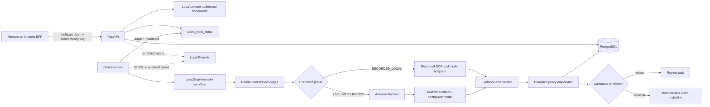
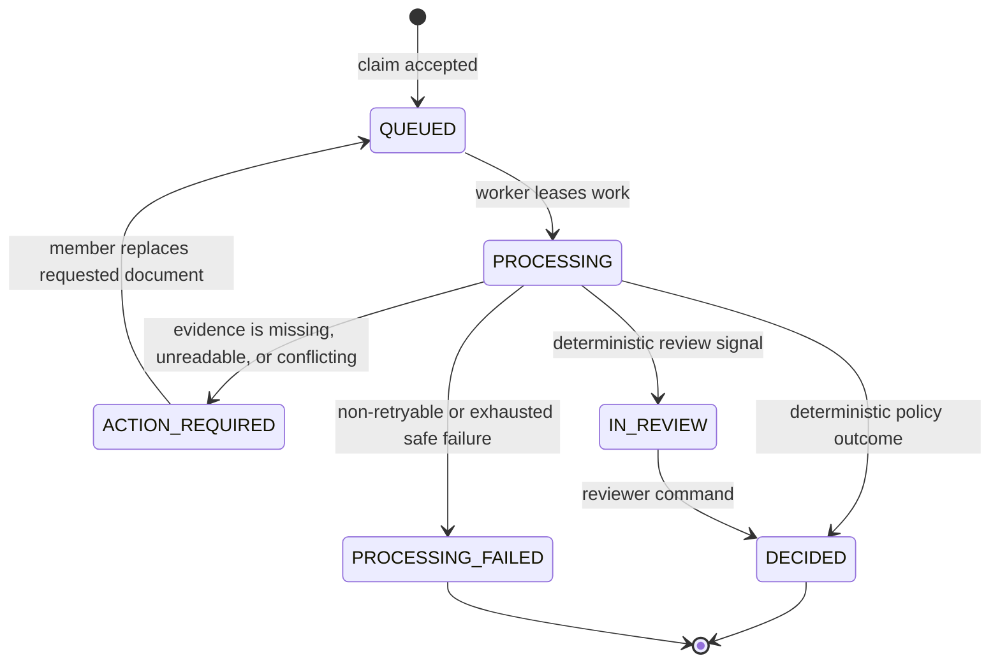
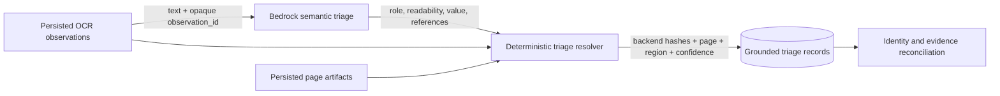
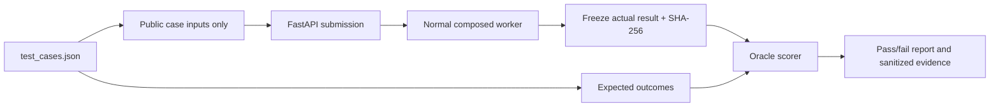

# Plum Claims Backend

An explainable, backend-first health-claim processing system. It accepts claim documents, turns
them into evidence, applies a versioned policy deterministically, and preserves enough durable
state to reconstruct why a claim reached its outcome.

The safety boundary is deliberate: **Textract and Bedrock produce evidence; deterministic policy
code determines money and claim outcomes; reviewers resolve ambiguity.** A model cannot approve a
payment directly.

## What is implemented

- Multipart claim submission, member-scoped claim reads, document replacement, and reviewer
  commands through FastAPI.
- A standalone `claims-worker` that leases durable PostgreSQL work and runs a checkpointed
  LangGraph workflow.
- Local content-addressed document storage; no S3 is required for local development.
- Recorded local intelligence by default, with explicit opt-in AWS Textract and Bedrock routes.
- Versioned policy import, compilation, activation, and deterministic integer-paise adjudication.
- Durable evidence, workflow events, effects, decisions, rule results, failures, review tasks,
  and audit events in PostgreSQL.
- Privacy-safe JSONL logs plus optional local Phoenix/OpenTelemetry traces.

## Architecture



### Processing lifecycle



### Runtime composition

| Layer | Responsibility |
|---|---|
| `api/` | HTTP schemas, upload validation, identity dependency, claim and review routes, health checks |
| `application/` | Use cases: claims, documents, intelligence, casefiles, work, review, policy administration |
| `domain/` | Immutable business concepts, lifecycle rules, policy/evidence models, reconstruction contracts |
| `policy/` | Policy compilation, deterministic adjudication, and member-facing explanations |
| `infrastructure/` | PostgreSQL repositories, local storage/rendering, LangGraph, recorded adapters, Textract, Bedrock |
| `runtime/` | Dependency composition and profile-specific provider selection |
| `worker/` | Worker command and durable lease-processing loop |
| `observability.py` | Full-content Phoenix spans, correlated JSONL engineering logs, and trace utilities |

PostgreSQL is the reconstruction authority. Phoenix and JSONL are diagnostic views, not the source
of truth. A reconstruction joins the claim/version, policy, work item, workflow run/events/effects,
document triage and its OCR references, casefile, evidence references, extraction envelope,
decision, rule results, failures, member actions, review task, and review resolutions.

### Model and provenance ownership

Bedrock performs semantic work but never creates provenance. Fast triage uses
`fast-triage-prompt-v2` with `triage-output-v3`; the model returns document roles, readability
labels, patient-name values, and exact references to supplied OCR observation IDs. It cannot return
hashes, page numbers, regions, render metadata, document-version identifiers, or OCR confidence.



The resolver rejects missing, duplicated, or cross-document references. It computes source-text
SHA-256 values from persisted OCR text, copies page/region/confidence from the referenced
observation, and copies preview hashes and render versions from page artifacts. A document with no
OCR observations becomes a deterministic `UNKNOWN`/`UNREADABLE` triage result instead of causing an
unhandled workflow invariant failure.

## Documentation

| Document | Purpose |
|---|---|
| [Architecture](docs/architecture.md) | Detailed design decisions, components, workflow, evaluation, and Mermaid diagrams |
| [Project context](CONTEXT.md) | Canonical domain terms and PRD context |
| [Frontend integration](docs/frontend-integration.md) | API contract, local identities, polling, BFF guidance, and response shapes |
| [Backend v1 completion](docs/validation/backend-v1-completion.md) | Current acceptance evidence, test results, and known limits |
| [Backend v1 acceptance audit](docs/validation/backend-v1-acceptance-audit.md) | Phase-by-phase proof index |
| [Acceptance artifacts](artifacts/backend-v1/) | Sanitized test, evaluation, manifest, privacy, and live-E2E evidence |

## Prerequisites

- Python 3.12
- [uv](https://docs.astral.sh/uv/)
- Docker and Docker Compose
- AWS credentials through the standard AWS SDK credential chain only when using
  `LIVE_INTELLIGENCE`; do not put AWS access keys in `.env`.

## Quick start

### 1. Configure and initialize local services

```bash
cp .env.example .env
npm ci
npm run dev:bootstrap
```

`npm ci` installs the root workspace helpers, syncs backend Python dependencies with `uv`,
and installs the frontend dependencies under `frontend/`.

Useful npm commands:

```bash
npm run api       # FastAPI backend on 127.0.0.1:8000
npm run worker    # durable claims worker loop
npm run phoenix   # Phoenix tracing UI on 127.0.0.1:6006
npm run frontend  # Next.js frontend on localhost:3000
npm run stop      # stop local API/worker/Phoenix/Next dev processes
```

### Docker quick start

To run the full stack in containers:

```bash
docker compose up --build
```

This starts:

- PostgreSQL on `127.0.0.1:55432`
- one-shot setup service that runs migrations and activates `PLUM_GHI_2024`
- FastAPI on `http://127.0.0.1:8000`
- claims worker
- Phoenix on `http://127.0.0.1:6006`
- Next.js frontend on `http://127.0.0.1:3000`

Stop containers:

```bash
docker compose down
```

Reset all Docker-managed data:

```bash
docker compose down -v
```

For normal development, keep these values in `.env`:

```dotenv
CLAIMS_EXECUTION_PROFILE=RECORDED_LOCAL
CLAIMS_RUN_LIVE_AWS=0
```

`RECORDED_LOCAL` is the default no-cost path. Environment variables supplied to a command override
`.env`, which makes paid AWS runs explicit.

### 2. Import and activate policy data

A fresh database needs immutable setup data and an active compiled policy.

```bash
npm run setup:data
```

This command is idempotent. If you prefer the manual CLI flow, run:

```bash
uv run claimsctl setup import --policy problem_statement/policy_terms.json
```

Copy `policy_source_sha256` from the JSON output, then compile and activate it:

```bash
uv run claimsctl policy compile \
  --source-sha <policy_source_sha256> \
  --overlay config/policy/assignment-overlay-v1.json

uv run claimsctl policy activate \
  --policy-version-id <policy_version_id> \
  --actor operator.local
```

### 3. Start the API and worker

Use separate terminals:

```bash
uv run uvicorn claims_backend.api.app:app --reload
```

```bash
uv run claims-worker run-loop
```

The API only accepts/reads requests. The worker leases `claim_work_items`, runs the workflow, and
advances claims. For one bounded pass, use:

```bash
uv run claims-worker run-once
```

### 4. Verify the runtime

```bash
curl --fail http://127.0.0.1:8000/health/live
curl --fail http://127.0.0.1:8000/health/ready
```

- API reference: http://127.0.0.1:8000/docs
- OpenAPI JSON: http://127.0.0.1:8000/openapi.json

## Submit a claim

Claims use multipart form data. The `documents[].upload_index` sequence must match repeated
`files` parts. Use synthetic or de-identified documents only while testing.

```bash
curl --fail-with-body \
  -X POST http://127.0.0.1:8000/v1/claims \
  -H 'X-Dev-Username: member.emp001' \
  -H 'Idempotency-Key: local-smoke-001' \
  -F 'metadata={"member_id":"EMP001","policy_id":"PLUM_GHI_2024","claim_category":"PHARMACY","treatment_date":"2024-11-01","claimed_amount":"1500.00","currency":"INR","documents":[{"upload_index":0,"client_document_id":"bill-001"}]}' \
  -F 'files=@/absolute/path/to/synthetic-bill.pdf'
```

The response is `202 Accepted` and contains `claim_id`, `version`, lifecycle `QUEUED`, and a
relative `status_url`. Poll it as the same member:

```bash
curl --fail-with-body \
  -H 'X-Dev-Username: member.emp001' \
  http://127.0.0.1:8000/v1/claims/<claim_id>
```

Seeded local identities are `member.emp001` through `member.emp010`, `reviewer.local`, and
`operator.local`. `X-Dev-Username` is a replaceable local identity adapter, not authentication.

### Optional SQLAdmin identity administration

An authenticated SQLAdmin UI can manage local users, roles, and member links and inspect the
policy-member identifiers used by those links. It is disabled by default. Configure a unique
username, a password of at least 12 characters, and a random secret key of at least 32 characters:

```dotenv
CLAIMS_SQLADMIN_ENABLED=1
CLAIMS_SQLADMIN_USERNAME=claims-admin
CLAIMS_SQLADMIN_PASSWORD=replace-with-a-long-random-password
CLAIMS_SQLADMIN_SECRET_KEY=replace-with-at-least-32-random-characters
```

After restarting the API, open `http://127.0.0.1:8000/admin`. Do not expose this local operational
UI to the public internet. User deletion is intentionally disabled because claim ownership,
idempotency, review resolutions, and audit history retain immutable user references.

## HTTP surface

| Method | Path | Actor | Purpose |
|---|---|---|---|
| `GET` | `/health/live` | any local caller | Process liveness only |
| `GET` | `/health/ready` | any local caller | Local configuration and PostgreSQL readiness |
| `POST` | `/v1/claims` | member | Submit one claim with documents |
| `GET` | `/v1/claims/{claim_id}` | owning member | Read member-safe claim state |
| `POST` | `/v1/claims/{claim_id}/actions` | owning member | Replace a requested document |
| `GET` | `/v1/review-tasks` | reviewer | List review tasks |
| `GET` | `/v1/review-tasks/{task_id}` | reviewer | Read reviewer evidence and trace |
| `POST` | `/v1/review-tasks/{task_id}/commands` | reviewer | Resolve an open review task |

Every mutating route requires an `Idempotency-Key`: 1–128 characters, beginning with an
alphanumeric character and otherwise limited to letters, numbers, `.`, `_`, `:`, and `-`.

## Execution profiles

| Profile | OCR/model adapters | Network | Use |
|---|---|---|---|
| `RECORDED_LOCAL` | Versioned recorded adapters | No | Default development and deterministic tests |
| `LIVE_INTELLIGENCE` | Amazon Textract + configured Bedrock model | Yes | Explicit synthetic AWS checks only |
| `RENDERED_RECORDED` | Recorded rendered-document adapters | No | Twelve-case rendered acceptance gate |

To run a live synthetic gate, opt in per command:

```bash
CLAIMS_RUN_LIVE_AWS=1 \
CLAIMS_EXECUTION_PROFILE=LIVE_INTELLIGENCE \
  uv run pytest tests/live/test_live_worker_tc004.py -q
```

The full test suite is intentionally able to skip live checks when
`CLAIMS_RUN_LIVE_AWS=0`. Never interpret the passing TC004 synthetic route as proof that arbitrary
real-world documents will succeed; live provider output can safely fail schema validation.

## Observability and decision reconstruction

Start Phoenix locally when you want trace exploration:

```bash
uv sync --group observability
uv run --group observability phoenix serve
```

Phoenix is then available at http://127.0.0.1:6006 and accepts OTLP traces at the configured
`CLAIMS_PHOENIX_ENDPOINT`. API and worker JSONL logs are written to:

```text
data/logs/api.jsonl
data/logs/worker.jsonl
data/logs/evaluation.jsonl
```

Phoenix is configured as a full-content local debugging surface. There is no content-capture or
synthetic-only privacy gate. Claim-submission, workflow, and node spans populate OpenInference
`input.value` and `output.value`; Bedrock spans include prompts, response schema, parsed and raw
provider output, model/route/prompt/schema metadata, stop reason, latency, request ID, and
prompt/completion/total tokens. Textract spans include the rendered page bytes as base64, page
metadata, raw provider response, and every normalized OCR observation including text, confidence,
page, and region. Exceptions include their messages and stack traces. The claim ID remains the
Phoenix `session.id`.

> **Debug-data warning:** Phoenix now contains complete uploaded document and model/OCR content,
> including patient data. Use only assignment/synthetic data, keep Phoenix local, and delete its
> local data before sharing the workspace. PostgreSQL remains the authoritative decision record;
> Phoenix is the correlated debugging view.

### Lease recovery traces

Workflow ownership is deliberately runtime-only: LangGraph checkpoints retain business progress,
not a worker's lease. On every new or resumed invocation, the worker supplies a fresh PostgreSQL
lease. Terminal member-action and decision writes are fenced in the same transaction by the active
owner, token, and expiry.

Phoenix workflow and node spans, plus the corresponding workflow JSONL records, expose these flat
fields for recovery debugging:

| Field | Meaning |
|---|---|
| `work.attempt` | The active scheduler attempt, including reclaim/resume attempts. |
| `work.lease_id.sha256` | A deterministic hash for correlating one lease without emitting its token. |
| `lease.validation.outcome` | `ACCEPTED`, `REJECTED_STALE`, or `NOT_EVALUATED`. |
| `terminal.commit.outcome` | `COMMITTED` or `NOT_COMMITTED`. |

To find a stale-worker terminal attempt in Phoenix, filter on
`lease.validation.outcome = "REJECTED_STALE"`. Raw fencing tokens are intentionally absent from
spans, JSONL, and public API responses.

## Testing and quality gates

### Evaluation data

The evaluation corpus is version-controlled under `problem_statement/`:

| Source | Used for | Runtime authority |
|---|---|---|
| `assignment.md` | Assignment scope and acceptance context | No |
| `policy_terms.json` | Policy source and member/setup facts | Yes, after compilation |
| `test_cases.json` | Twelve synthetic claim submissions and the privileged expected-outcome oracle | Inputs only during execution; oracle only after actuals are frozen |
| `sample_documents_guide.md` | Document-format/extraction guidance | No |
| `config/policy/assignment-overlay-v1.json` | Reviewed clarification for policy contradictions | Yes, as part of the compiled policy version |

The evaluation workbench is intentionally outside `src/claims_backend/`. The backend cannot import
the scorer or accept expected decisions through the API. `load_evaluation_inputs()` extracts only
`case_id`, name, description, and the case `input`; it drops every `expected` field. The runner
then records immutable actual lifecycle, adjudication, amount, reason codes, provenance, failures,
and trace-completeness results. Only after all actuals are finalized and hashed does `OracleScorer`
open `test_cases.json` to compare them with the privileged expected outcomes.



### Evaluation modes

| Gate | Providers | Cases | Purpose | AWS cost |
|---|---|---:|---|---|
| OCR-bypassed structured | Recorded structured components | 12 | Isolate policy/evidence behavior | No |
| Rendered recorded | Generated rendered documents + recorded OCR/model adapters | 12 | Primary end-to-end correctness gate through FastAPI and worker | No |
| Live provider smokes | Textract and Bedrock | targeted | Check provider connectivity and structured contract | Yes, explicit opt-in |
| Live TC004 | Generated synthetic TC004 document, Textract, Bedrock, FastAPI, worker | 1 | Bounded live end-to-end proof | Yes, explicit opt-in |

The rendered recorded gate is the v1 acceptance gate. It creates fresh test data, runs each case
through normal workflow composition and verifies PostgreSQL reconstruction plus complete workflow
traces. It does not call AWS.

### Run evaluation

Run the fast diagnostic control when investigating deterministic policy or evidence behavior:

```bash
CLAIMS_EXECUTION_PROFILE=RECORDED_LOCAL \
CLAIMS_RUN_LIVE_AWS=0 \
CLAIMS_INJECT_ANOMALY_ENRICHMENT_FAILURE=0 \
  uv run pytest \
  tests/integration/test_rendered_evaluation_gate.py::test_all_twelve_cases_pass_the_ocr_bypassed_structured_gate \
  -q
```

Run the primary twelve-case acceptance gate:

```bash
CLAIMS_EXECUTION_PROFILE=RECORDED_LOCAL \
CLAIMS_RUN_LIVE_AWS=0 \
CLAIMS_INJECT_ANOMALY_ENRICHMENT_FAILURE=0 \
  uv run pytest \
  tests/integration/test_rendered_evaluation_gate.py::test_all_twelve_cases_pass_the_recorded_rendered_evaluation_gate \
  -q
```

Run the full suite without AWS cost. Pytest uses the separate `CLAIMS_TEST_DATABASE_URL` and
refuses to target the application database unless a destructive override is explicitly supplied:

```bash
CLAIMS_EXECUTION_PROFILE=RECORDED_LOCAL \
CLAIMS_RUN_LIVE_AWS=0 \
CLAIMS_INJECT_ANOMALY_ENRICHMENT_FAILURE=0 \
  uv run pytest -q
```

Run the explicitly paid, synthetic live worker tracer only when AWS credentials are available:

```bash
CLAIMS_RUN_LIVE_AWS=1 \
CLAIMS_EXECUTION_PROFILE=LIVE_INTELLIGENCE \
  uv run pytest tests/live/test_live_worker_tc004.py -q
```

Current sanitized outcomes, source hashes, and privacy checks are committed under
[`artifacts/backend-v1/`](artifacts/backend-v1/). They contain no raw documents, OCR text,
prompts, model responses, or trace identifiers.

### Static quality checks

Run static and migration checks:

```bash
uv run ruff format --check .
uv run ruff check .
uv run mypy
uv run alembic check
```

The latest evidence is in [the Backend v1 completion report](docs/validation/backend-v1-completion.md)
and [`artifacts/backend-v1/`](artifacts/backend-v1/).

## Repository layout

```text
src/claims_backend/       FastAPI, workflow, domain, policy, providers, persistence, worker
tests/                    unit, contract, integration, and explicit live-AWS tests
migrations/               Alembic database migrations
config/policy/            approved policy overlays
problem_statement/        assignment sources and evaluation cases
evaluation_workbench/     isolated evaluation harness and scorers
artifacts/backend-v1/     sanitized acceptance evidence
docs/                     architecture, domain, frontend, and validation documentation
plans/ and prds/          historical planning and product requirements
data/                     ignored local documents and rotating JSONL logs
```

## Known limits

- This is a local operational backend, not a deployed production service.
- JWT/OAuth, CORS, member claim listing, document download, pagination, and event streaming are
  intentionally not implemented yet.
- Recorded rendered evaluation is the primary twelve-case correctness gate. The live TC004 route
  is bounded synthetic proof, not broad real-document accuracy validation.
- No model-produced text is allowed to authorize payment or replace deterministic policy logic.
