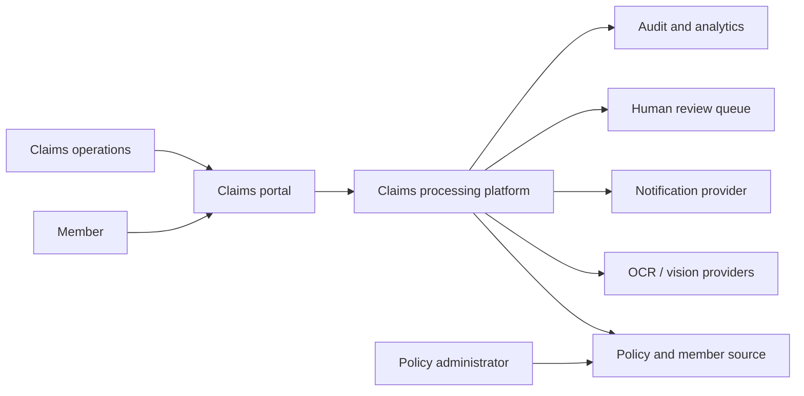
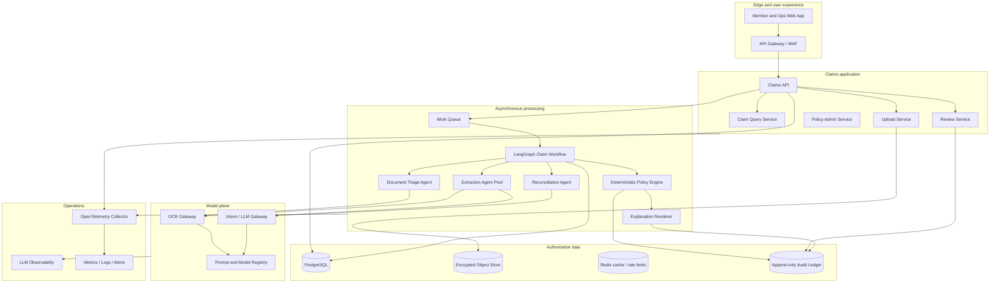
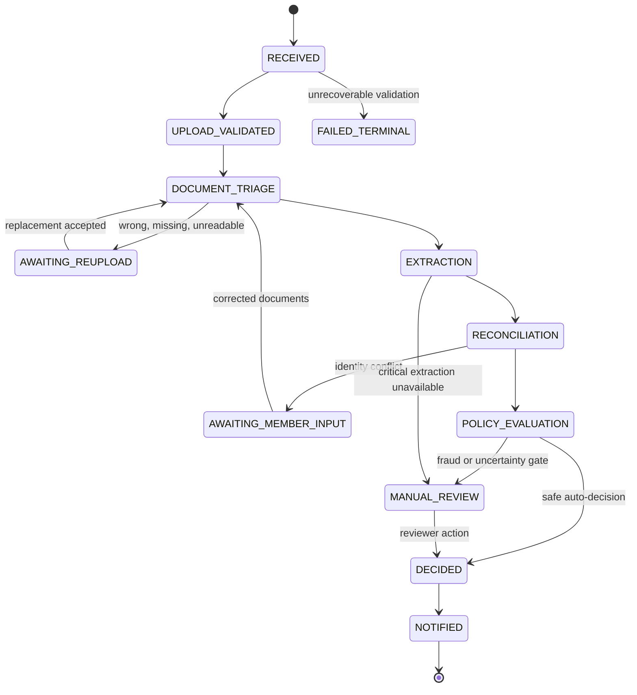
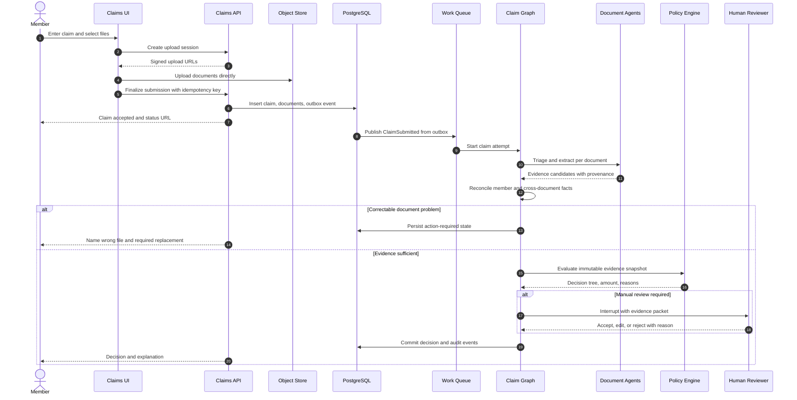
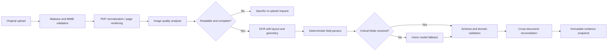
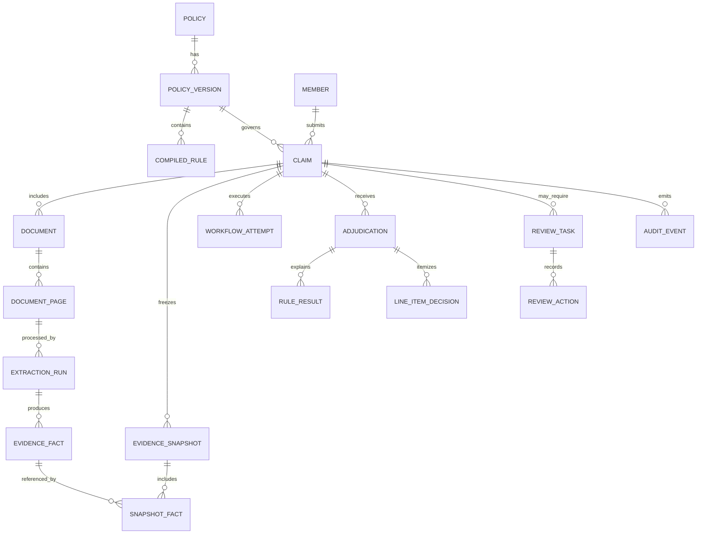
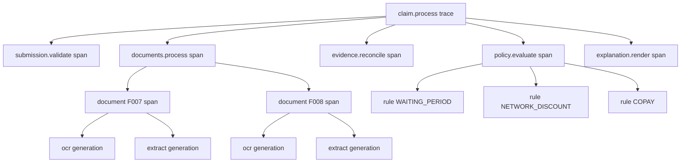
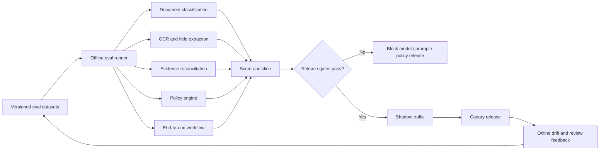
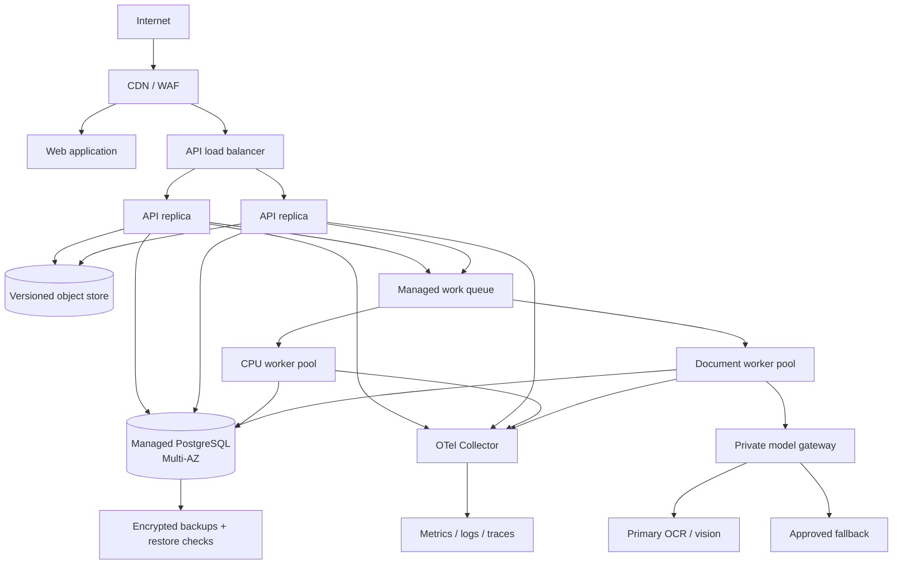

# Production Architecture for the Plum Claims Processing System

Status: proposed architecture  
Source baseline: `problem_statement/` package, version 2.0 test cases  
Prepared: 2026-07-28  
Target: production-grade design with a 2 to 3 day assignment implementation path and explicit scale seams

## 1. Executive recommendation

Build a **durable claim-processing workflow**, not a free-form society of agents.

Use LangGraph 1.0.x as the orchestration framework for the AI-bearing portion of the claim workflow. Model the workflow as one typed state graph with narrow specialist nodes. Persist every state transition. Allow models to classify documents, extract fields, normalize clinical text, and reconcile evidence. Do not allow a model to calculate payable amounts, interpret rule precedence on its own, or write the final claim state directly.

Use:

- A server-rendered web application for member upload and operations review.
- A Python API service, with FastAPI as the pragmatic implementation choice.
- PostgreSQL as the authoritative transactional database.
- An S3-compatible object store for original documents and derived page images.
- A managed work queue for asynchronous claim processing.
- LangGraph for checkpointed agent orchestration and human interruption.
- A deterministic, versioned policy engine for eligibility and financial calculations.
- Google Enterprise Document OCR as the first production OCR candidate, selected only after a bake-off on Indian medical documents.
- A vision-capable structured-output model, initially Gemini 3.6 Flash or the current approved equivalent, only for fields that OCR and deterministic parsing cannot resolve.
- OpenTelemetry for vendor-neutral service telemetry.
- Langfuse for LLM traces, prompt/model versions, datasets, experiments, and evaluation views.
- A separate append-only domain audit ledger for legally and operationally meaningful claim evidence. Observability data is not the audit record.

The first implementation should be a modular monolith plus worker, not many networked microservices. The module boundaries below are service seams. Split them only when load, ownership, data isolation, or release cadence proves the need.

Rendered overview artifacts are available in [`diagrams/claims-architecture.svg`](diagrams/claims-architecture.svg), [`diagrams/claims-architecture.png`](diagrams/claims-architecture.png), and the editable [`diagrams/claims-architecture.excalidraw`](diagrams/claims-architecture.excalidraw). The Mermaid source is [`diagrams/claims-architecture.mmd`](diagrams/claims-architecture.mmd).

### 1.1 The central architectural rule

> Agents produce evidence. Deterministic code applies policy. Humans resolve ambiguity. No model directly authorizes payment.

This rule gives the system useful AI behavior without making the claim decision a black box.

### 1.2 Recommended agent topology

| Unit | Type | Uses a model? | Authority |
|---|---|---:|---|
| Submission validator | Deterministic component | No | May reject malformed API input |
| Document triage agent | Bounded perception agent | Yes | May request a specific re-upload; cannot adjudicate |
| Document extraction agents | Schema-bound specialist agents | Yes | Produce field candidates and evidence locations |
| Evidence reconciliation agent | Bounded consistency agent | Sometimes | Produces conflicts and normalized facts |
| Clinical normalization agent | Bounded terminology agent | Sometimes | Maps text to policy concepts; never invents diagnoses |
| Fraud signal detector | Rules first, ML later | Optional | Routes to review; never auto-rejects solely on anomaly |
| Policy engine | Deterministic domain service | No | Produces adjudication recommendation and amount |
| Explanation renderer | Deterministic template service | No by default | Explains recorded rule and evidence nodes |
| Human reviewer | Human-in-the-loop actor | No | May confirm, amend, or override with a reason |

Do not build a planner agent, a debate agent, an autonomous supervisor that invents tasks, or multiple agents that vote on the claim outcome. Those patterns add latency and nondeterminism without improving the central job: faithfully turning evidence plus policy into an auditable decision.

## 2. What the source package requires

The package defines six non-negotiable behaviors:

1. Accept a claim with member, treatment, amount, and one or more images or PDFs.
2. Stop before adjudication when a required document is missing, wrong, unreadable, or belongs to a different patient.
3. Extract patient, clinical, provider, date, and financial fields from messy Indian medical documents.
4. Return `APPROVED`, `PARTIAL`, `REJECTED`, or `MANUAL_REVIEW`, plus amount, reasons, and confidence.
5. Preserve a trace that explains every check, failure, and confidence reduction.
6. Continue safely when a non-critical component fails.

The evaluation weights make architecture and observability half the score. The design therefore treats the decision trace and component contracts as first-class product outputs, not debugging additions.

## 3. Source inconsistencies that must be resolved

The supplied policy and expected test outcomes are not fully consistent. A production system must fail policy publication when contradictions are unresolved. It must not silently bend rules until tests pass.

### 3.1 Contradiction register

| ID | Source facts | Conflict | Required owner decision |
|---|---|---|---|
| C1 | Global `per_claim_limit` is ₹5,000; TC006 expects ₹8,000 dental approval on a ₹12,000 claim | The expected approval exceeds the global per-claim limit | Define whether category rules override the global limit or whether TC006 is wrong |
| C2 | Consultation `sub_limit` is ₹2,000; TC010 expects ₹3,240 approval after discount and co-pay | The expected amount exceeds the stated category sub-limit | Define whether `sub_limit` is annual, per item, per claim, or intentionally ignored in this fixture |
| C3 | TC008 expects full rejection when ₹7,500 exceeds the ₹5,000 per-claim limit | Many insurance engines cap rather than fully reject over-limit claims | Specify `REJECT`, `CAP`, or category-specific behavior |
| C4 | TC011 expects `APPROVED` and also recommends manual review after a component failure | An adjudication result and a payment-release status are being conflated | Separate adjudication recommendation from release/operations status |
| C5 | Dental says `requires_dental_report: true`, but document requirements make `DENTAL_REPORT` optional | Two policy fields disagree about mandatory documents | Define one canonical document requirement source |
| C6 | Several dependents referenced by employees are absent from the roster | Referential integrity is incomplete | Complete the roster or reject unpublished policy versions |

### 3.2 Assignment-safe handling

For the assignment:

- Keep the original JSON immutable.
- Compile it into a versioned policy intermediate representation.
- Emit validation warnings for C1 through C6.
- Create an explicit `assignment_fixture_overlay_v2.json` only if exact expected outputs must be reproduced.
- Make overlays domain-based, such as rule precedence or category semantics. Never branch on `case_id`.
- Show the overlay and its rationale in the eval report.

For production:

- Block activation of a policy version with unresolved errors.
- Require four-eyes approval for policy publication.
- Store the author, reviewer, source document, effective date, compiler version, checksum, and semantic diff.

## 4. Quality attributes and invariants

### 4.1 Hard invariants

1. Original uploads are immutable.
2. Every extracted field links to a page and bounding region or explicit whole-document evidence.
3. Every decision links to one policy version and one policy compiler version.
4. Money uses integer paise or fixed-precision decimal, never binary floating point.
5. Re-running the same accepted submission cannot create a second claim or double-use a benefit.
6. A model response is untrusted input until schema validation and domain validation pass.
7. Missing evidence is represented as `UNKNOWN`, not `false`.
8. Fraud suspicion routes to review and does not become a rejection reason unless an approved policy explicitly permits it.
9. An operations override records the before value, after value, actor, timestamp, and reason.
10. Logs and model traces do not contain raw health documents or unrestricted personally identifiable information.

### 4.2 Initial service objectives

These are starting targets to validate with actual traffic:

| Measure | Initial target |
|---|---:|
| Submission API availability | 99.9% monthly |
| Submission API p95 latency, excluding upload bytes | under 500 ms |
| Clean 1 to 3 page claim p50 completion | under 20 s |
| Clean 1 to 3 page claim p95 completion | under 60 s |
| Workflow completion without operator retry | at least 99.5% |
| Trace completeness | 100% of terminal claims |
| Duplicate financial decision rate | 0 |
| Auto-decision policy arithmetic mismatch | 0 |
| Required-document false accept rate | below 0.5% |
| Manual-review queue age p95 | business-defined, alarmed |

Do not promise these as facts. Instrument them, establish a baseline, and then set contractual objectives.

## 5. System context



The claims platform owns orchestration and evidence lineage. It does not treat OCR providers, model providers, or an observability vendor as a source of business truth.

## 6. Logical component architecture



## 7. Why a modular monolith first

A modular monolith means one deployable application with enforced internal boundaries. It is not unstructured code.

The assignment begins with 75,000 claims per year, about 205 claims per day on average. Even a 20x peak is not a reason to introduce ten networked services. Document pages and model calls dominate workload, not API request volume. Scale the worker pool and provider concurrency independently while keeping claim transactions local to PostgreSQL.

Start with these deployables:

1. `web`: member and operations UI.
2. `api`: synchronous submission, query, review, and policy APIs.
3. `worker`: LangGraph workflows and document tasks.
4. `scheduler`: retries, reconciliation scans, eval jobs, and retention tasks.

Keep the following code modules independent inside `api` and `worker`:

- `claims`
- `documents`
- `evidence`
- `policy`
- `adjudication`
- `review`
- `audit`
- `models`
- `evaluation`
- `notifications`

Split a module into a service only when at least one of these is true:

- It needs a materially different scaling profile.
- It has a separate data sensitivity boundary.
- A separate team owns its release and on-call lifecycle.
- Its failure domain must be isolated.
- Its runtime or region requirements differ.

The OCR/model gateway is the first likely extraction because it scales per page and must enforce provider budgets and data-routing controls.

## 8. Agent framework decision

### 8.1 Recommendation: LangGraph for the AI workflow

LangGraph is a good fit because the workflow is stateful, branch-heavy, retryable, and may pause for human input. Current LangGraph documentation describes checkpoint-backed state, durable execution, interrupts for human input, subgraphs, and resumable long-running agents.

Use LangGraph only inside the processing plane. Keep the API, policy engine, persistence schema, and audit ledger framework-independent.

Recommended graph settings:

- A PostgreSQL checkpointer in every non-local environment.
- One stable `thread_id` per claim processing attempt.
- Synchronous durability before any irreversible boundary.
- Explicit retry policies only for transient provider errors.
- Interrupts before human review or policy override.
- Subgraphs for per-document processing and reconciliation.
- Typed state with schema versioning.
- Nodes that return state deltas rather than mutate global objects.

### 8.2 Why not a fully autonomous multi-agent framework

| Option | Decision | Reason |
|---|---|---|
| LangGraph typed workflow | Choose | Explicit state, branches, persistence, retries, and human pauses fit claims |
| Agent chat crews | Reject | Conversation is a poor representation of policy state and evidence lineage |
| Planner-executor loop | Reject | The task graph is known in advance; planning adds failure modes |
| Multi-agent voting | Reject | Agreement between models is not calibrated evidence |
| Hand-written `if/else` pipeline only | Reject for full production | Easy initially, but human pauses, resumability, and per-node retries become brittle |
| Large workflow platform plus LangGraph on day one | Defer | Adds two durable state machines and unclear ownership |

### 8.3 Framework escape hatch

Define a `ClaimWorkflow` port:

```python
class ClaimWorkflow(Protocol):
    async def start(self, claim_id: UUID, attempt_id: UUID) -> None: ...
    async def resume(self, claim_id: UUID, command: ReviewCommand) -> None: ...
    async def status(self, claim_id: UUID) -> WorkflowStatus: ...
    async def cancel(self, claim_id: UUID, reason: str) -> None: ...
```

LangGraph implements this port. Domain modules never import LangGraph types. This prevents orchestration framework lock-in.

## 9. Claim workflow

### 9.1 State machine



`AWAITING_REUPLOAD` is not `REJECTED`. It is an incomplete submission with a precise remediation request.

### 9.2 End-to-end sequence



### 9.3 Graph nodes

```text
load_claim
  -> validate_submission
  -> fan_out_document_triage
  -> document_gate
       -> await_reupload
       -> fan_out_extraction
  -> reconcile_evidence
  -> identity_gate
       -> await_member_input
       -> normalize_clinical_terms
  -> detect_fraud_signals
  -> freeze_evidence_snapshot
  -> evaluate_policy
  -> confidence_gate
       -> interrupt_for_manual_review
       -> render_explanation
  -> persist_terminal_result
  -> publish_notifications
```

The graph may fan out by document page, but it must fan in before freezing the evidence snapshot. Policy evaluation sees one immutable, versioned snapshot.

## 10. Typed workflow state

```python
class ClaimGraphState(TypedDict):
    schema_version: Literal["1"]
    claim_id: UUID
    attempt_id: UUID
    policy_version_id: UUID
    claim_snapshot_version: int
    document_ids: list[UUID]
    triage_results: dict[UUID, DocumentTriageResult]
    extraction_result_ids: list[UUID]
    evidence_snapshot_id: UUID | None
    validation_issues: list[Issue]
    degraded_components: list[ComponentFailure]
    fraud_signals: list[FraudSignal]
    adjudication_id: UUID | None
    review_task_id: UUID | None
    next_action: NextAction | None
```

Do not store full images, raw OCR documents, full prompts, or large model responses in graph state. Store immutable object or database references. This keeps checkpoints small and reduces sensitive-data replication.

## 11. Component contracts

### 11.1 Contract conventions

Every component response has:

```json
{
  "contract_version": "1.0",
  "request_id": "uuid",
  "status": "SUCCEEDED | DEGRADED | RETRYABLE_FAILURE | PERMANENT_FAILURE",
  "result": {},
  "issues": [],
  "metrics": {
    "duration_ms": 0
  }
}
```

Errors are data when the graph can continue. Exceptions are reserved for programmer errors or infrastructure failures that prevent a valid contract response.

### 11.2 Submission service

Input:

- Member and policy identifiers.
- Claim category and treatment date.
- Claimed amount in paise.
- Finalized upload object identifiers.
- Client idempotency key.

Output:

- Claim identifier.
- Current status.
- Accepted document identifiers.
- Poll or subscription location.

Errors:

- `INVALID_INPUT`
- `UNKNOWN_MEMBER`
- `UNKNOWN_POLICY`
- `POLICY_NOT_ACTIVE`
- `UPLOAD_NOT_FINALIZED`
- `DUPLICATE_IDEMPOTENCY_KEY_WITH_DIFFERENT_BODY`
- `UNSUPPORTED_MEDIA_TYPE`
- `FILE_TOO_LARGE`
- `MALWARE_DETECTED`

### 11.3 Document triage

Input:

```json
{
  "claim_category": "CONSULTATION",
  "required_types": ["PRESCRIPTION", "HOSPITAL_BILL"],
  "document": {
    "document_id": "uuid",
    "object_version": "string",
    "mime_type": "image/jpeg",
    "page_count": 1
  }
}
```

Output:

```json
{
  "document_id": "uuid",
  "predicted_type": "PRESCRIPTION",
  "type_confidence": 0.98,
  "quality": "GOOD",
  "quality_score": 0.91,
  "quality_issues": [],
  "is_complete": true,
  "evidence": [
    {"page": 1, "bbox": [0.04, 0.02, 0.92, 0.20], "label": "prescription_header"}
  ],
  "model_run_id": "uuid"
}
```

Errors:

- `UNREADABLE`
- `PASSWORD_PROTECTED_PDF`
- `CORRUPT_FILE`
- `PAGE_LIMIT_EXCEEDED`
- `UNSUPPORTED_DOCUMENT`
- `MODEL_TIMEOUT`
- `MODEL_SCHEMA_INVALID`

### 11.4 Document extractor

Input:

- Immutable document version.
- Predicted document type.
- OCR blocks with geometry and confidence.
- Type-specific extraction schema.
- Model and prompt policy.

Output:

- Document-level facts.
- Repeated line items or medicines.
- One or more candidates per ambiguous field.
- Field confidence.
- Exact evidence references.
- Explicit missing fields.
- Alteration and ambiguity markers.

Each fact follows:

```json
{
  "field": "patient.name",
  "normalized_value": "Rajesh Kumar",
  "raw_value": "Rajesh Kumar",
  "status": "PRESENT",
  "confidence": 0.97,
  "evidence": {
    "document_id": "uuid",
    "page": 1,
    "bbox": [0.08, 0.23, 0.41, 0.28],
    "text_span_hash": "sha256:..."
  },
  "producer": {
    "ocr_provider": "google_document_ai",
    "ocr_version": "pinned-version",
    "model_provider": "google",
    "model": "pinned-model-version",
    "prompt_version": "extract-prescription@3"
  }
}
```

### 11.5 Evidence reconciler

Input:

- Claim submission facts.
- Member roster snapshot.
- All document facts.
- Matching thresholds and normalization version.

Output:

- Canonical facts.
- Source candidates.
- Agreement and contradiction records.
- Identity match result.
- Required missing facts.
- Review or re-upload recommendation.

Errors:

- `IDENTITY_CONFLICT`
- `DATE_CONFLICT`
- `AMOUNT_MISMATCH`
- `INSUFFICIENT_EVIDENCE`
- `AMBIGUOUS_PROVIDER`

The reconciler cannot silently choose between contradictory high-confidence patient names.

### 11.6 Policy engine

Input:

```json
{
  "policy_ir_version": "uuid",
  "member_snapshot_id": "uuid",
  "claim_snapshot_id": "uuid",
  "evidence_snapshot_id": "uuid",
  "as_of": "2024-11-03"
}
```

Output:

```json
{
  "recommendation": "APPROVED",
  "claimed_amount_paise": 450000,
  "approved_amount_paise": 324000,
  "line_item_results": [],
  "rule_results": [],
  "calculation_steps": [
    {"operation": "NETWORK_DISCOUNT", "rate_bps": 2000, "before": 450000, "after": 360000},
    {"operation": "COPAY", "rate_bps": 1000, "before": 360000, "after": 324000}
  ],
  "reason_codes": [],
  "policy_version_id": "uuid",
  "engine_version": "1.0.0"
}
```

Errors:

- `POLICY_NOT_COMPILED`
- `POLICY_VERSION_MISMATCH`
- `MISSING_CRITICAL_FACT`
- `RULE_CONFLICT`
- `ARITHMETIC_INVARIANT_FAILED`

### 11.7 Manual review

Input:

- Decision recommendation.
- Evidence packet.
- Conflicts and degraded components.
- Allowed reviewer actions.

Output:

- `ACCEPT_RECOMMENDATION`, `AMEND`, `REQUEST_DOCUMENT`, or `REJECT_RECOMMENDATION`.
- Structured reason code.
- Required free-text note for overrides.
- Actor and role.
- Before/after decision diff.

Errors:

- `STALE_REVIEW_VERSION`
- `UNAUTHORIZED_ACTION`
- `REVIEW_ALREADY_CLOSED`
- `INVALID_OVERRIDE`

Use optimistic locking, which means a reviewer update succeeds only if the claim version is still the one they opened. This prevents two reviewers from unknowingly overwriting each other.

## 12. Document and OCR architecture

### 12.1 Processing stages



### 12.2 Model recommendation

Do not use one multimodal model as both OCR engine and adjudicator.

Recommended routing:

1. **Digital PDF text layer**: extract natively first. Preserve coordinates when available.
2. **Primary OCR candidate**: Google Enterprise Document OCR. Its current documentation describes printed text, handwriting, layout, deskewing, and image-quality scores. Pin a processor version.
3. **Alternative OCR bake-off**: Azure Document Intelligence `prebuilt-read`, which returns words, line geometry, confidence, and handwritten-style signals.
4. **Bills and receipts experiment**: compare the generic OCR route with a receipt/invoice parser. AWS Textract `AnalyzeExpense` is an alternative for summary fields and line items, but must win on the actual Indian clinic and pharmacy corpus.
5. **Vision fallback**: Gemini 3.6 Flash or the currently approved stable multimodal model with JSON Schema structured output. Invoke it only for unresolved fields, handwriting, complex corrections, stamps, or semantic classification.
6. **Escalation model**: a higher-cost multimodal model only when the fast model is uncertain and the expected reduction in review work justifies the cost.
7. **Human review**: mandatory when critical identity, date, amount, or eligibility evidence remains ambiguous.

The exact model choice is an eval result, not an architecture belief. Hide providers behind:

```python
class DocumentIntelligenceProvider(Protocol):
    async def analyze(
        self,
        document: DocumentRef,
        task: DocumentTask,
        schema: type[BaseModel],
        policy: ModelRoutingPolicy,
    ) -> ProviderResult: ...
```

### 12.3 Image preprocessing

Preprocessing is conditional. Always retain the original.

- Correct orientation from metadata and detected text angle.
- Render PDFs at a controlled resolution.
- Deskew phone photos.
- Detect blur, glare, crop loss, and shadows.
- Apply contrast normalization only when it improves the validation set.
- Split multi-page documents while preserving order.
- Hash every original and derivative.
- Never overwrite the original with an enhanced image.

Aggressive thresholding can erase faint handwriting and stamps. Measure field accuracy before enabling a transform.

### 12.4 Type-specific extraction schemas

Maintain separate schemas for:

- `Prescription`
- `HospitalBill`
- `LabReport`
- `PharmacyBill`
- `DentalReport`
- `DiagnosticReport`
- `PreAuthorization`
- `DischargeSummary`

Do not use a single giant nullable schema. Type-specific schemas give clearer prompts, validators, metrics, and failure messages.

### 12.5 Confidence at field level

Provider confidence is not globally calibrated. Treat it as a feature.

For each critical field, retain:

- OCR token confidence.
- Extractor confidence.
- Schema validation outcome.
- Cross-document agreement.
- Member-record agreement.
- Visual quality.
- Evidence coverage.
- Whether a fallback or human supplied the value.

A candidate field becomes trusted only after deterministic validation. Examples:

- Dates must parse and fall within plausible claim and policy windows.
- Line-item sums must reconcile to totals within a configured tolerance.
- Doctor registration numbers must match a known structural pattern, but pattern validity does not prove a real registration.
- Patient identity requires normalized name agreement plus corroborating fields when available.
- A model may normalize `T2DM` to diabetes, but must preserve the raw text and evidence.

## 13. Early document gate

The first three test cases require the system to stop before adjudication.

The gate evaluates:

1. Required type coverage.
2. Duplicate types that displace a required type.
3. Readability.
4. Page completeness.
5. Cross-document patient identity.
6. Claimed member identity.
7. Basic date coherence.

Example message contract:

```json
{
  "status": "ACTION_REQUIRED",
  "code": "REQUIRED_DOCUMENT_REPLACEMENT",
  "title": "Replace one prescription with the hospital bill",
  "message": "You uploaded two prescriptions. A consultation claim needs one prescription and one hospital bill. Replace another_prescription.jpg with the itemized hospital bill for the 1 November 2024 visit.",
  "documents": [
    {
      "file_name": "another_prescription.jpg",
      "detected_type": "PRESCRIPTION",
      "required_replacement_type": "HOSPITAL_BILL"
    }
  ],
  "can_resubmit": true
}
```

Message generation should be template-based from structured issues. A language model may translate or soften copy, but it must not change the required action.

## 14. Evidence reconciliation

### 14.1 Identity resolution

Normalize:

- Unicode and whitespace.
- Honorifics such as `Dr`, `Mr`, and `Mrs`.
- Common punctuation and transliteration variants.
- Order-independent name tokens where culturally appropriate.

Then compare:

- Submitted member name.
- Roster name.
- Patient name on every required document.
- Date of birth or age, when present.
- Gender, when present.
- Primary/dependent relationship.

Use explicit outcomes:

- `MATCH`
- `PROBABLE_MATCH`
- `CONFLICT`
- `INSUFFICIENT_EVIDENCE`

Only `MATCH` may pass automatic identity gates. `PROBABLE_MATCH` needs corroboration or review.

### 14.2 Amount reconciliation

For each bill:

```text
derived_total = sum(line_item.net_amount)
stated_total = extracted bill total
claimed_amount = submission amount
```

Persist all three. Differences are not silently corrected.

Suggested issue types:

- `LINE_ITEMS_DO_NOT_SUM`
- `CLAIMED_AMOUNT_EXCEEDS_BILL`
- `MULTIPLE_BILL_TOTALS`
- `CORRECTED_AMOUNT_PRESENT`
- `AMOUNT_TEXT_AND_FIGURES_DISAGREE`

### 14.3 Clinical normalization

Normalize only to policy concepts needed for adjudication:

- Diagnosis synonyms and abbreviations.
- Treatment and procedure names.
- Medicine brand/generic class when policy requires it.
- Test families such as MRI, CT, and PET.
- Exclusion concepts such as bariatric treatment or cosmetic dental work.

Return a ranked mapping with evidence. Do not create a medical diagnosis that is absent from the document.

## 15. Deterministic policy engine

### 15.1 Policy lifecycle


### 15.2 Policy intermediate representation

Do not evaluate arbitrary JSON throughout the application. Compile the file into typed rules:

```python
class RuleIR(BaseModel):
    rule_id: str
    version: int
    priority: int
    effective_from: date
    effective_to: date | None
    scope: RuleScope
    predicate: PredicateIR
    effect: EffectIR
    source_pointer: str
```

Each rule has a stable ID such as:

- `DOC.CONSULTATION.REQUIRED_TYPES`
- `ELIGIBILITY.DIABETES.WAIT_90D`
- `EXCLUSION.OBESITY_TREATMENT`
- `PREAUTH.MRI.ABOVE_10000`
- `LIMIT.GLOBAL.PER_CLAIM`
- `DISCOUNT.NETWORK.CONSULTATION`
- `COPAY.CONSULTATION.10PCT`

### 15.3 Proposed rule order

The business owner must approve final precedence. A safe starting order is:

1. Policy and member validity.
2. Submission window and minimum amount.
3. Required evidence sufficiency.
4. Waiting periods.
5. Explicit exclusions.
6. Pre-authorization requirements.
7. Line-item coverage classification.
8. Category and per-claim limits.
9. Annual and family limits.
10. Network contractual adjustment.
11. Co-pay.
12. Rounding and zero-payable handling.
13. Fraud and manual-review routing.

The order is data, versioned with the policy. TC010 proves why financial operation order must be explicit.

### 15.4 Rule result tree

```json
{
  "rule_id": "COPAY.CONSULTATION.10PCT",
  "outcome": "APPLIED",
  "inputs": {
    "eligible_amount_paise": 360000,
    "copay_basis_points": 1000
  },
  "outputs": {
    "member_share_paise": 36000,
    "payable_amount_paise": 324000
  },
  "evidence_refs": ["fact:hospital.network_match"],
  "policy_source": "/opd_categories/consultation/copay_percent",
  "children": []
}
```

This tree powers the operations trace and member explanation. Do not ask a model to reconstruct the rationale after the fact.

### 15.5 Arithmetic invariants

- `approved_amount >= 0`
- `approved_amount <= claimed_amount`
- `sum(approved_line_items) == pre_adjustment_eligible_amount`
- Discounts and co-pay apply in configured order.
- Every deduction has one reason code.
- Re-evaluation of the same evidence and policy versions produces identical output.
- All rounding uses one documented rule.

## 16. Separate adjudication from lifecycle status

One enum is not enough.

Use:

```text
adjudication_recommendation:
  APPROVED | PARTIAL | REJECTED | MANUAL_REVIEW

claim_status:
  RECEIVED | PROCESSING | ACTION_REQUIRED | IN_REVIEW | DECIDED | CLOSED

release_status:
  NOT_APPLICABLE | HELD | ELIGIBLE_FOR_PAYMENT | RELEASED
```

TC011 can then produce:

- `adjudication_recommendation = APPROVED`
- `claim_status = IN_REVIEW` or `DECIDED`, depending on the assignment contract
- `release_status = HELD`
- `manual_review_recommended = true`
- `degraded_components = [...]`

In production, a degraded critical component should normally hold payment even if the available policy evidence points to approval.

## 17. Confidence design

Do not invent confidence by averaging model self-scores.

### 17.1 Three separate confidence values

1. `document_confidence`: probability that document type and readability are correct.
2. `evidence_confidence`: calibrated probability that required canonical facts are correct.
3. `decision_confidence`: calibrated probability that the recommendation and amount match a qualified human adjudicator under the same policy.

### 17.2 Calibration features

- Minimum confidence across critical fields.
- Cross-document agreement count.
- Identity match class.
- Bill arithmetic reconciliation.
- Number and severity of missing facts.
- Document quality bucket.
- Model route and prompt version.
- Provider disagreement.
- Policy ambiguity.
- Degraded component count.
- Whether the case is out of the training/eval distribution.

Train a lightweight calibration model only after enough labeled decisions exist. Before that, use conservative, transparent bands:

| Band | Meaning | Allowed action |
|---|---|---|
| High | All critical evidence validated and no conflicts | Eligible for auto-decision |
| Medium | Non-critical ambiguity or fallback used | Decision visible; release policy may hold |
| Low | Critical ambiguity, conflict, or degraded control | Manual review |

Always place hard gates before the confidence threshold. A 0.99 average cannot cancel a patient-name conflict.

### 17.3 Calibration metrics

- Brier score.
- Expected calibration error.
- Reliability plot.
- Coverage versus selective risk.
- False-auto-approval rate.
- False-auto-rejection rate.
- Amount-weighted error.

## 18. Data architecture

### 18.1 Storage choices

| Data | Store | Reason |
|---|---|---|
| Claims, statuses, policy versions, reviews | PostgreSQL | Transactions, constraints, joins, audit references |
| Original files and page derivatives | Object storage | Large immutable blobs, lifecycle policies, versioning |
| Graph checkpoints | PostgreSQL | Durable workflow recovery near claim data |
| Rate limits and short-lived cache | Redis | Fast ephemeral coordination |
| Async work | Managed queue | Backpressure, retries, dead-letter handling |
| Service traces and metrics | Observability backend | Operational diagnosis |
| Model traces and eval datasets | Langfuse or equivalent | AI-specific analysis |
| Business audit events | PostgreSQL append-only ledger, exported to immutable archive | Domain truth and retention control |

Do not add a vector database to the claim decision path. The policy is structured and small. Exact, versioned rule evaluation is better than retrieval. A vector index may later support operations search or similar-case discovery, never policy authority.

### 18.2 Entity model



### 18.3 Core tables

`claims`

- `id UUID PK`
- `tenant_id UUID`
- `external_reference TEXT`
- `member_id UUID`
- `policy_version_id UUID`
- `category claim_category`
- `treatment_date DATE`
- `claimed_amount_paise BIGINT`
- `claim_status`
- `adjudication_recommendation`
- `release_status`
- `version INTEGER`
- `created_at`, `updated_at`
- unique `(tenant_id, external_reference)`

`documents`

- `id UUID PK`
- `claim_id UUID FK`
- `object_key TEXT`
- `object_version TEXT`
- `sha256 BYTEA`
- `mime_type TEXT`
- `size_bytes BIGINT`
- `page_count INTEGER`
- `supersedes_document_id UUID NULL`
- `upload_status`
- unique `(claim_id, sha256)`

`evidence_facts`

- `id UUID PK`
- `claim_id UUID`
- `document_id UUID`
- `extraction_run_id UUID`
- `field_path TEXT`
- `normalized_value JSONB`
- `raw_value_encrypted BYTEA`
- `status`
- `confidence NUMERIC(5,4)`
- `page INTEGER`
- `bbox NUMERIC[]`
- `text_span_hash BYTEA`
- `created_at`

`adjudications`

- `id UUID PK`
- `claim_id UUID`
- `evidence_snapshot_id UUID`
- `policy_version_id UUID`
- `engine_version TEXT`
- `recommendation`
- `claimed_amount_paise BIGINT`
- `approved_amount_paise BIGINT`
- `decision_confidence NUMERIC(5,4)`
- `reason_codes TEXT[]`
- `calculation JSONB`
- `created_at`
- unique `(claim_id, evidence_snapshot_id, policy_version_id, engine_version)`

`audit_events`

- `sequence BIGSERIAL PK`
- `event_id UUID UNIQUE`
- `tenant_id UUID`
- `claim_id UUID`
- `event_type TEXT`
- `actor_type TEXT`
- `actor_id UUID NULL`
- `occurred_at TIMESTAMPTZ`
- `payload JSONB`
- `previous_event_hash BYTEA`
- `event_hash BYTEA`
- `trace_id TEXT`

### 18.4 Indexes

Start with:

- `claims(tenant_id, created_at DESC)`
- `claims(member_id, treatment_date DESC)`
- `claims(claim_status, updated_at)` for work queues.
- `documents(claim_id)`
- `evidence_facts(claim_id, field_path)`
- `review_tasks(status, priority DESC, created_at)`
- `audit_events(claim_id, sequence)`
- partial index on open review tasks.
- GIN only for measured JSONB query needs.

Do not index sensitive raw values unless an actual query requires it.

## 19. Consistency, idempotency, and concurrency

Idempotency means retrying the same operation produces one logical result.

### 19.1 Submission

- Client sends an idempotency key.
- API hashes the canonical request body.
- The database stores `(tenant_id, key, body_hash, response)`.
- Same key and body returns the first response.
- Same key and different body returns `409`.

### 19.2 Transactional outbox

Write the claim and `ClaimSubmitted` event in one PostgreSQL transaction. A relay publishes the outbox row to the queue and marks it published. Consumers keep an inbox table keyed by event ID so duplicate deliveries are safe.

### 19.3 Workflow attempts

- One active attempt per claim snapshot.
- Each node has a deterministic operation key.
- Provider calls record a request fingerprint.
- Completed node results are immutable and reusable.
- Re-upload creates a new document version and claim snapshot.
- Policy re-evaluation creates a new adjudication, never edits the prior one.

### 19.4 Concurrent reviews

Review writes include `expected_claim_version`. A stale update fails with `409 STALE_REVIEW_VERSION`. The reviewer sees the intervening change and must re-open the packet.

## 20. Failure design

### 20.1 Failure classification

| Class | Examples | Action |
|---|---|---|
| Member-correctable | Wrong document, unreadable image, password-protected PDF | Stop and request a precise correction |
| Transient provider | Timeout, `429`, `503` | Retry with bounded exponential delay and jitter |
| Permanent provider | Unsupported format, repeated schema failure | Try approved fallback or route to review |
| Domain ambiguity | Patient mismatch, conflicting totals | Do not retry; request correction or review |
| Policy defect | Conflicting compiled rules | Stop auto-adjudication and page owner |
| Infrastructure | Database unavailable, queue unavailable | Preserve accepted submission and resume |
| Programmer defect | Invariant violation, unhandled state | Fail closed, alert, retain trace |

A circuit breaker temporarily stops calls to a repeatedly failing provider so workers do not amplify the outage.

### 20.2 Retry policy

- Retry only operations known to be safe.
- Maximum attempts and elapsed time vary by provider.
- Respect provider retry hints.
- Persist every attempt.
- Never retry schema-invalid model output with the identical prompt more than once.
- A fallback provider is a new recorded route, not an invisible retry.
- Send exhausted work to a dead-letter queue, which is a holding queue for jobs that need operator intervention.

### 20.3 Degraded operation

Maintain a component criticality matrix:

| Component | Failure effect |
|---|---|
| Notification | Decision persists; notification retries |
| Non-critical fraud enrichment | Continue, reduce confidence, recommend review |
| OCR on optional document | Continue if required evidence is complete |
| OCR on required bill | Cannot auto-adjudicate |
| Policy engine | No decision |
| Audit ledger write | No terminal decision commit |
| LLM observability | Continue; buffer telemetry |

This prevents “graceful degradation” from becoming “ignore any failure.”

## 21. API surface

### 21.1 Member APIs

```text
POST   /v1/upload-sessions
POST   /v1/claims
GET    /v1/claims/{claim_id}
GET    /v1/claims/{claim_id}/timeline
POST   /v1/claims/{claim_id}/documents
POST   /v1/claims/{claim_id}/actions/{action_id}/complete
```

### 21.2 Operations APIs

```text
GET    /v1/review-tasks
GET    /v1/review-tasks/{task_id}
POST   /v1/review-tasks/{task_id}/actions
GET    /v1/claims/{claim_id}/evidence
GET    /v1/claims/{claim_id}/rule-trace
POST   /v1/claims/{claim_id}/reprocess
```

### 21.3 Policy APIs

```text
POST   /v1/policies/{policy_id}/versions
POST   /v1/policy-versions/{version_id}/validate
POST   /v1/policy-versions/{version_id}/approve
POST   /v1/policy-versions/{version_id}/activate
GET    /v1/policy-versions/{version_id}/semantic-diff
```

### 21.4 Response envelope

```json
{
  "data": {},
  "meta": {
    "request_id": "uuid",
    "schema_version": "1.0"
  },
  "errors": []
}
```

Never expose provider stack traces or prompts through member APIs.

## 22. Explainability and the audit ledger

### 22.1 Operations trace

The operations UI should show:

1. Submission facts.
2. Original documents with evidence overlays.
3. Document type and quality checks.
4. Extracted field candidates and confidence.
5. Cross-document agreement and conflicts.
6. The exact policy version.
7. Rule results in evaluation order.
8. Financial calculation steps.
9. Component failures and fallbacks.
10. Human actions and overrides.

### 22.2 Member explanation

Member explanations should be concise and actionable:

- What was decided.
- Approved and unapproved amounts.
- Item-level reasons.
- Policy limit or exclusion involved.
- Dates and amounts used.
- What to upload or do next.
- How to request review.

Use structured templates keyed by reason code. Do not reveal fraud thresholds or internal risk features to members.

### 22.3 Audit versus observability

| Audit ledger | Observability |
|---|---|
| Business and compliance record | Engineering diagnosis |
| Append-only and retention-controlled | Sampled when appropriate |
| Stable domain event schemas | Tool/vendor-specific span schemas allowed |
| Redacted but reconstructable evidence references | No raw health data by default |
| Must survive observability vendor outage | May degrade temporarily |

## 23. Observability strategy

Do not build a tracing backend or prompt-evaluation UI from scratch.

Build:

- Domain event schemas.
- Claim and evidence identifiers.
- Redaction rules.
- Trace propagation.
- Service-level indicators.
- Audit views required by claims operations.

Buy or adopt:

- OpenTelemetry SDK and Collector.
- A metrics, logs, and traces backend.
- Langfuse or an equivalent LLM observability platform.

Langfuse currently supports nested traces and observations, model/cost/latency fields, datasets, experiments, evaluation scores, and self-hosting. OpenTelemetry gives vendor-neutral trace, metric, and log correlation.

### 23.1 Trace shape



### 23.2 Required correlation keys

- `trace_id`
- `claim_id` as a non-public opaque identifier.
- `attempt_id`
- `tenant_id`
- `policy_version_id`
- `evidence_snapshot_id`
- `document_id`
- `model_run_id`
- `prompt_version`
- `engine_version`
- `deployment_version`

### 23.3 Metrics

Product and decision:

- Claims by terminal result and category.
- Auto-decision coverage.
- Manual-review rate and queue age.
- Re-upload rate by reason.
- Reviewer override rate.
- Approved amount distribution.
- Appeal or correction rate.

Document and AI:

- Type classification precision and recall.
- Unreadable-document precision and recall.
- Field exact match and normalized match.
- Critical-field missing rate.
- Provider fallback rate.
- Schema-invalid model output rate.
- Tokens, cost, latency, and timeout rate by model and prompt version.

System:

- Queue depth and oldest message age.
- Worker saturation.
- Database pool saturation.
- Node retry and dead-letter counts.
- Object-store errors.
- End-to-end latency.

### 23.4 Privacy-safe telemetry

- Default to hashes or opaque IDs.
- Do not emit document text, diagnoses, names, addresses, phone numbers, or bill images.
- Store prompts with synthetic placeholders or restricted encrypted access.
- Sample verbose model payloads only in a controlled evaluation environment.
- Apply role-based access and short retention to sensitive traces.
- Test redaction as code.

## 24. Evaluation architecture

Evaluation must test perception, extraction, reconciliation, rules, the full workflow, and operational behavior separately.



### 24.1 Dataset layers

1. **Assignment golden set**: the 12 provided JSON scenarios.
2. **Synthetic document set**: rendered bills, prescriptions, lab reports, and pharmacy bills with controlled degradation.
3. **Human-labeled de-identified set**: real document layouts and handwriting, subject to approval.
4. **Adversarial set**: altered amounts, duplicate pages, mixed patients, prompt injection text, and conflicting totals.
5. **Regression set**: every confirmed production failure after de-identification.

Split by provider/template and member, not random page, to prevent near-duplicate leakage between train and test.

### 24.2 Component metrics

Document triage:

- Macro and per-class precision, recall, F1.
- Required-document false accept rate.
- Wrong-document message completeness.
- Unreadable detection precision and recall.

Extraction:

- Exact match.
- Normalized match.
- Character error rate for raw OCR.
- Field-level precision, recall, F1.
- Numeric absolute and relative error.
- Line-item table structure accuracy.
- Evidence-region overlap or verified page/span presence.
- Critical-field hallucination rate.

Reconciliation:

- Patient conflict detection recall.
- False conflict rate.
- Amount reconciliation accuracy.
- `UNKNOWN` correctness.

Policy engine:

- Exact decision match.
- Exact approved amount match in paise.
- Exact reason-code set.
- Rule trace completeness.
- Determinism under repeated execution.
- Boundary and property-based tests.

End to end:

- Test-case pass rate.
- Trace completeness.
- Action message quality.
- Graceful-degradation correctness.
- Latency and cost per claim/page.

### 24.3 Release gates

Example initial gates:

- 100% pass on deterministic policy unit and property tests.
- 12 of 12 assignment cases after documented fixture interpretation.
- 100% trace completeness.
- Zero critical identity false accepts in the golden set.
- Zero invented monetary values.
- No regression beyond an approved tolerance on any protected document-quality slice.
- Model cost and p95 latency remain within budget.
- Every prompt or model change produces a before/after eval artifact.

### 24.4 Test-case mapping

| Test | Primary component | Required assertion |
|---|---|---|
| TC001 | Document gate | Stops; names two prescriptions and missing hospital bill |
| TC002 | Quality gate | Requests pharmacy bill re-upload; no rejection |
| TC003 | Identity reconciler | Names Rajesh Kumar and Arjun Mehta; no adjudication |
| TC004 | Policy engine | 10% co-pay; ₹1,350 |
| TC005 | Waiting-period rule | Rejected; eligibility date shown |
| TC006 | Line-item coverage | Root canal approved; whitening excluded; contradiction C1 resolved |
| TC007 | Pre-auth rule | MRI threshold and resubmission action shown |
| TC008 | Limit rule | ₹5,000 versus ₹7,500 shown |
| TC009 | Fraud router | Manual review with same-day signals; no auto-reject |
| TC010 | Calculation order | 20% discount before 10% co-pay; contradiction C2 resolved |
| TC011 | Failure injection | No 500; component failure visible; lower confidence |
| TC012 | Exclusion rule | Obesity exclusion; high evidence confidence |

### 24.5 LLM-as-judge policy

Use model-based graders only for soft properties such as explanation clarity. Do not use them to grade arithmetic, reason codes, schema validity, or document identity. Calibrate soft graders against human labels and retain the grader model and prompt versions.

## 25. Testing strategy

### 25.1 Test pyramid

- Pure unit tests for policy rules, arithmetic, schemas, normalization, and state transitions.
- Property-based tests for monetary invariants and rule boundaries.
- Contract tests for OCR and model provider adapters using recorded fixtures.
- Component tests with a real PostgreSQL instance and object-store emulator.
- Workflow tests with fake providers and injected timeouts.
- End-to-end browser tests for upload, action required, approval trace, and human review.
- Load tests focused on pages per second and provider limits.
- Chaos tests for queue duplication, worker death, provider outage, and telemetry outage.

### 25.2 Mandatory failure injection

Support named injection points only outside production:

```text
after_upload_finalize
during_document_triage
during_ocr
during_extraction
before_policy_evaluation
after_decision_before_event_publish
during_notification
```

The eval runner should assert final state, retry count, audit events, and user-visible message.

### 25.3 Policy property examples

- Increasing co-pay cannot increase approved amount.
- Adding an excluded line item cannot increase approved amount.
- Reordering bill line items cannot change the result.
- Network discount order is stable.
- Same input, policy, and evidence versions produce byte-equivalent calculation steps.
- Approved amount never exceeds eligible covered line items.

## 26. Security and privacy

This system processes health and financial data. Treat every uploaded document as hostile and sensitive.

### 26.1 Controls

- Direct-to-object-store uploads using short-lived signed URLs.
- MIME sniffing, size limits, page limits, decompression limits, and malware scanning.
- Separate upload quarantine from accepted documents.
- Encryption in transit and at rest with managed keys.
- Tenant isolation in every query and object key.
- Least-privilege service identities.
- Role-based access for member, reviewer, policy administrator, auditor, and support.
- Step-up authentication for overrides and policy activation.
- Secret manager, never environment files in source control.
- Private networking for databases and internal services.
- Provider contracts and routing policies approved for health data.
- Retention and deletion jobs with legal-hold support.
- Immutable audit events.
- Regular restore tests, not backup existence checks.

### 26.2 Prompt injection

Prompt injection is document text that tries to instruct the model instead of acting as evidence.

Controls:

- Tell models that document content is untrusted data.
- Do not expose tools to extraction agents.
- Use schema-bound outputs.
- Separate system instructions from OCR text.
- Escape and delimit document content.
- Reject output containing unrequested actions or fields.
- Never allow text in a document to choose a policy, model, URL, or tool call.

### 26.3 India-specific governance

The production design needs legal review against applicable insurance, employment-benefit, and data-protection obligations. The Digital Personal Data Protection Rules 2025 are now published with phased commencement. ABDM guidance emphasizes consent, purpose limitation, privacy by design, and federated handling of health data. Translate legal requirements into versioned retention, consent, access, correction, deletion, breach, and processor-control requirements before launch.

This document is an engineering design, not legal advice.

## 27. Deployment architecture



### 27.1 Cloud mapping

Keep application ports cloud-neutral:

| Capability | AWS example | GCP example | Azure example |
|---|---|---|---|
| Containers | ECS/Fargate or EKS | Cloud Run or GKE | Container Apps or AKS |
| PostgreSQL | RDS/Aurora PostgreSQL | Cloud SQL/AlloyDB | Azure Database for PostgreSQL |
| Object storage | S3 | Cloud Storage | Blob Storage |
| Queue | SQS | Pub/Sub | Service Bus |
| Redis | ElastiCache | Memorystore | Azure Managed Redis |
| Keys/secrets | KMS/Secrets Manager | Cloud KMS/Secret Manager | Key Vault |

Choose the cloud already approved for protected health data. Avoid cross-cloud document transfer merely to use a model if a same-cloud option meets the eval gate.

### 27.2 Environments

- `local`: synthetic data only.
- `dev`: synthetic and redacted fixtures.
- `staging`: production-like controls, no unrestricted real data.
- `prod`: approved data region, restricted support access.
- `eval`: isolated, reproducible model and prompt experiments.

Each environment has separate keys, buckets, databases, model credentials, and observability projects.

## 28. Scaling model

### 28.1 Unit of capacity

Scale by document pages, not claims.

Track:

```text
pages_per_claim
ocr_seconds_per_page
vision_calls_per_page
tokens_per_page
worker_seconds_per_claim
provider_quota_per_minute
```

### 28.2 Backpressure

Backpressure means slowing intake into a constrained stage instead of allowing unbounded work to exhaust the system.

- Separate queues for triage, OCR, extraction, and review preparation if load warrants it.
- Set worker concurrency from provider quotas and database capacity.
- Use weighted jobs for multi-page documents.
- Prioritize member-blocking triage before enrichment.
- Pause low-priority reprocessing during provider incidents.
- Bound page count and file size.

### 28.3 Scale stages

**Stage 1: assignment and pilot**

- One API service.
- One worker service.
- PostgreSQL.
- Object storage.
- Simple managed queue.
- Redis optional.

**Stage 2: 10x throughput**

- Separate document workers from policy workers.
- Autoscale on queue age and page backlog.
- Batch compatible OCR calls where supported.
- Read replicas for operations queries.
- Partition audit exports by tenant and month.
- Provider quota management and fallback routing.

**Stage 3: multi-tenant enterprise**

- Strong tenant-aware access layer.
- Regional data planes if contracts require them.
- Dedicated model gateway.
- Policy publication service.
- Warehouse or lakehouse fed from redacted events.
- Per-tenant encryption keys for high-sensitivity customers where justified.

### 28.4 What not to do at 10x

- Do not shard PostgreSQL first.
- Do not add Kafka only because the word “scale” appears.
- Do not cache adjudication results without version keys.
- Do not place documents in a vector database.
- Do not increase model concurrency beyond provider and downstream limits.
- Do not split every agent into a network service.

## 29. Repository structure

```text
plumhq/
├── apps/
│   ├── api/
│   ├── web/
│   └── worker/
├── src/
│   ├── claims/
│   │   ├── domain/
│   │   ├── application/
│   │   └── adapters/
│   ├── documents/
│   │   ├── contracts/
│   │   ├── triage/
│   │   ├── extraction/
│   │   └── providers/
│   ├── evidence/
│   ├── policy/
│   │   ├── schema/
│   │   ├── compiler/
│   │   ├── engine/
│   │   └── explanations/
│   ├── workflow/
│   │   ├── graph.py
│   │   ├── state.py
│   │   ├── nodes/
│   │   └── routing.py
│   ├── review/
│   ├── audit/
│   ├── observability/
│   └── shared/
├── evals/
│   ├── datasets/
│   ├── graders/
│   ├── runners/
│   ├── reports/
│   └── baselines/
├── tests/
│   ├── unit/
│   ├── property/
│   ├── contract/
│   ├── integration/
│   └── e2e/
├── migrations/
├── prompts/
│   ├── triage/
│   ├── extraction/
│   └── normalization/
├── policies/
│   ├── source/
│   ├── overlays/
│   └── compiled/
├── docs/
│   ├── contracts/
│   ├── adr/
│   ├── runbooks/
│   └── threat-model.md
├── diagrams/
├── arch_codex.md
└── problem_statement/
```

Dependency direction:

```text
domain <- application <- adapters
```

Domain code imports no web framework, model SDK, database driver, queue SDK, or LangGraph type.

## 30. Delivery plan

### 30.1 Two to three day assignment slice

Day 1:

- Define schemas and database model.
- Implement direct upload or local upload flow.
- Implement policy loader, validator, and deterministic decision engine.
- Build fake/provider-independent document contracts.
- Map all 12 cases into executable tests.

Day 2:

- Implement LangGraph nodes and checkpointing.
- Implement document triage and extraction provider adapter.
- Build member upload status UI and operations trace UI.
- Implement audit events and structured tracing.
- Run the golden eval and fix contract gaps.

Day 3:

- Add human review.
- Add failure injection for TC011.
- Harden error messages for TC001 to TC003.
- Run browser and load smoke tests.
- Produce eval report, architecture rationale, setup instructions, and demo.

Cut before deadline:

- Learned fraud model.
- Vector search.
- Service decomposition.
- Custom OCR training.
- Automatic provider selection trained from live data.

Do not cut:

- Deterministic policy arithmetic.
- Exact test-case eval.
- Evidence lineage.
- Early document gate.
- Failure injection.
- Trace UI.
- Tests for every significant component.

### 30.2 Production hardening after the assignment

1. Resolve policy contradictions with domain owners.
2. Collect and label a representative Indian medical-document dataset.
3. Run OCR/model bake-off and calibration.
4. Complete threat model and privacy impact assessment.
5. Add policy publication approval workflow.
6. Add load, chaos, backup-restore, and disaster-recovery tests.
7. Shadow human decisions before enabling auto-adjudication.
8. Enable auto-decisions by category and confidence band through feature flags.
9. Review error slices and reviewer overrides weekly.

## 31. CI/CD and release safety

Pull-request checks:

- Formatting, linting, type checks.
- Unit and property tests.
- Database migration safety.
- Contract tests.
- Policy compiler tests.
- Mermaid syntax check.
- Secret and dependency scanning.
- Eval smoke set.

Release checks:

- Full golden eval.
- Prompt and model diff.
- Policy semantic diff.
- Migration dry run.
- Container vulnerability scan.
- Staging workflow replay.
- Canary deployment.

Model, prompt, and policy versions are deployable artifacts independent of application code. Each has an approval and rollback path.

Never replace a model alias in place without capturing the provider-resolved version and re-running evaluation.

## 32. Operations runbooks

Create runbooks for:

- OCR provider outage.
- Model provider rate limiting.
- Queue backlog.
- Stuck graph checkpoint.
- Policy conflict.
- Audit write failure.
- Suspected data exposure.
- Duplicate submission.
- Large manual-review backlog.
- Model quality regression.
- Restore from backup.

Each runbook must state detection, impact, immediate containment, recovery, validation, and owner.

## 33. Architecture decisions

### ADR-001: deterministic policy authority

Decision: models may produce evidence but not financial outcomes.

Reason: policy calculations must be reproducible, testable, and explainable.

Trade-off: more domain modeling and rule code.

### ADR-002: LangGraph inside a framework-independent workflow port

Decision: use LangGraph for checkpointed AI orchestration.

Reason: durable state, interrupts, and explicit graph branches fit document processing.

Trade-off: graph state and checkpoint migrations need discipline.

### ADR-003: PostgreSQL as system of record

Decision: store claims, evidence metadata, policy versions, reviews, and audit references in PostgreSQL.

Reason: transactionality and relational constraints are more important than flexible distributed storage at current and near-term scale.

Trade-off: large blobs and analytical workloads must live elsewhere.

### ADR-004: layered OCR and vision

Decision: native text, dedicated OCR, deterministic parsing, then vision fallback.

Reason: lower cost and better evidence geometry than sending every page to a large model.

Trade-off: routing and provider contracts add implementation work.

### ADR-005: two observability records

Decision: use standard telemetry plus a separate business audit ledger.

Reason: sampled engineering telemetry cannot be the legal or operational claim record.

Trade-off: events must be intentionally designed and correlated.

### ADR-006: modular monolith

Decision: four deployables with internal module boundaries.

Reason: preserves fast development and transactions while allowing worker scaling.

Trade-off: module enforcement needs tests and review.

## 34. Risk register

| Risk | Impact | Mitigation |
|---|---|---|
| Policy fixture contradictions | Incorrect or test-specific logic | Compilation validation, owner sign-off, explicit overlay |
| Handwriting accuracy | Missing diagnosis or prescription | OCR bake-off, vision fallback, human gate |
| Model hallucinated amount | Financial loss | Evidence-required schema and arithmetic reconciliation |
| Patient identity false match | Severe privacy and claims error | Hard identity gate and cross-document evidence |
| Provider outage | Backlog and timeouts | Bounded retries, fallback, backpressure |
| Prompt/model drift | Silent quality regression | Pin versions and block on eval |
| Sensitive trace leakage | Privacy breach | Redaction, restricted projects, no raw data by default |
| Reviewer race | Lost override | Optimistic locking and immutable actions |
| Duplicate queue delivery | Duplicate work or decision | Outbox/inbox and operation keys |
| Fraud false positive | Poor member experience | Review routing, no anomaly-only rejection |
| Policy admin error | Systematic claim errors | Four-eyes activation and semantic diff |
| Over-engineering | Missed assignment deadline | Modular monolith and staged delivery |

## 35. Definition of done

Architecture:

- Every significant component has an input, output, and error contract.
- Rule authority and agent authority are unambiguous.
- Policy contradictions are documented.
- All diagrams render.

Working system:

- Member can submit images and PDFs.
- TC001 to TC003 stop with specific action messages.
- All terminal decisions have amount, reason codes, confidence band, and trace.
- A non-critical component failure is visible and does not produce a 500.
- Operations can inspect evidence and rule results.

Evaluation:

- All 12 cases run through the public workflow.
- Results, traces, expected comparison, latency, and cost are recorded.
- Component metrics and failure slices are reported.
- Model, prompt, policy, and code versions appear in the report.

Production readiness:

- Idempotency and duplicate queue delivery are tested.
- Original documents are immutable and encrypted.
- Audit events are append-only.
- Policy publishing has approval and rollback.
- Alerts and runbooks cover critical failure modes.
- Backup restore has been exercised.

## 36. Current documentation consulted

These links were verified while preparing the architecture:

- [LangGraph 1.0.8 repository and durable execution overview](https://github.com/langchain-ai/langgraph/blob/1.0.8/README.md)
- [LangGraph human interrupt example](https://github.com/langchain-ai/langgraph/blob/1.0.8/libs/prebuilt/README.md)
- [Google Enterprise Document OCR](https://docs.cloud.google.com/document-ai/docs/enterprise-document-ocr)
- [Azure Document Intelligence Read OCR](https://learn.microsoft.com/en-us/azure/ai-services/document-intelligence/prebuilt/read?view=doc-intel-4.0.0)
- [Amazon Textract AnalyzeExpense](https://docs.aws.amazon.com/textract/latest/APIReference/API_AnalyzeExpense.html)
- [Gemini structured outputs](https://ai.google.dev/gemini-api/docs/structured-output)
- [Gemini image understanding](https://ai.google.dev/gemini-api/docs/image-understanding)
- [OpenTelemetry semantic conventions](https://opentelemetry.io/docs/concepts/semantic-conventions/)
- [Langfuse observability overview](https://langfuse.com/docs/observability/overview)
- [Digital Personal Data Protection Rules 2025, MeitY](https://www.meity.gov.in/documents/act-and-policies/digital-personal-data-protection-rules-2025-gDOxUjMtQWa?pageTitle=Digital-Personal-Data-Protection-Rules-2025.pdf)
- [ABDM health-data consent and privacy guidance](https://abdm.gov.in/FAQ)

Provider availability, model names, prices, regional processing, and legal obligations change. Re-verify them at implementation and procurement time.
