# 🏗️ Architecture Opus — Health Insurance Claims Processing System

> **Codename:** `ClaimFlow`
> **Version:** 1.0 · Production-Grade Multi-Agent Architecture
> **Author:** Faishal · Plum AI Engineer Assignment

---

## Table of Contents

1. [Executive Summary](#1-executive-summary)
2. [System-Level Architecture](#2-system-level-architecture)
3. [Multi-Agent Design — Framework & Agent Taxonomy](#3-multi-agent-design--framework--agent-taxonomy)
4. [Agent Deep-Dives & Component Contracts](#4-agent-deep-dives--component-contracts)
5. [Database Architecture](#5-database-architecture)
6. [OCR & Document Intelligence — Model Selection](#6-ocr--document-intelligence--model-selection)
7. [LLM Strategy — Model Selection & Orchestration](#7-llm-strategy--model-selection--orchestration)
8. [Observability & Tracing](#8-observability--tracing)
9. [Evaluation Pipeline](#9-evaluation-pipeline)
10. [Failure Handling & Graceful Degradation](#10-failure-handling--graceful-degradation)
11. [Scalability Blueprint](#11-scalability-blueprint)
12. [Security & Compliance](#12-security--compliance)
13. [Frontend Architecture](#13-frontend-architecture)
14. [Deployment Architecture](#14-deployment-architecture)
15. [Trade-offs & Rejected Alternatives](#15-trade-offs--rejected-alternatives)
16. [Appendix — Data Models & Schemas](#16-appendix--data-models--schemas)

---

## 1. Executive Summary

ClaimFlow is a **multi-agent, event-driven** health insurance claims processing system that automates the full lifecycle: document intake → verification → OCR extraction → cross-validation → policy adjudication → decision output — with full observability at every step.

### Design Principles

| Principle | Manifestation |
|-----------|---------------|
| **Explainability over accuracy** | Every decision produces a human-readable trace. No black boxes. |
| **Graceful degradation** | Component failures reduce confidence, never crash the pipeline. |
| **Modularity** | Each agent is independently deployable and replaceable. |
| **Policy as data** | All policy rules read from `policy_terms.json` at runtime. Zero hardcoded logic. |
| **Eval-first** | Every agent has a contract; every contract has test fixtures. |

### Key Decisions Summary

| Decision Area | Choice | Rationale |
|--------------|--------|-----------|
| Agent Framework | **LangGraph** (LangChain ecosystem) | Graph-based orchestration, native state machines, conditional edges, human-in-the-loop support, first-class streaming |
| Primary LLM | **Claude 3.5 Sonnet** (via AWS Bedrock) | Best vision+reasoning balance for document understanding |
| Fast LLM | **Claude 3.5 Haiku** | Classification, routing, low-latency tasks |
| OCR Backbone | **Claude 3.5 Sonnet Vision** (primary) + **Tesseract** (fallback) | Vision LLMs outperform traditional OCR on messy Indian medical docs |
| Database | **PostgreSQL** (primary) + **Redis** (cache/state) | ACID for claims, JSON columns for flexible schemas |
| Observability | **LangSmith** (agent traces) + **OpenTelemetry** (infra) | Purpose-built for LLM tracing; OTel for everything else |
| Eval Framework | **Custom harness** + **LangSmith Evaluators** | Test case format is domain-specific; LangSmith for LLM-as-judge |
| Backend | **FastAPI** (Python 3.12) | Async-native, Pydantic-first, excellent for ML/AI workloads |
| Frontend | **Next.js 14** (App Router) | SSR for SEO, React Server Components for performance |
| Queue | **Redis Streams** (MVP) → **Apache Kafka** (scale) | Redis Streams for simplicity; Kafka for partition-level parallelism at scale |

---

## 2. System-Level Architecture

### 2.1 High-Level Flow

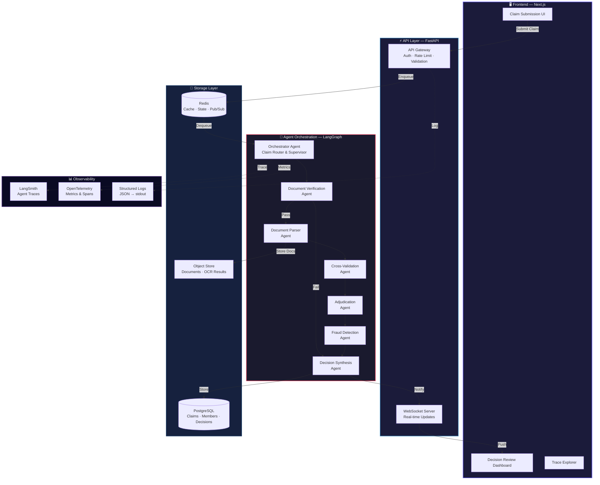

### 2.2 Request Lifecycle — Sequence Diagram

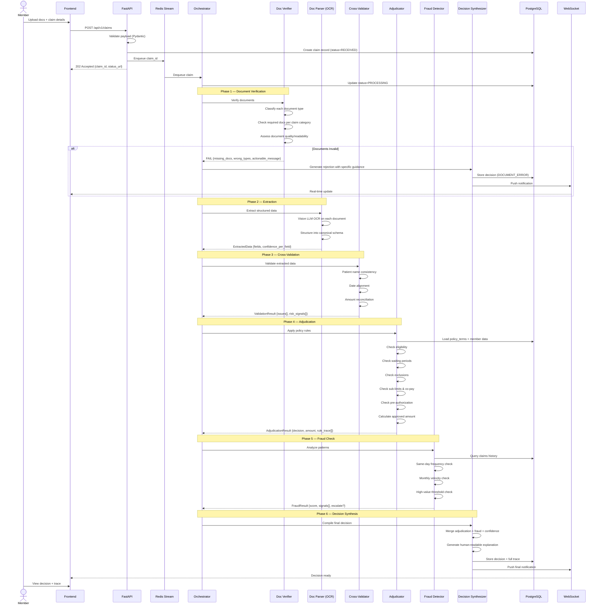

---

## 3. Multi-Agent Design — Framework & Agent Taxonomy

### 3.1 Why LangGraph (Not CrewAI, AutoGen, or Raw LangChain)

| Framework | Considered? | Verdict | Why |
|-----------|-------------|---------|-----|
| **LangGraph** | ✅ **Selected** | Best fit | Directed graph execution, explicit state machine, conditional branching, native checkpointing, human-in-the-loop, first-class streaming. Production-hardened by LangChain team. |
| **CrewAI** | ✅ Evaluated | Rejected | Role-based agent model is elegant but too implicit for a system where the _order_ of operations matters legally (doc verification MUST precede adjudication). Limited control over state transitions. |
| **AutoGen** | ✅ Evaluated | Rejected | Conversation-based multi-agent paradigm. Our agents don't "chat" — they execute a deterministic pipeline with LLM-powered steps. AutoGen's strengths (debate, reflection) aren't needed here. |
| **Raw LangChain** | ✅ Evaluated | Rejected | No graph orchestration. Would require building our own state machine. LangGraph is literally LangChain's answer to this. |
| **Custom (no framework)** | ✅ Evaluated | Rejected | Maximum control but reinvents checkpointing, retry, tracing, streaming. Not worth it for a 2-3 day assignment. |
| **DSPy** | ✅ Evaluated | Rejected | Prompt optimization focus. Excellent for tuning prompts, wrong abstraction for orchestrating a multi-step pipeline with branching. |

### 3.2 Agent Architecture — The Graph

```mermaid
stateDiagram-v2
    [*] --> ClaimReceived

    ClaimReceived --> DocumentVerification: Start Pipeline

    state DocumentVerification {
        [*] --> ClassifyDocs
        ClassifyDocs --> CheckRequired
        CheckRequired --> AssessQuality
        AssessQuality --> [*]
    }

    DocumentVerification --> DocVerificationFailed: Missing/Wrong/Unreadable Docs
    DocumentVerification --> DocumentParsing: All Docs Valid

    DocVerificationFailed --> DecisionSynthesis: Generate Specific Error

    state DocumentParsing {
        [*] --> OCRExtraction
        OCRExtraction --> StructuredOutput
        StructuredOutput --> ConfidenceScoring
        ConfidenceScoring --> [*]
    }

    DocumentParsing --> CrossValidation: Extracted Data

    state CrossValidation {
        [*] --> PatientNameMatch
        PatientNameMatch --> DateAlignment
        DateAlignment --> AmountReconciliation
        AmountReconciliation --> [*]
    }

    CrossValidation --> CrossValidationFailed: Critical Mismatch
    CrossValidation --> Adjudication: Data Consistent

    CrossValidationFailed --> DecisionSynthesis: Generate Mismatch Error

    state Adjudication {
        [*] --> EligibilityCheck
        EligibilityCheck --> WaitingPeriodCheck
        WaitingPeriodCheck --> ExclusionCheck
        ExclusionCheck --> SubLimitCheck
        SubLimitCheck --> PreAuthCheck
        PreAuthCheck --> AmountCalculation
        AmountCalculation --> [*]
    }

    Adjudication --> FraudDetection: Adjudication Complete

    state FraudDetection {
        [*] --> FrequencyAnalysis
        FrequencyAnalysis --> VelocityAnalysis
        VelocityAnalysis --> ValueThreshold
        ValueThreshold --> FraudScoring
        FraudScoring --> [*]
    }

    FraudDetection --> DecisionSynthesis: All Checks Complete

    state DecisionSynthesis {
        [*] --> MergeResults
        MergeResults --> CalculateConfidence
        CalculateConfidence --> GenerateExplanation
        GenerateExplanation --> [*]
    }

    DecisionSynthesis --> [*]: Final Decision
```

### 3.3 Agent Taxonomy

| # | Agent | Type | LLM? | Stateless? | Purpose |
|---|-------|------|------|------------|---------|
| 1 | **Orchestrator** | Supervisor | No | Yes | Routes claims through the graph. Manages state. Handles failures. |
| 2 | **Document Verifier** | Tool-using LLM Agent | Yes | Yes | Classifies documents, checks completeness, assesses quality. |
| 3 | **Document Parser** | Tool-using LLM Agent | Yes | Yes | OCR extraction, structured output, confidence scoring per field. |
| 4 | **Cross-Validator** | Deterministic + LLM | Hybrid | Yes | Patient name matching, date alignment, amount reconciliation. |
| 5 | **Adjudicator** | Primarily Deterministic | Minimal | Yes | Policy rule engine. All business logic. Calculates amounts. |
| 6 | **Fraud Detector** | Deterministic + LLM | Hybrid | No | Pattern analysis, frequency checks, scoring. Needs history. |
| 7 | **Decision Synthesizer** | LLM Agent | Yes | Yes | Merges all outputs into final decision with human-readable explanation. |

### 3.4 Why This Agent Split (Not Fewer, Not More)

**Why not a single monolithic agent?**
- A single LLM call cannot reliably: classify docs, extract data, check policy rules, calculate amounts, and detect fraud — all at once. Context window pollution, hallucination risk, and zero explainability.

**Why not more fine-grained agents (e.g., one per document type)?**
- Over-decomposition creates coordination overhead. The Document Parser already handles multiple doc types via parameterized prompts. One agent with multiple tools beats five single-purpose agents.

**Why is the Adjudicator mostly deterministic?**
- Policy rules are _contractual_. "10% co-pay" means exactly 10%, not "the LLM thinks roughly 10%." Financial calculations must be deterministic code. The LLM's job is understanding _what_ the diagnosis is and _which_ rule applies — not computing the math.

---

## 4. Agent Deep-Dives & Component Contracts

### 4.1 Orchestrator Agent

```
┌─────────────────────────────────────────────────┐
│                ORCHESTRATOR AGENT                │
├─────────────────────────────────────────────────┤
│ RESPONSIBILITY:                                 │
│ • Manages the claim processing state machine    │
│ • Routes to appropriate agents based on state   │
│ • Handles agent failures and circuit breaking    │
│ • Aggregates results from all agents             │
│ • Manages the overall claim lifecycle            │
├─────────────────────────────────────────────────┤
│ INPUT:                                           │
│ {                                                │
│   claim_id: str,                                 │
│   member_id: str,                                │
│   policy_id: str,                                │
│   claim_category: ClaimCategory,                 │
│   treatment_date: date,                          │
│   claimed_amount: Decimal,                       │
│   documents: List[UploadedDocument],             │
│   claims_history?: List[PriorClaim],             │
│   ytd_claims_amount?: Decimal,                   │
│   simulate_component_failure?: bool              │
│ }                                                │
├─────────────────────────────────────────────────┤
│ OUTPUT:                                          │
│ {                                                │
│   claim_id: str,                                 │
│   final_decision: Decision,                      │
│   trace: ProcessingTrace,                        │
│   total_processing_time_ms: int                  │
│ }                                                │
├─────────────────────────────────────────────────┤
│ ERRORS:                                          │
│ • CLAIM_NOT_FOUND — claim_id doesn't exist       │
│ • PIPELINE_TIMEOUT — exceeded 120s timeout       │
│ • ALL_AGENTS_FAILED — complete pipeline failure  │
└─────────────────────────────────────────────────┘
```

**LangGraph State Schema:**

```python
from typing import TypedDict, Optional, Literal
from pydantic import BaseModel
from decimal import Decimal

class ClaimState(TypedDict):
    # Input
    claim_id: str
    member_id: str
    policy_id: str
    claim_category: str
    treatment_date: str
    claimed_amount: float
    documents: list[dict]
    claims_history: list[dict]
    ytd_claims_amount: float
    simulate_component_failure: bool

    # Pipeline State
    current_phase: str
    phase_results: dict          # agent_name -> result
    errors: list[dict]           # accumulated errors
    confidence_adjustments: list[dict]

    # Document Verification Output
    doc_verification: dict | None
    doc_verification_passed: bool

    # Extraction Output
    extracted_data: dict | None

    # Cross-Validation Output
    cross_validation: dict | None
    cross_validation_passed: bool

    # Adjudication Output
    adjudication: dict | None

    # Fraud Output
    fraud_result: dict | None

    # Final
    final_decision: dict | None
    processing_trace: list[dict]
```

### 4.2 Document Verification Agent

```
┌─────────────────────────────────────────────────┐
│           DOCUMENT VERIFICATION AGENT            │
├─────────────────────────────────────────────────┤
│ RESPONSIBILITY:                                  │
│ • Classify each uploaded document by type         │
│ • Check if required docs are present per claim   │
│   category (from policy_terms.json)              │
│ • Assess document readability/quality             │
│ • Generate specific, actionable error messages    │
├─────────────────────────────────────────────────┤
│ INPUT:                                           │
│ {                                                │
│   claim_category: ClaimCategory,                 │
│   documents: [                                   │
│     {                                            │
│       file_id: str,                              │
│       file_name: str,                            │
│       file_bytes: bytes,                         │
│       mime_type: str                              │
│     }                                            │
│   ],                                             │
│   document_requirements: PolicyDocRequirements   │
│ }                                                │
├─────────────────────────────────────────────────┤
│ OUTPUT (Success):                                │
│ {                                                │
│   status: "PASSED",                              │
│   classified_documents: [                        │
│     {                                            │
│       file_id: str,                              │
│       detected_type: DocumentType,               │
│       classification_confidence: float,          │
│       quality_score: float,  // 0.0–1.0          │
│       quality_issues: str[]  // e.g. "BLURRY"    │
│     }                                            │
│   ],                                             │
│   all_required_present: true,                    │
│   trace: VerificationTrace                       │
│ }                                                │
├─────────────────────────────────────────────────┤
│ OUTPUT (Failure):                                │
│ {                                                │
│   status: "FAILED",                              │
│   failure_type: "WRONG_DOCUMENT" |               │
│                 "MISSING_DOCUMENT" |              │
│                 "UNREADABLE_DOCUMENT",            │
│   member_message: str,  // Specific & actionable │
│   details: {                                     │
│     uploaded_types: DocumentType[],               │
│     required_types: DocumentType[],               │
│     missing_types: DocumentType[],                │
│     unreadable_docs: [{file_id, reason}]          │
│   },                                             │
│   trace: VerificationTrace                       │
│ }                                                │
├─────────────────────────────────────────────────┤
│ ERRORS:                                          │
│ • LLM_TIMEOUT — Vision model didn't respond      │
│ • UNSUPPORTED_FORMAT — Not image or PDF           │
│ • FILE_CORRUPTED — Cannot decode file bytes       │
└─────────────────────────────────────────────────┘
```

**Model Used:** Claude 3.5 Sonnet (Vision) — for document classification and quality assessment.

**Prompt Strategy:**
- **Classification**: Pass the document image to Claude with a structured prompt asking it to classify into one of: `PRESCRIPTION`, `HOSPITAL_BILL`, `PHARMACY_BILL`, `LAB_REPORT`, `DIAGNOSTIC_REPORT`, `DENTAL_REPORT`, `DISCHARGE_SUMMARY`, `UNKNOWN`.
- **Quality Assessment**: In the same call, ask the model to rate readability (0.0–1.0) and flag issues: `BLURRY`, `PARTIAL`, `HANDWRITTEN_ILLEGIBLE`, `STAMP_OVER_TEXT`, `LOW_CONTRAST`.

**Message Generation Example (TC001):**
> "You uploaded 2 prescriptions, but a CONSULTATION claim requires both a **Prescription** and a **Hospital Bill**. We found: ✅ Prescription (dr_sharma_prescription.jpg), ✅ Prescription (another_prescription.jpg). Missing: ❌ **Hospital Bill** — please upload your hospital or clinic bill/receipt and resubmit."

### 4.3 Document Parser Agent (OCR + Extraction)

```
┌─────────────────────────────────────────────────┐
│          DOCUMENT PARSER AGENT (OCR)             │
├─────────────────────────────────────────────────┤
│ RESPONSIBILITY:                                  │
│ • Extract structured data from each document     │
│ • Handle messy inputs: handwritten, stamped,     │
│   phone photos, multi-page PDFs                  │
│ • Assign per-field confidence scores             │
│ • Normalize extracted data to canonical schema   │
├─────────────────────────────────────────────────┤
│ INPUT:                                           │
│ {                                                │
│   documents: [                                   │
│     {                                            │
│       file_id: str,                              │
│       file_bytes: bytes,                         │
│       detected_type: DocumentType,               │
│       quality_score: float                        │
│     }                                            │
│   ]                                              │
│ }                                                │
├─────────────────────────────────────────────────┤
│ OUTPUT:                                          │
│ {                                                │
│   parsed_documents: [                            │
│     {                                            │
│       file_id: str,                              │
│       document_type: DocumentType,               │
│       extracted_fields: {                        │
│         [field_name]: {                          │
│           value: any,                            │
│           confidence: float,                     │
│           source_region: str,  // approx loc     │
│           raw_text: str        // original OCR   │
│         }                                        │
│       },                                         │
│       line_items?: [                             │
│         {                                        │
│           description: str,                      │
│           amount: Decimal,                       │
│           confidence: float                      │
│         }                                        │
│       ],                                         │
│       overall_confidence: float,                 │
│       warnings: str[]                            │
│     }                                            │
│   ]                                              │
│ }                                                │
├─────────────────────────────────────────────────┤
│ ERRORS:                                          │
│ • EXTRACTION_FAILED — Could not extract any data │
│ • PARTIAL_EXTRACTION — Some fields unreadable    │
│   (NOT a hard error — returns what it has)        │
│ • LLM_TIMEOUT — Vision model timeout             │
└─────────────────────────────────────────────────┘
```

**Extraction Schema Per Document Type:**

```python
# Prescription
class PrescriptionData(BaseModel):
    doctor_name: FieldWithConfidence[str]
    doctor_registration: FieldWithConfidence[str]
    doctor_specialization: FieldWithConfidence[str | None]
    hospital_name: FieldWithConfidence[str | None]
    patient_name: FieldWithConfidence[str]
    patient_age: FieldWithConfidence[int | None]
    patient_gender: FieldWithConfidence[str | None]
    date: FieldWithConfidence[date]
    diagnosis: FieldWithConfidence[str]
    diagnosis_secondary: FieldWithConfidence[str | None]
    medicines: list[MedicineEntry]
    tests_ordered: list[str]

# Hospital Bill
class HospitalBillData(BaseModel):
    hospital_name: FieldWithConfidence[str]
    hospital_address: FieldWithConfidence[str | None]
    gstin: FieldWithConfidence[str | None]
    bill_number: FieldWithConfidence[str | None]
    patient_name: FieldWithConfidence[str]
    date: FieldWithConfidence[date]
    line_items: list[BillLineItem]
    subtotal: FieldWithConfidence[Decimal]
    gst_amount: FieldWithConfidence[Decimal | None]
    total: FieldWithConfidence[Decimal]
    payment_mode: FieldWithConfidence[str | None]
```

### 4.4 Cross-Validation Agent

```
┌─────────────────────────────────────────────────┐
│          CROSS-VALIDATION AGENT                  │
├─────────────────────────────────────────────────┤
│ RESPONSIBILITY:                                  │
│ • Verify patient name consistency across docs    │
│ • Verify date alignment (treatment date matches) │
│ • Verify amount reconciliation (bill matches     │
│   claimed amount)                                │
│ • Detect documents belonging to different people │
│ • Flag anomalies for fraud detection downstream  │
├─────────────────────────────────────────────────┤
│ INPUT:                                           │
│ {                                                │
│   member_name: str,                              │
│   treatment_date: date,                          │
│   claimed_amount: Decimal,                       │
│   parsed_documents: ParsedDocument[]             │
│ }                                                │
├─────────────────────────────────────────────────┤
│ OUTPUT:                                          │
│ {                                                │
│   status: "PASSED" | "FAILED" | "WARNING",       │
│   checks: [                                     │
│     {                                            │
│       check_name: str,                           │
│       result: "PASS" | "FAIL" | "WARN",          │
│       details: str,                              │
│       found_values: dict  // what each doc had   │
│     }                                            │
│   ],                                             │
│   critical_failures: str[],                      │
│   risk_signals: str[],                           │
│   member_message?: str  // if docs are for       │
│                         // different patients     │
│ }                                                │
├─────────────────────────────────────────────────┤
│ ERRORS:                                          │
│ • INSUFFICIENT_DATA — Not enough fields to cross-│
│   validate (degrades to WARNING, not hard fail)   │
└─────────────────────────────────────────────────┘
```

**Name Matching Strategy:**
- Fuzzy matching using `rapidfuzz` (Levenshtein distance, token sort ratio).
- Threshold: >85% similarity = match, 60–85% = warning, <60% = fail.
- Handles: "Rajesh Kumar" vs "Kumar, Rajesh" vs "R. Kumar".
- Uses LLM as fallback for ambiguous cases (e.g., regional name variations).

### 4.5 Adjudication Agent

```
┌─────────────────────────────────────────────────┐
│            ADJUDICATION AGENT                    │
├─────────────────────────────────────────────────┤
│ RESPONSIBILITY:                                  │
│ • Apply ALL policy rules from policy_terms.json  │
│ • Check member eligibility                       │
│ • Check waiting periods (initial + condition)    │
│ • Check exclusions (general + category-specific) │
│ • Check sub-limits per category                  │
│ • Check per-claim limit                          │
│ • Check pre-authorization requirements            │
│ • Apply network hospital discounts               │
│ • Calculate co-pay                               │
│ • Calculate final approved amount                │
│ • Produce rule-by-rule trace                     │
├─────────────────────────────────────────────────┤
│ INPUT:                                           │
│ {                                                │
│   member: MemberRecord,                          │
│   policy: PolicyTerms,                           │
│   claim_category: ClaimCategory,                 │
│   treatment_date: date,                          │
│   claimed_amount: Decimal,                       │
│   ytd_claims_amount: Decimal,                    │
│   extracted_data: ExtractedClaimData,            │
│   hospital_name?: str,                           │
│   has_pre_authorization?: bool                   │
│ }                                                │
├─────────────────────────────────────────────────┤
│ OUTPUT:                                          │
│ {                                                │
│   decision: "APPROVED" | "PARTIAL" | "REJECTED", │
│   approved_amount: Decimal,                      │
│   rejected_amount: Decimal,                      │
│   rejection_reasons: RejectionReason[],          │
│   amount_breakdown: {                            │
│     claimed: Decimal,                            │
│     network_discount: Decimal,                   │
│     after_discount: Decimal,                     │
│     copay_amount: Decimal,                       │
│     sub_limit_cap: Decimal | null,               │
│     per_claim_cap: Decimal | null,               │
│     annual_limit_remaining: Decimal,             │
│     final_approved: Decimal                      │
│   },                                             │
│   line_item_decisions?: [                        │
│     {                                            │
│       description: str,                          │
│       amount: Decimal,                           │
│       decision: "APPROVED" | "REJECTED",         │
│       reason?: str                               │
│     }                                            │
│   ],                                             │
│   rule_trace: [                                  │
│     {                                            │
│       rule_name: str,                            │
│       rule_description: str,                     │
│       input_values: dict,                        │
│       result: "PASS" | "FAIL",                   │
│       impact: str                                │
│     }                                            │
│   ]                                              │
│ }                                                │
├─────────────────────────────────────────────────┤
│ ERRORS:                                          │
│ • POLICY_NOT_FOUND — policy_id invalid           │
│ • MEMBER_NOT_FOUND — member_id not in roster     │
│ • CATEGORY_UNKNOWN — claim category not in policy│
│ • CALCULATION_ERROR — arithmetic/overflow error   │
└─────────────────────────────────────────────────┘
```

**Calculation Order (Critical — TC010):**

```
1. Start with claimed_amount
2. Apply network discount (if network hospital)
   → after_discount = claimed_amount × (1 - network_discount_percent/100)
3. Apply co-pay
   → copay = after_discount × (copay_percent/100)
   → after_copay = after_discount - copay
4. Cap at sub-limit
   → capped = min(after_copay, category_sub_limit)
5. Cap at per-claim limit
   → capped = min(capped, per_claim_limit)
6. Cap at remaining annual limit
   → final = min(capped, annual_opd_limit - ytd_claims_amount)
```

**LLM Usage in Adjudicator:**
- The adjudicator is **primarily deterministic Python code**.
- LLM is used _only_ for **diagnosis-to-condition mapping**: "Is 'Morbid Obesity — BMI 37' related to the excluded condition 'Obesity and weight loss programs'?" — this requires semantic understanding, not string matching.
- LLM is used with structured output (tool calling / function calling) to return `{"matches_exclusion": true, "matched_condition": "Obesity and weight loss programs", "confidence": 0.95}`.

### 4.6 Fraud Detection Agent

```
┌─────────────────────────────────────────────────┐
│           FRAUD DETECTION AGENT                  │
├─────────────────────────────────────────────────┤
│ RESPONSIBILITY:                                  │
│ • Check same-day claim frequency                 │
│ • Check monthly claim velocity                   │
│ • Check high-value claim threshold               │
│ • Compute composite fraud score                  │
│ • Decide: proceed vs. escalate to MANUAL_REVIEW  │
├─────────────────────────────────────────────────┤
│ INPUT:                                           │
│ {                                                │
│   member_id: str,                                │
│   claim_date: date,                              │
│   claimed_amount: Decimal,                       │
│   claims_history: PriorClaim[],                  │
│   extracted_data: ExtractedClaimData,            │
│   cross_validation_signals: str[]                │
│ }                                                │
├─────────────────────────────────────────────────┤
│ OUTPUT:                                          │
│ {                                                │
│   fraud_score: float,  // 0.0–1.0                │
│   signals: [                                     │
│     {                                            │
│       signal_name: str,                          │
│       severity: "LOW" | "MEDIUM" | "HIGH",       │
│       details: str                               │
│     }                                            │
│   ],                                             │
│   escalate_to_manual_review: bool,               │
│   escalation_reason?: str                        │
│ }                                                │
├─────────────────────────────────────────────────┤
│ ERRORS:                                          │
│ • HISTORY_UNAVAILABLE — DB query failed          │
│   (degrades gracefully: score = 0.5, flag sent)  │
└─────────────────────────────────────────────────┘
```

**Fraud Score Computation:**

```python
def compute_fraud_score(signals: list[FraudSignal]) -> float:
    weights = {
        "SAME_DAY_FREQUENCY": 0.35,
        "MONTHLY_VELOCITY": 0.20,
        "HIGH_VALUE": 0.15,
        "DOCUMENT_ALTERATION": 0.15,
        "CROSS_DOC_MISMATCH": 0.10,
        "PROVIDER_PATTERN": 0.05,
    }
    score = sum(
        weights.get(s.signal_name, 0.05) * s.severity_score
        for s in signals
    )
    return min(score, 1.0)
```

### 4.7 Decision Synthesis Agent

```
┌─────────────────────────────────────────────────┐
│         DECISION SYNTHESIS AGENT                 │
├─────────────────────────────────────────────────┤
│ RESPONSIBILITY:                                  │
│ • Merge adjudication + fraud results              │
│ • Compute final confidence score                 │
│ • Generate human-readable decision explanation   │
│ • Produce complete, auditable trace              │
│ • Override decision if fraud signals are critical │
├─────────────────────────────────────────────────┤
│ INPUT:                                           │
│ {                                                │
│   adjudication_result: AdjudicationResult,       │
│   fraud_result: FraudResult,                     │
│   extraction_confidence: float,                  │
│   cross_validation_result: CrossValidationResult,│
│   pipeline_errors: PipelineError[],              │
│   processing_time_ms: int                        │
│ }                                                │
├─────────────────────────────────────────────────┤
│ OUTPUT (Final Decision):                         │
│ {                                                │
│   decision: "APPROVED" | "PARTIAL" |             │
│             "REJECTED" | "MANUAL_REVIEW",        │
│   approved_amount: Decimal | null,               │
│   confidence_score: float,                       │
│   explanation: {                                 │
│     summary: str,           // 1-2 sentence      │
│     detailed_reasoning: str, // full narrative    │
│     member_message: str,     // user-facing       │
│     ops_notes: str           // ops-team-facing   │
│   },                                             │
│   amount_breakdown: AmountBreakdown | null,       │
│   line_item_decisions: LineItemDecision[] | null, │
│   rule_trace: RuleTraceEntry[],                  │
│   fraud_signals: FraudSignal[],                  │
│   pipeline_warnings: str[],                      │
│   processing_metadata: {                         │
│     total_time_ms: int,                          │
│     agents_invoked: str[],                       │
│     agents_failed: str[],                        │
│     model_calls: int,                            │
│     model_tokens_used: int                       │
│   }                                              │
│ }                                                │
├─────────────────────────────────────────────────┤
│ ERRORS:                                          │
│ • This agent NEVER errors. It always produces a  │
│   decision, even if it's MANUAL_REVIEW with low  │
│   confidence. It is the terminal node.           │
└─────────────────────────────────────────────────┘
```

**Confidence Score Computation:**

```python
def compute_final_confidence(
    extraction_confidence: float,      # avg across docs
    cross_validation_passed: bool,
    adjudication_confidence: float,    # rule match confidence
    fraud_score: float,
    pipeline_errors: list[PipelineError],
) -> float:
    base = (
        extraction_confidence * 0.30 +
        (1.0 if cross_validation_passed else 0.5) * 0.15 +
        adjudication_confidence * 0.40 +
        (1.0 - fraud_score) * 0.15
    )

    # Penalize for pipeline errors (TC011)
    error_penalty = len(pipeline_errors) * 0.10
    final = max(base - error_penalty, 0.1)

    return round(final, 2)
```

---

## 5. Database Architecture

### 5.1 Why PostgreSQL + Redis

| Requirement | PostgreSQL | Redis | Why not MongoDB? |
|------------|-----------|-------|-----------------|
| ACID transactions for claims | ✅ | ❌ | Claims are financial; ACID is non-negotiable |
| JSON flexibility for extracted data | ✅ (`jsonb`) | ❌ | PostgreSQL `jsonb` gives us schema flexibility with relational joins |
| Full-text search on traces | ✅ (`tsvector`) | ❌ | Need to search traces by rule name, member, decision |
| Fast state during processing | ❌ | ✅ | In-flight claim state needs sub-ms reads/writes |
| Cache policy terms | ❌ | ✅ | Policy terms loaded once, cached for all claims |
| Pub/Sub for real-time updates | ❌ | ✅ | WebSocket notifications on claim status change |
| Claims history queries | ✅ (indexed) | ❌ | Complex queries: same-day count, monthly aggregates |

### 5.2 Schema Design

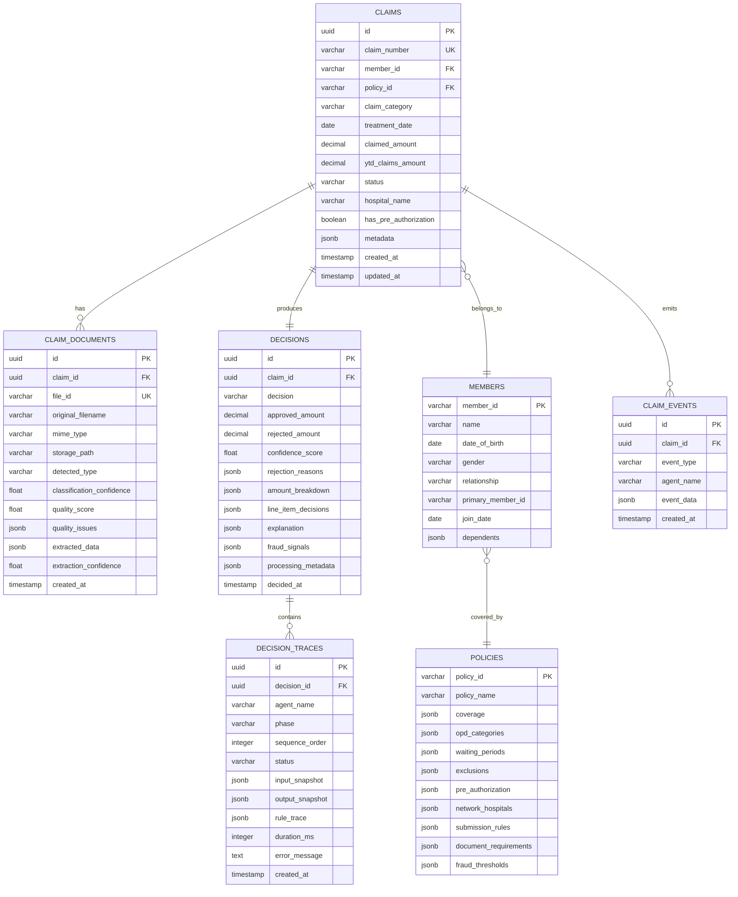

### 5.3 Key Indexes

```sql
-- Claims
CREATE INDEX idx_claims_member_id ON claims(member_id);
CREATE INDEX idx_claims_status ON claims(status);
CREATE INDEX idx_claims_treatment_date ON claims(treatment_date);
CREATE INDEX idx_claims_member_date ON claims(member_id, treatment_date);
CREATE INDEX idx_claims_created ON claims(created_at DESC);

-- Fraud queries: same-day claims
CREATE INDEX idx_claims_member_treatment ON claims(member_id, treatment_date)
    WHERE status NOT IN ('DOCUMENT_ERROR', 'CANCELLED');

-- Decision traces: full reconstruction
CREATE INDEX idx_traces_decision ON decision_traces(decision_id, sequence_order);
CREATE INDEX idx_traces_agent ON decision_traces(agent_name);

-- Events: audit trail
CREATE INDEX idx_events_claim ON claim_events(claim_id, created_at);
```

---

## 6. OCR & Document Intelligence — Model Selection

### 6.1 Why Vision LLMs Over Traditional OCR

| Approach | Handles Handwriting | Handles Stamps | Structured Output | Context Understanding | Setup Complexity |
|----------|-------------------|----------------|-------------------|----------------------|-----------------|
| **Tesseract** | ❌ Poor | ❌ Poor | ❌ Raw text | ❌ None | Low |
| **Google Document AI** | ✅ Good | ✅ Moderate | ✅ Good | ❌ Limited | Medium |
| **AWS Textract** | ✅ Good | ✅ Moderate | ✅ Good | ❌ Limited | Medium |
| **Claude 3.5 Sonnet Vision** | ✅ Excellent | ✅ Good | ✅ Excellent | ✅ Excellent | Low |
| **GPT-4o Vision** | ✅ Excellent | ✅ Good | ✅ Excellent | ✅ Excellent | Low |

**Decision: Claude 3.5 Sonnet Vision as primary, Tesseract as fallback.**

**Rationale:**
1. Indian medical documents are uniquely messy — handwritten Rx, rubber stamps, mixed-language, poor phone photos. Traditional OCR engines cannot reliably extract _meaning_ from these.
2. Vision LLMs can extract structured data in a single call: "Read this prescription image and return JSON with doctor_name, diagnosis, medicines..." — no separate OCR → NER pipeline.
3. Claude 3.5 Sonnet specifically excels at structured output with high accuracy on medical abbreviations (HTN, T2DM).
4. Tesseract fallback is for when the LLM fails/times out — returns raw text that can be partially parsed.

### 6.2 OCR Pipeline

```mermaid
flowchart LR
    subgraph INPUT["📄 Document Input"]
        IMG[Image File]
        PDF[PDF File]
    end

    subgraph PREPROCESS["🔧 Preprocessing"]
        DECODE[Decode & Validate]
        PDF2IMG[PDF → Images<br/>pdf2image/PyMuPDF]
        ORIENT[Auto-Orient<br/>EXIF Correction]
        ENHANCE[Quality Enhancement<br/>Contrast · Denoise]
    end

    subgraph PRIMARY["🧠 Primary: Vision LLM"]
        PROMPT[Type-Specific Prompt<br/>Prescription / Bill / Lab]
        CLAUDE[Claude 3.5 Sonnet<br/>Vision API]
        PARSE[Parse Structured<br/>JSON Response]
        VALIDATE[Validate Against<br/>Pydantic Schema]
    end

    subgraph FALLBACK["🔄 Fallback: Tesseract"]
        TESS[Tesseract OCR<br/>Raw Text Extraction]
        REGEX[Regex + Heuristic<br/>Field Extraction]
        MANUAL_FLAG[Flag for<br/>Manual Review]
    end

    subgraph OUTPUT["📊 Output"]
        STRUCTURED[Structured Data<br/>with Confidence]
    end

    IMG --> DECODE
    PDF --> DECODE
    DECODE --> PDF2IMG
    DECODE --> ORIENT
    PDF2IMG --> ORIENT
    ORIENT --> ENHANCE
    ENHANCE --> PROMPT
    PROMPT --> CLAUDE
    CLAUDE -->|Success| PARSE
    CLAUDE -->|Timeout/Error| TESS
    PARSE --> VALIDATE
    VALIDATE -->|Valid| STRUCTURED
    VALIDATE -->|Invalid| TESS
    TESS --> REGEX
    REGEX --> MANUAL_FLAG
    MANUAL_FLAG --> STRUCTURED

    style PRIMARY fill:#1a1a2e,stroke:#e94560,stroke-width:2px,color:#eee
    style FALLBACK fill:#16213e,stroke:#f39c12,stroke-width:2px,color:#eee
```

### 6.3 Prompt Engineering for OCR

**Prescription Extraction Prompt (Simplified):**
```
You are an expert medical document OCR system specialized in Indian medical prescriptions.

Analyze this prescription image and extract ALL information into the exact JSON schema below.

IMPORTANT:
- Indian prescriptions may be handwritten, partially illegible, or have stamps over text.
- Medical abbreviations: HTN = Hypertension, T2DM = Type 2 Diabetes, URI = Upper Respiratory Infection
- Dosage format: "1-1-1" means morning-afternoon-night
- Registration numbers follow format: STATE_CODE/XXXXX/YYYY (e.g., KA/45678/2015)
- If a field is unreadable, set its value to null and confidence to 0.0
- DO NOT hallucinate or guess — if unsure, return null with low confidence

Return ONLY valid JSON matching this schema:
{
  "doctor_name": {"value": str|null, "confidence": 0.0-1.0},
  "doctor_registration": {"value": str|null, "confidence": 0.0-1.0},
  ...
}
```

---

## 7. LLM Strategy — Model Selection & Orchestration

### 7.1 Model Selection Matrix

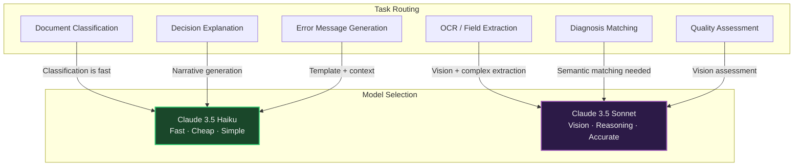

| Task | Model | Reasoning |
|------|-------|-----------|
| Document classification | **Haiku** | Simple classification task. Haiku is 10x faster, 80% cheaper, and classification accuracy is comparable. |
| OCR extraction (images) | **Sonnet** | Vision tasks require the larger model. Handwritten text recognition, stamp handling, structured output. |
| Diagnosis → condition mapping | **Sonnet** | "Morbid Obesity — BMI 37" → "Obesity and weight loss programs" requires semantic reasoning. |
| Decision explanation | **Haiku** | Template-driven narrative. All data is already structured. Haiku handles this fine. |
| Quality assessment | **Sonnet** | Needs vision to assess blur, stamps, contrast. |
| Error message generation | **Haiku** | Structured templates with contextual fill. Fast and cheap. |

### 7.2 LLM Interaction Patterns

**All LLM calls use:**
1. **Structured output** (Pydantic models → JSON schema → tool/function calling)
2. **Temperature 0** for deterministic outputs (except explanation generation: temp 0.3)
3. **Retry with exponential backoff** (3 retries, 1s/2s/4s)
4. **Timeout**: 30s for Haiku, 60s for Sonnet
5. **Fallback chain**: Sonnet → Haiku → Deterministic fallback

### 7.3 Cost Estimation

| Component | Model | Calls/Claim | Avg Tokens | Cost/Claim |
|-----------|-------|-------------|------------|------------|
| Doc classification (×2) | Haiku | 2 | ~500 | ~$0.001 |
| OCR extraction (×2) | Sonnet | 2 | ~2000 | ~$0.024 |
| Quality assessment (×2) | Sonnet | 2 | ~500 | ~$0.006 |
| Diagnosis matching | Sonnet | 1 | ~800 | ~$0.005 |
| Decision explanation | Haiku | 1 | ~1000 | ~$0.001 |
| **Total per claim** | | **~8** | | **~$0.037** |

At 75,000 claims/year: **~$2,775/year** in LLM costs. This is negligible.

---

## 8. Observability & Tracing

### 8.1 Why LangSmith + OpenTelemetry (Not Build-From-Scratch)

| Option | Considered | Verdict | Rationale |
|--------|-----------|---------|-----------|
| **LangSmith** | ✅ Selected | Agent-level tracing | Purpose-built for LLM chains. Shows prompt/response pairs, token usage, latency per step, cost tracking. Native LangGraph integration. |
| **OpenTelemetry + Jaeger** | ✅ Selected | Infra-level tracing | Industry standard. Traces HTTP requests, DB queries, cache hits. Integrates with Grafana. |
| **Build custom** | ✅ Evaluated | Rejected | Would take 2+ days just for the tracing layer. LangSmith gives us 90% of what we need out of the box. |
| **Phoenix (Arize)** | ✅ Evaluated | Rejected | Good OSS alternative but less mature LangGraph integration than LangSmith. |
| **Langfuse** | ✅ Evaluated | Strong alternative | Open-source, self-hostable. Would pick this over LangSmith if cost or data sovereignty were concerns. Good fallback option. |

### 8.2 Three Layers of Observability

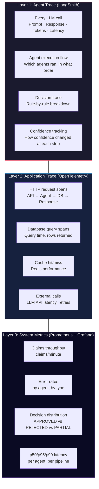

### 8.3 Trace Schema (What Gets Stored Per Claim)

```python
class ProcessingTrace(BaseModel):
    """Complete trace for a single claim — this is what the ops team sees."""

    claim_id: str
    started_at: datetime
    completed_at: datetime
    total_duration_ms: int

    phases: list[PhaseTrace]

class PhaseTrace(BaseModel):
    """Trace for a single processing phase/agent."""

    phase_name: str       # e.g., "document_verification"
    agent_name: str       # e.g., "DocumentVerifierAgent"
    status: str           # "SUCCESS" | "FAILED" | "SKIPPED" | "DEGRADED"
    started_at: datetime
    duration_ms: int

    # What the agent received
    input_summary: dict

    # What the agent produced
    output_summary: dict

    # Rule-by-rule trace (for adjudicator)
    rule_checks: list[RuleCheck] | None

    # LLM calls made
    llm_calls: list[LLMCallTrace]

    # Errors encountered
    errors: list[ErrorTrace]

    # Confidence at this stage
    confidence_before: float
    confidence_after: float
    confidence_adjustment_reason: str | None

class RuleCheck(BaseModel):
    """Single rule evaluation — the atomic unit of explainability."""
    rule_name: str              # e.g., "WAITING_PERIOD_CHECK"
    rule_description: str       # e.g., "Check if diabetes 90-day waiting period has elapsed"
    input_values: dict          # e.g., {"join_date": "2024-09-01", "treatment_date": "2024-10-15", "required_days": 90}
    result: str                 # "PASS" | "FAIL"
    impact: str                 # e.g., "REJECTED — member eligible from 2024-11-30"
    confidence: float

class LLMCallTrace(BaseModel):
    """Single LLM API call."""
    model: str
    purpose: str                # e.g., "classify_document"
    prompt_tokens: int
    completion_tokens: int
    latency_ms: int
    success: bool
    retry_count: int
```

### 8.4 Trace UI Requirements

The ops team must be able to:

1. **Search** by claim_id, member_id, decision, date range.
2. **See the full pipeline** as a visual timeline (which agents ran, how long each took).
3. **Drill into any agent** to see its input/output and rule checks.
4. **See the confidence score evolution** — how it changed at each stage and why.
5. **View raw LLM prompts/responses** for any step (for debugging).
6. **Replay a claim** — re-run the same inputs through the pipeline to test changes.

---

## 9. Evaluation Pipeline

### 9.1 Eval Architecture

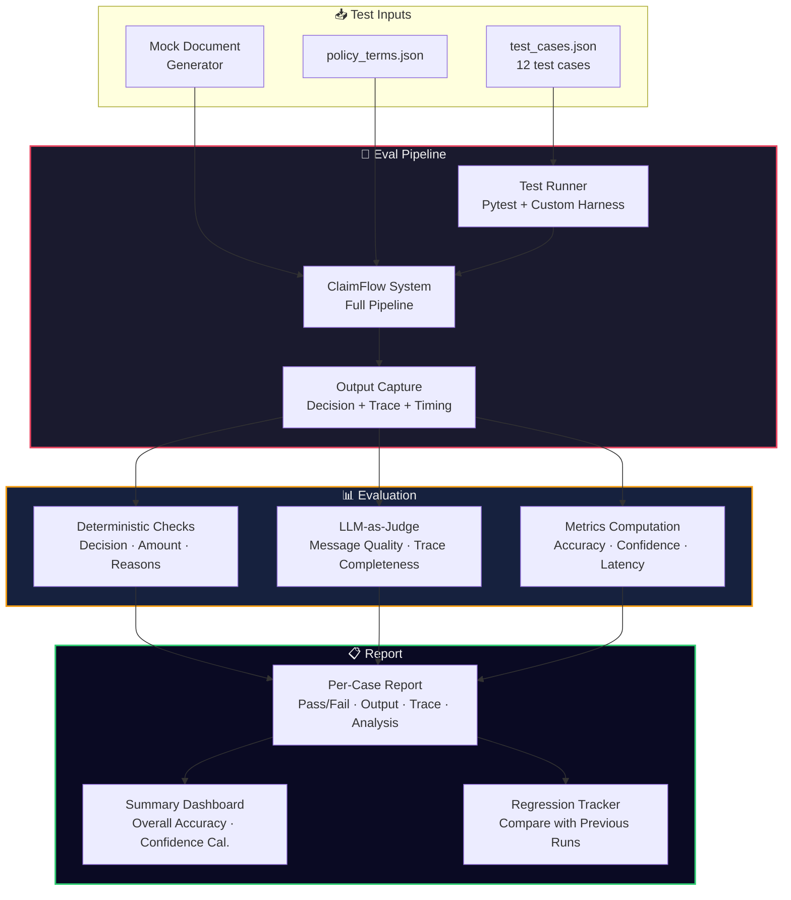

### 9.2 Eval Dimensions

| Dimension | What We Measure | How | Pass Criteria |
|-----------|----------------|-----|---------------|
| **Decision accuracy** | Does `system.decision` match `expected.decision`? | Exact match | 100% for deterministic cases |
| **Amount accuracy** | Does `system.approved_amount` match `expected.approved_amount`? | Exact decimal match | ±₹1 tolerance |
| **Rejection reason accuracy** | Are the correct rejection reasons present? | Set intersection | All expected reasons present |
| **Message quality** | Is the member-facing message specific and actionable? | LLM-as-judge + human review | Score ≥ 4/5 |
| **Trace completeness** | Does the trace show every rule check? | Schema validation | All required fields present |
| **Confidence calibration** | Are confidence scores well-calibrated? | Statistical analysis | High confidence → correct decisions |
| **Latency** | End-to-end processing time | Timer | p95 < 30 seconds |
| **Graceful degradation** | Does TC011 not crash? | Exception catching | System returns decision, not 500 |

### 9.3 Test Case Classification

```
TC001–TC003: Document Verification Tests
├── TC001: Wrong document type    → Should STOP with specific message
├── TC002: Unreadable document    → Should STOP with re-upload request
└── TC003: Different patients     → Should STOP with name mismatch

TC004: Golden Path
└── TC004: Clean consultation     → APPROVED, ₹1,350 (10% copay)

TC005–TC008: Policy Rule Tests
├── TC005: Waiting period         → REJECTED (diabetes 90-day wait)
├── TC006: Partial approval       → PARTIAL, ₹8,000 (cosmetic excluded)
├── TC007: Pre-auth missing       → REJECTED (MRI > ₹10K needs pre-auth)
└── TC008: Per-claim limit        → REJECTED (₹7,500 > ₹5,000 limit)

TC009: Fraud Detection
└── TC009: Multiple same-day      → MANUAL_REVIEW

TC010: Financial Calculation
└── TC010: Network discount order → APPROVED, ₹3,240 (discount → copay)

TC011: Resilience
└── TC011: Component failure      → APPROVED with reduced confidence

TC012: Exclusion
└── TC012: Excluded treatment     → REJECTED (obesity excluded)
```

### 9.4 Mock Document Generation Strategy

Since the test cases provide structured `content` objects (not real images), we need a two-tier approach:

**Tier 1: Structured Input Mode (for eval)**
- Parse the `content` field directly from `test_cases.json`.
- Skip the OCR pipeline entirely.
- This tests the adjudication logic in isolation.
- Fast, deterministic, no LLM cost.

**Tier 2: Image Input Mode (for demo)**
- Generate mock document images using Python (Pillow/fpdf2).
- Run through the full OCR pipeline.
- Tests the complete end-to-end system.
- Slower, non-deterministic, uses LLM credits.

```python
# Eval runner pseudo-code
class EvalRunner:
    async def run_test_case(self, tc: TestCase) -> EvalResult:
        # Generate mock documents if content is structured
        docs = self.generate_mock_documents(tc.input.documents)

        # Run through full pipeline
        result = await self.pipeline.process_claim(
            ClaimInput(
                member_id=tc.input.member_id,
                claim_category=tc.input.claim_category,
                treatment_date=tc.input.treatment_date,
                claimed_amount=tc.input.claimed_amount,
                documents=docs,
                claims_history=tc.input.claims_history or [],
                ytd_claims_amount=tc.input.ytd_claims_amount or 0,
                simulate_component_failure=tc.input.simulate_component_failure or False,
            )
        )

        # Evaluate
        checks = []
        if tc.expected.decision:
            checks.append(self.check_decision(result, tc.expected))
        if tc.expected.approved_amount:
            checks.append(self.check_amount(result, tc.expected))
        if tc.expected.system_must:
            checks.append(self.check_system_must(result, tc.expected))
        if tc.expected.rejection_reasons:
            checks.append(self.check_rejection_reasons(result, tc.expected))

        return EvalResult(
            case_id=tc.case_id,
            passed=all(c.passed for c in checks),
            checks=checks,
            full_output=result,
            trace=result.processing_trace,
        )
```

### 9.5 LLM-as-Judge for Message Quality

```python
JUDGE_PROMPT = """
You are evaluating the quality of an error message produced by a health insurance
claims processing system. The message is shown to a member (employee) who submitted
a claim.

Score the message on a 1-5 scale:
1 = Generic error ("An error occurred")
2 = Mentions the problem but not specifically enough to act
3 = Specific problem but unclear what to do next
4 = Specific problem AND clear action required
5 = Specific problem, clear action, names exact document types, friendly tone

Message to evaluate: {message}

Context: {test_case_description}

Return JSON: {"score": int, "reasoning": str}
"""
```

---

## 10. Failure Handling & Graceful Degradation

### 10.1 Failure Taxonomy

```mermaid
flowchart TD
    FAIL["Failure Types"]

    FAIL --> LLM["LLM Failures"]
    FAIL --> DB_FAIL["Database Failures"]
    FAIL --> INPUT["Input Failures"]
    FAIL --> LOGIC["Logic Failures"]

    LLM --> TIMEOUT["Timeout<br/>→ Retry 3x → Fallback model → Degraded"]
    LLM --> RATE["Rate Limit<br/>→ Backoff → Queue → Retry"]
    LLM --> INVALID["Invalid Response<br/>→ Re-prompt → Fallback → Degraded"]
    LLM --> REFUSED["Content Refused<br/>→ Rephrase → Log → Manual Review"]

    DB_FAIL --> CONN["Connection Lost<br/>→ Retry → Fail claim to PENDING"]
    DB_FAIL --> QUERY["Query Error<br/>→ Log → Default values"]

    INPUT --> CORRUPT["Corrupted File<br/>→ Flag → Skip doc → Reduce confidence"]
    INPUT --> UNSUP["Unsupported Format<br/>→ Error message → Stop"]

    LOGIC --> CALC["Calculation Error<br/>→ Log → Manual Review"]
    LOGIC --> RULE["Missing Rule<br/>→ Log → Manual Review"]

    style FAIL fill:#1a1a2e,stroke:#e94560,stroke-width:2px,color:#eee
    style LLM fill:#2c1a47,stroke:#e94560,color:#eee
    style DB_FAIL fill:#2c1a47,stroke:#f39c12,color:#eee
    style INPUT fill:#2c1a47,stroke:#3282b8,color:#eee
    style LOGIC fill:#2c1a47,stroke:#2ecc71,color:#eee
```

### 10.2 Circuit Breaker Pattern

```python
class AgentCircuitBreaker:
    """
    Each agent has a circuit breaker.
    If an agent fails 3 consecutive times within 60 seconds,
    the circuit opens and future calls return a degraded result
    instead of attempting the call.
    """

    def __init__(self, agent_name: str, failure_threshold: int = 3, reset_timeout: int = 60):
        self.agent_name = agent_name
        self.failure_count = 0
        self.failure_threshold = failure_threshold
        self.last_failure_time = None
        self.state = "CLOSED"  # CLOSED | OPEN | HALF_OPEN
        self.reset_timeout = reset_timeout

    async def call(self, agent_fn, *args, **kwargs):
        if self.state == "OPEN":
            if time.time() - self.last_failure_time > self.reset_timeout:
                self.state = "HALF_OPEN"
            else:
                return self._degraded_result()

        try:
            result = await agent_fn(*args, **kwargs)
            self._on_success()
            return result
        except Exception as e:
            self._on_failure(e)
            if self.state == "OPEN":
                return self._degraded_result()
            raise
```

### 10.3 Degradation Strategy Per Agent

| Agent | Failure Mode | Degraded Behavior | Confidence Impact |
|-------|-------------|-------------------|-------------------|
| Document Verifier | LLM timeout | Skip classification, pass docs through as-is | -0.20 |
| Document Parser | LLM timeout | Use Tesseract fallback + regex extraction | -0.15 |
| Cross-Validator | Insufficient data | Issue WARNING, proceed with available fields | -0.10 |
| Adjudicator | Calculation error | Route to MANUAL_REVIEW immediately | Set to 0.30 |
| Fraud Detector | DB query failure | Set fraud_score = 0.5 (neutral), flag for review | -0.10 |
| Decision Synthesizer | **Never fails** | Always produces output, even if it's MANUAL_REVIEW | N/A |

### 10.4 TC011 — Simulated Component Failure

```python
async def process_with_failure_simulation(self, state: ClaimState) -> ClaimState:
    if state.get("simulate_component_failure"):
        # Randomly fail one non-critical agent
        failed_agent = random.choice(["cross_validator", "fraud_detector"])
        state["errors"].append({
            "agent": failed_agent,
            "error_type": "SIMULATED_FAILURE",
            "message": f"{failed_agent} failed due to simulated component failure",
            "timestamp": datetime.utcnow().isoformat(),
        })
        state["confidence_adjustments"].append({
            "agent": failed_agent,
            "adjustment": -0.15,
            "reason": "Component failure — agent skipped",
        })
        # Skip the failed agent
        state[f"{failed_agent}_skipped"] = True
    return state
```

---

## 11. Scalability Blueprint

### 11.1 Current Scale vs. 10x Scale

| Dimension | Current (75K claims/year) | 10x (750K claims/year) | What Changes |
|-----------|--------------------------|------------------------|-------------|
| Throughput | ~9 claims/hour | ~90 claims/hour | Queue → Kafka, Workers → K8s pods |
| Concurrency | 5 concurrent claims | 50 concurrent claims | Connection pooling, async everywhere |
| Storage | ~50GB/year | ~500GB/year | S3 lifecycle policies, DB partitioning |
| LLM costs | ~$2,775/year | ~$27,750/year | Model routing optimization, caching |
| Latency | p95 < 30s | p95 < 30s | Same — horizontal scaling, not vertical |

### 11.2 Scaling Architecture

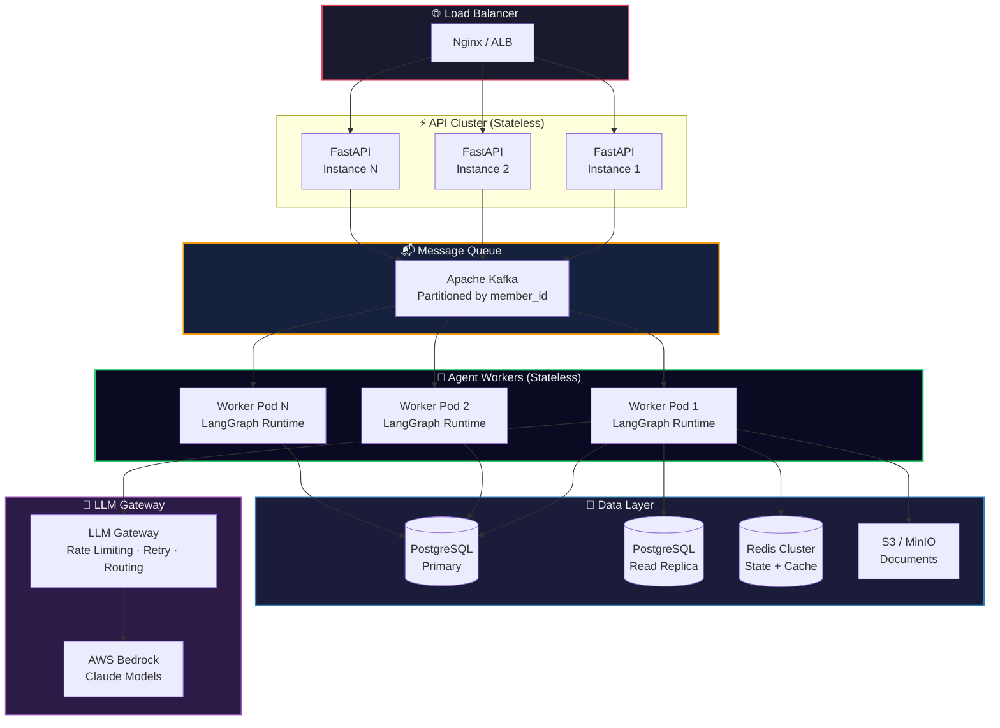

### 11.3 Scaling Levers

| Lever | How | When |
|-------|-----|------|
| **Horizontal API scaling** | Add more FastAPI pods behind load balancer | API becomes bottleneck |
| **Kafka partitioning** | Partition by `member_id` — ensures per-member ordering | Queue depth > 100 |
| **Worker auto-scaling** | K8s HPA based on queue depth metrics | Queue depth > 50 per partition |
| **DB read replicas** | Route reads (policy lookups, history queries) to replica | DB CPU > 70% |
| **DB table partitioning** | Partition `claims` by `created_at` (monthly) | Table > 10M rows |
| **LLM request batching** | Batch document classifications (multiple docs in one call) | LLM rate limit hit |
| **Result caching** | Cache policy terms, member records in Redis (TTL: 5 min) | Same data fetched repeatedly |
| **Async processing** | All I/O is already `asyncio` — just add more workers | Default architecture |

### 11.4 What Stays The Same At Scale

- **Agent logic** — agents are stateless functions. Scale by adding workers.
- **LangGraph graph definition** — the state machine doesn't change.
- **Database schema** — designed for scale from day one (proper indexing, `jsonb` for flexibility).
- **API contracts** — versioned, backward-compatible.

---

## 12. Security & Compliance

### 12.1 Data Protection

| Concern | Mitigation |
|---------|------------|
| PII in documents | Documents stored in S3 with server-side encryption (AES-256). Access via pre-signed URLs only. |
| PII in database | Sensitive fields (name, DOB) encrypted at rest. Column-level encryption for `member_name`. |
| PII in LLM calls | LLM prompts contain document images — use AWS Bedrock (data doesn't leave AWS, no training on your data). |
| PII in logs | Structured logging with PII scrubbing. Member IDs: yes. Member names: redacted. |
| PII in traces | LangSmith traces may contain PII. Use self-hosted LangSmith or Langfuse for production. |

### 12.2 Authentication & Authorization

| Layer | Mechanism |
|-------|-----------|
| API authentication | JWT tokens (issued by Auth0 or Cognito) |
| API authorization | Role-based: `member` (submit claims), `ops` (review decisions), `admin` (system config) |
| Internal service auth | mTLS between services (in K8s: service mesh / Istio) |
| Document access | Pre-signed S3 URLs with 15-minute expiry |

### 12.3 IRDAI Compliance Notes

- All claim decisions must be stored for **8 years** (IRDAI regulation).
- Decision traces must be **immutable** — append-only `decision_traces` table, no updates/deletes.
- Member must be able to receive **written explanation** of any rejection — the `member_message` field serves this purpose.

---

## 13. Frontend Architecture

### 13.1 Page Structure

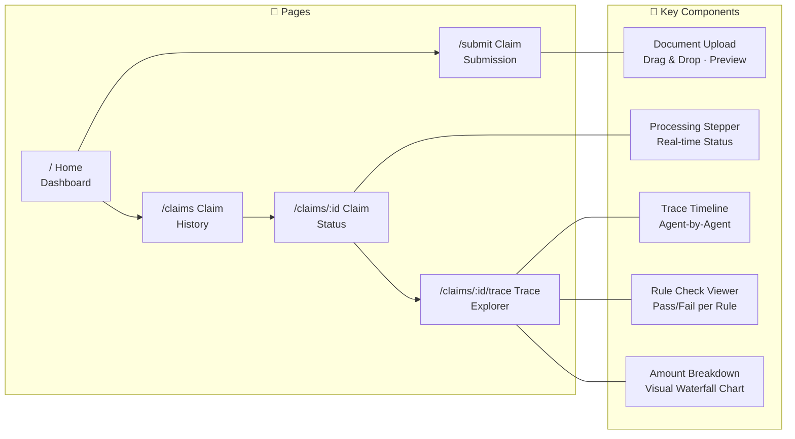

### 13.2 Real-Time Updates

- **WebSocket** connection from frontend to FastAPI.
- On claim submission: client subscribes to `claim:{claim_id}` channel.
- Backend publishes events: `PROCESSING`, `DOC_VERIFIED`, `EXTRACTED`, `ADJUDICATED`, `DECIDED`.
- Frontend updates the processing stepper in real time.

---

## 14. Deployment Architecture

### 14.1 MVP Deployment (Single Server)

```
┌─────────────────────────────────────────────┐
│  EC2 Instance (t3.large) or Local           │
│                                             │
│  ┌─────────┐ ┌─────────┐ ┌──────────┐     │
│  │ FastAPI  │ │ Next.js │ │ LangGraph│     │
│  │ :8000   │ │ :3000   │ │ Workers  │     │
│  └────┬────┘ └────┬────┘ └─────┬────┘     │
│       │           │             │          │
│  ┌────┴───────────┴─────────────┴────┐     │
│  │           Docker Compose           │     │
│  ├──────────┬────────────┬──────────┤     │
│  │PostgreSQL│   Redis    │  MinIO   │     │
│  │  :5432   │   :6379    │  :9000   │     │
│  └──────────┘────────────┘──────────┘     │
│                                             │
│  External: AWS Bedrock (Claude API)         │
└─────────────────────────────────────────────┘
```

### 14.2 Production Deployment (AWS)

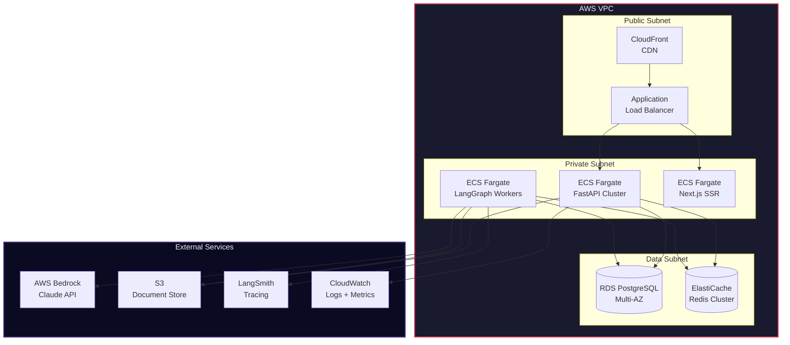

---

## 15. Trade-offs & Rejected Alternatives

### 15.1 Architecture Trade-offs

| Decision | Trade-off | Why We Accept It |
|----------|-----------|-----------------|
| **LangGraph over custom orchestration** | Vendor lock-in to LangChain ecosystem | LangGraph's graph model is a natural fit. Migration cost is low — agents are just functions. |
| **Claude over GPT-4o** | Single provider risk | AWS Bedrock provides enterprise SLAs. Claude's structured output is more reliable for our schema. Fallback to GPT-4o via OpenAI API is trivial. |
| **PostgreSQL over DynamoDB** | Vertical scaling limits | Our scale (75K–750K claims/year) is well within PostgreSQL's range. Complex queries (fraud detection, history) are painful in DynamoDB. |
| **Redis Streams over Kafka (MVP)** | Less partition-level control | Redis is already in the stack for caching. Adding Kafka for 9 claims/hour is over-engineering. Kafka when we hit 90+/hour. |
| **LLM-as-OCR over traditional OCR** | Higher per-call cost, non-deterministic | $0.037/claim is negligible. The accuracy gain on handwritten Indian Rx is worth 10x the cost of Tesseract. |
| **Synchronous eval over streaming eval** | Eval takes longer | Eval correctness matters more than eval speed. We run eval in CI, not in production. |

### 15.2 Rejected Alternatives in Detail

**1. Microservices per agent:**
- Each agent as a separate deployable service.
- Rejected because: at our scale, the coordination overhead (service discovery, inter-service auth, distributed tracing) far outweighs the benefit. A monolith with clean module boundaries is the right call for 2-3 days. Extract services only when deployment independence is needed.

**2. Vector database for policy matching:**
- Embed policy rules, use semantic search to find relevant rules.
- Rejected because: `policy_terms.json` has 15 rules. A `dict` lookup is faster, cheaper, and 100% deterministic. Vector search is for when you have 10,000+ rules and need fuzzy matching.

**3. Fine-tuned model for OCR:**
- Fine-tune a smaller model on Indian medical documents.
- Rejected because: requires labeled training data we don't have, weeks of training, ongoing model maintenance. Claude Sonnet out-of-the-box is sufficient.

**4. Event sourcing for claims:**
- Every state change is an event; reconstruct current state from event stream.
- Rejected because: adds significant complexity for a system that has ~6 state transitions per claim. The `claim_events` table gives us the audit trail without full event sourcing.

---

## 16. Appendix — Data Models & Schemas

### 16.1 Core Enums

```python
class ClaimCategory(str, Enum):
    CONSULTATION = "CONSULTATION"
    DIAGNOSTIC = "DIAGNOSTIC"
    PHARMACY = "PHARMACY"
    DENTAL = "DENTAL"
    VISION = "VISION"
    ALTERNATIVE_MEDICINE = "ALTERNATIVE_MEDICINE"

class DocumentType(str, Enum):
    PRESCRIPTION = "PRESCRIPTION"
    HOSPITAL_BILL = "HOSPITAL_BILL"
    PHARMACY_BILL = "PHARMACY_BILL"
    LAB_REPORT = "LAB_REPORT"
    DIAGNOSTIC_REPORT = "DIAGNOSTIC_REPORT"
    DENTAL_REPORT = "DENTAL_REPORT"
    DISCHARGE_SUMMARY = "DISCHARGE_SUMMARY"
    UNKNOWN = "UNKNOWN"

class Decision(str, Enum):
    APPROVED = "APPROVED"
    PARTIAL = "PARTIAL"
    REJECTED = "REJECTED"
    MANUAL_REVIEW = "MANUAL_REVIEW"

class ClaimStatus(str, Enum):
    RECEIVED = "RECEIVED"
    PROCESSING = "PROCESSING"
    DOCUMENT_ERROR = "DOCUMENT_ERROR"
    DECIDED = "DECIDED"
    MANUAL_REVIEW = "MANUAL_REVIEW"
    CANCELLED = "CANCELLED"

class RejectionReason(str, Enum):
    WAITING_PERIOD = "WAITING_PERIOD"
    EXCLUDED_CONDITION = "EXCLUDED_CONDITION"
    PRE_AUTH_MISSING = "PRE_AUTH_MISSING"
    PER_CLAIM_EXCEEDED = "PER_CLAIM_EXCEEDED"
    SUB_LIMIT_EXCEEDED = "SUB_LIMIT_EXCEEDED"
    ANNUAL_LIMIT_EXCEEDED = "ANNUAL_LIMIT_EXCEEDED"
    DOCUMENT_MISMATCH = "DOCUMENT_MISMATCH"
    MEMBER_NOT_ELIGIBLE = "MEMBER_NOT_ELIGIBLE"
    POLICY_EXPIRED = "POLICY_EXPIRED"
```

### 16.2 API Contracts

```python
# POST /api/v1/claims
class ClaimSubmissionRequest(BaseModel):
    member_id: str
    policy_id: str
    claim_category: ClaimCategory
    treatment_date: date
    claimed_amount: Decimal = Field(gt=0)
    hospital_name: str | None = None
    has_pre_authorization: bool = False
    notes: str | None = None
    # Documents uploaded as multipart form data

class ClaimSubmissionResponse(BaseModel):
    claim_id: str
    status: ClaimStatus
    status_url: str           # GET /api/v1/claims/{claim_id}
    estimated_processing_seconds: int

# GET /api/v1/claims/{claim_id}
class ClaimStatusResponse(BaseModel):
    claim_id: str
    status: ClaimStatus
    decision: Decision | None
    approved_amount: Decimal | None
    confidence_score: float | None
    explanation: DecisionExplanation | None
    trace_url: str | None     # GET /api/v1/claims/{claim_id}/trace
    created_at: datetime
    decided_at: datetime | None

# GET /api/v1/claims/{claim_id}/trace
class ClaimTraceResponse(BaseModel):
    claim_id: str
    processing_trace: ProcessingTrace
```

### 16.3 Directory Structure

```
plumhq/
├── arch_opus.md                    # This document
├── problem_statement/              # Given assignment files
│   ├── assignment.md
│   ├── policy_terms.json
│   ├── test_cases.json
│   └── sample_documents_guide.md
│
├── backend/                        # FastAPI Application
│   ├── pyproject.toml
│   ├── alembic/                    # DB migrations
│   │   └── versions/
│   ├── app/
│   │   ├── __init__.py
│   │   ├── main.py                 # FastAPI app factory
│   │   ├── config.py               # Settings (pydantic-settings)
│   │   ├── api/
│   │   │   ├── __init__.py
│   │   │   ├── routes/
│   │   │   │   ├── claims.py       # POST/GET /claims
│   │   │   │   ├── health.py       # Health check
│   │   │   │   └── webhooks.py     # WebSocket endpoints
│   │   │   ├── dependencies.py     # DI: DB session, auth
│   │   │   └── middleware.py       # CORS, rate limiting
│   │   ├── models/                 # SQLAlchemy models
│   │   │   ├── claim.py
│   │   │   ├── decision.py
│   │   │   ├── document.py
│   │   │   └── member.py
│   │   ├── schemas/                # Pydantic schemas
│   │   │   ├── claim.py
│   │   │   ├── decision.py
│   │   │   ├── document.py
│   │   │   └── trace.py
│   │   ├── agents/                 # LangGraph Agents
│   │   │   ├── __init__.py
│   │   │   ├── graph.py            # Main LangGraph definition
│   │   │   ├── state.py            # ClaimState TypedDict
│   │   │   ├── orchestrator.py     # Supervisor node
│   │   │   ├── doc_verifier.py     # Document verification
│   │   │   ├── doc_parser.py       # OCR + extraction
│   │   │   ├── cross_validator.py  # Cross-document checks
│   │   │   ├── adjudicator.py      # Policy rule engine
│   │   │   ├── fraud_detector.py   # Fraud analysis
│   │   │   └── decision_synth.py   # Final decision
│   │   ├── services/               # Business logic
│   │   │   ├── policy_engine.py    # Policy terms loader
│   │   │   ├── member_service.py   # Member lookup
│   │   │   ├── document_store.py   # S3/MinIO interface
│   │   │   └── notification.py     # WebSocket push
│   │   ├── llm/                    # LLM utilities
│   │   │   ├── client.py           # Bedrock / API client
│   │   │   ├── prompts/            # Prompt templates
│   │   │   │   ├── classify_doc.py
│   │   │   │   ├── extract_prescription.py
│   │   │   │   ├── extract_bill.py
│   │   │   │   ├── match_diagnosis.py
│   │   │   │   └── generate_explanation.py
│   │   │   ├── fallback.py         # Tesseract fallback
│   │   │   └── circuit_breaker.py  # LLM circuit breaker
│   │   ├── core/                   # Shared utilities
│   │   │   ├── exceptions.py
│   │   │   ├── logging.py          # Structured JSON logging
│   │   │   └── tracing.py          # OTel + LangSmith setup
│   │   └── db/
│   │       ├── session.py          # Async SQLAlchemy session
│   │       └── repository.py       # CRUD operations
│   └── tests/
│       ├── conftest.py
│       ├── test_agents/
│       │   ├── test_doc_verifier.py
│       │   ├── test_doc_parser.py
│       │   ├── test_adjudicator.py
│       │   └── test_fraud.py
│       ├── test_api/
│       │   └── test_claims.py
│       └── eval/
│           ├── eval_runner.py      # Run 12 test cases
│           ├── eval_report.py      # Generate eval report
│           └── mock_docs.py        # Generate mock documents
│
├── frontend/                       # Next.js Application
│   ├── package.json
│   ├── next.config.js
│   ├── app/
│   │   ├── layout.tsx
│   │   ├── page.tsx                # Dashboard
│   │   ├── submit/
│   │   │   └── page.tsx            # Claim submission
│   │   ├── claims/
│   │   │   ├── page.tsx            # Claims list
│   │   │   └── [id]/
│   │   │       ├── page.tsx        # Claim detail
│   │   │       └── trace/
│   │   │           └── page.tsx    # Trace explorer
│   │   └── api/                    # API routes (BFF)
│   ├── components/
│   │   ├── DocumentUpload.tsx
│   │   ├── ProcessingStepper.tsx
│   │   ├── TraceTimeline.tsx
│   │   ├── RuleCheckViewer.tsx
│   │   └── AmountBreakdown.tsx
│   └── lib/
│       ├── api.ts                  # Backend API client
│       └── websocket.ts            # WS connection manager
│
├── docker-compose.yml              # Local development
├── Dockerfile.backend
├── Dockerfile.frontend
├── Makefile                        # Dev commands
└── docs/
    ├── COMPONENT_CONTRACTS.md      # Deliverable 3
    ├── EVAL_REPORT.md              # Deliverable 4
    └── AWS_DEPLOYMENT.md           # Deployment guide
```

### 16.4 Technology Versions

| Technology | Version | Purpose |
|-----------|---------|---------|
| Python | 3.12+ | Backend runtime |
| FastAPI | 0.115+ | API framework |
| LangGraph | 0.2+ | Agent orchestration |
| LangChain | 0.3+ | LLM abstractions |
| SQLAlchemy | 2.0+ | ORM (async) |
| Alembic | 1.14+ | DB migrations |
| Pydantic | 2.0+ | Data validation |
| Redis | 7.0+ | Cache + state + pub/sub |
| PostgreSQL | 16+ | Primary database |
| Next.js | 14+ | Frontend framework |
| TypeScript | 5.0+ | Frontend language |
| Docker | 24+ | Containerization |
| Claude 3.5 Sonnet | Latest | Primary LLM (via Bedrock) |
| Claude 3.5 Haiku | Latest | Fast LLM (via Bedrock) |
| Tesseract | 5.0+ | OCR fallback |
| LangSmith | Latest | Agent observability |
| OpenTelemetry | 1.25+ | Infra observability |

---

> **This document is a living blueprint.** Each section maps directly to a deliverable in the assignment. The architecture prioritizes **explainability** (20% of evaluation weight), **modularity** (30% system design weight), and **resilience** (TC011). Every decision has a _why_, every component has a _contract_, and every failure has a _plan_.
