# Backend Architecture — Explainable Health-Claim Processing

**Status:** current architecture baseline for local development
**Scope:** the supplied Plum AI Engineer assignment and its twelve evaluation cases  
**Runtime posture:** application processes run locally; managed capabilities are consumed from AWS  
**Primary rule:** **models produce evidence; deterministic code applies policy; humans resolve ambiguity; no model authorizes payment**

---

## 1. Executive decision

Build a **modular monolith with a durable workflow**, not a collection of autonomous agent services.
Expose one deep `ClaimProcessing` module with three commands:

```python
receipt = await claims.submit(submission, idempotency_key=key)
view = await claims.get(claim_id)
view = await claims.resume(claim_id, command, expected_version=view.version)
```

Internally, the module owns four cohesive capabilities:

1. `DocumentIntelligence` turns untrusted files into provenance-linked observations.
2. `ClaimEvidenceCasefile` reconciles those observations into facts, conflicts, and explicit `UNKNOWN` values.
3. `VersionedPolicyAdjudicator` applies a compiled, versioned policy with deterministic integer-paise arithmetic.
4. `DecisionRecord` atomically records the decision, rule trace, evidence references, workflow state, and audit events.

LangGraph implements the resumable control flow, but its nodes are adapters around these domain modules. PostgreSQL is the system of record, workflow checkpoint store, and durable local work queue. Local FastAPI, worker, and web processes use the local filesystem for documents, local JSONL files for engineering telemetry, and only two external AWS capabilities: Textract for OCR/document analysis and Bedrock Runtime for semantic extraction.

This architecture is scoped exclusively to local application processes. “Scalable” here means bounded work, backpressure, idempotency, stateless compute boundaries, replaceable adapters, and measurable capacity.

### 1.1 Decision summary

| Concern | Decision | Reason |
|---|---|---|
| Architecture style | Modular monolith with deep modules | One transaction boundary, simple local operation, clean future extraction seams |
| Workflow framework | LangGraph behind `WorkflowRuntime` | Durable pause/resume and explicit graph state without granting agent autonomy |
| Model authority | Evidence generation only | Policy and money must be reproducible and testable |
| OCR | AWS Textract first, Bedrock for semantic recovery | OCR geometry and confidence remain separate from model interpretation |
| Foundation models | AWS Bedrock Runtime, configurable model profiles | Region/account availability changes; promotion is eval-gated |
| Database | PostgreSQL | Relational integrity, JSONB evidence, audit transactions, local work leases, workflow checkpoints |
| Work scheduling | PostgreSQL `claim_work_items` table | Durable retries/resume without a separate queue service |
| Document storage | Content-addressed local filesystem | Simplest durable storage for a single-machine assignment |
| Observability | PostgreSQL domain trace + rotating local JSONL logs and spans | Complete local reconstruction without a hosted observability service |
| Evaluation | Component, rendered-document E2E, replay, and optional live-Textract/Bedrock suites | Separates reasoning correctness from OCR/provider variance |
| Policy representation | Compile source JSON into immutable Policy IR | Detect contradictions before a claim can be processed |

### 1.2 Non-goals

- No payment execution, insurer integration, or financial ledger.
- No hosting, cloud networking, release automation, or environment-topology design.
- No general-purpose autonomous agent platform.
- No vector database or policy retrieval by semantic similarity.
- No model-generated final policy outcome.
- No raw prompts, responses, medical images, or OCR bodies in general logs.
- No S3, SQS, SNS, CloudWatch, X-Ray, Redis, Kafka, or hosted tracing platform.

---

## 2. Source-of-truth hierarchy and contradictions

The supplied artifacts are not mutually consistent. The system must not hide this with case-specific code. It must compile and validate policy before accepting claims.

### 2.1 Authority order

1. An explicitly approved, versioned assignment overlay.
2. A compiled `PolicyIR` derived from `policy_terms.json`.
3. Source policy JSON retained unchanged for audit.
4. Test-case expectations as evaluation oracles, never runtime inputs.
5. Natural-language sample-document guidance as extraction guidance only.

An overlay is a reviewed data artifact:

```yaml
overlay_id: assignment-v1
base_policy_sha256: "..."
changes:
  - rule_path: coverage.per_claim_limit
    action: clarify_precedence
    value: "category-specific allowance may exceed global limit for DENTAL"
    rationale: "Required to reconcile TC006; pending business-owner confirmation"
approval:
  status: PROVISIONAL
  approved_by: assignment_assumption
  approved_at: "..."
```

The compiler rejects unapproved or structurally invalid overlays. It never branches on `case_id`.

### 2.2 Contradiction register

| ID | Conflict | Architectural treatment |
|---|---|---|
| C-01 | Global per-claim limit is ₹5,000, but TC006 expects ₹8,000 dental approval | Compilation error until precedence/overlay is explicit |
| C-02 | Consultation sub-limit is ₹2,000, but TC010 expects ₹3,240 after discount and co-pay | Compilation error; do not infer a silent exception |
| C-03 | Dental says a dental report is required, but document requirements mark it optional | Semantic validator requires a product-owner resolution |
| C-04 | Diagnostic says `requires_pre_auth=false`, while threshold/high-value rules require it | Compile into conditional pre-auth rules and warn on misleading source flag |
| C-05 | Covered relationship uses `CHILDREN`; roster representation uses singular relationship concepts | Canonical vocabulary maps aliases and records the mapping version |
| C-06 | Members reference DEP003–DEP005, but complete dependent records are absent | Affected identity/eligibility facts become `UNKNOWN`; never synthesize members |
| C-07 | TC008 expects rejection when a claim exceeds a limit, while cap semantics are plausible | Outcome behavior must be a policy field: `REJECT`, `CAP`, or `REVIEW` |
| C-08 | TC011 combines `APPROVED` with a manual-review recommendation | Separate adjudication from lifecycle routing |

### 2.3 Production request versus evaluation oracle

The production request accepts member-entered data and uploaded bytes only:

```python
class ClaimSubmission(BaseModel):
    member_id: str
    policy_id: str
    category: ClaimCategory
    treatment_date: date
    claimed_amount: Money  # immutable value object backed by integer paise
    currency: Literal["INR"]
    documents: list[UploadedDocumentRef]
```

These fixture fields are forbidden in that API:

| Fixture field | Meaning | Eval adapter behavior |
|---|---|---|
| `actual_type` | Ground-truth document class | Render/generate the corresponding document; retain label only in oracle store |
| `quality` | Ground-truth readability | Apply deterministic blur/occlusion transform or use a labeled corpus artifact |
| `content` | Ground-truth fields | Render into a synthetic PDF/image; never inject as extracted output in E2E mode |
| `patient_name_on_doc` | Ground-truth content shorthand | Render the value into the document |
| `claims_history` | Backend history fixture | Seed repository before submission |
| `ytd_claims_amount` | Backend aggregate fixture | Seed prior adjudicated claims; compute the aggregate normally |
| `simulate_component_failure` | Evaluation fault request | Map to a named fault in the eval-only composition root |

The production dependency container cannot construct `FaultInjecting*` adapters. A startup assertion fails if an eval adapter is imported by the production/local-interactive composition root.

---

## 3. Quality attributes and invariants

### 3.1 Hard domain invariants

1. A model output is never a claim decision.
2. Every material fact has provenance or is explicitly `UNKNOWN`.
3. Every money operation uses a `Money` value object backed by integer paise and a named rounding rule; floats are forbidden.
4. A decision references immutable `policy_version`, `policy_source_hash`, `casefile_version`, and `workflow_run_id`.
5. A terminal decision and its audit events commit in one PostgreSQL transaction.
6. A missing required fact cannot become a negative fact. “No pre-auth observed” is not “pre-auth absent.”
7. Failed or timed-out evidence components reduce automation authority; they do not silently lower payable amount.
8. Member-facing document correction happens before adjudication.
9. Replaying the same casefile against the same Policy IR returns the same rule tree and amount.
10. A reviewer override preserves the machine proposal and appends a new version; it never mutates history.
11. Idempotency applies at submission, document processing, workflow node, reviewer command, and terminal commit boundaries.
12. Test oracles cannot cross into the production domain model.

### 3.2 Initial local quality objectives

These are engineering targets to measure, not unsupported production SLO claims:

| Signal | Initial target |
|---|---|
| Policy replay determinism | 100% identical canonical decision hash |
| Duplicate terminal decisions | 0 |
| Money invariant/property tests | 100% pass |
| Required evidence with provenance | 100% |
| Unexplained terminal rule result | 0 |
| Early-gate wrong-document recall on labeled eval set | ≥ 0.98 |
| Early-gate unreadable-document recall | ≥ 0.98 |
| Structured schema validation after bounded repair | ≥ 0.99 on supported corpus |
| PHI found in application log scan | 0 |

Latency, token, OCR-page, manual-review, and AWS cost budgets are recorded by task and calibrated from actual local runs before thresholds are asserted.

---

## 4. Deep-module architecture

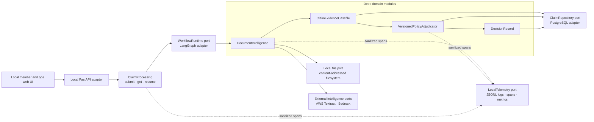

The arrows describe dependency direction, not network services. All core modules can live in one Python process and repository. A LangGraph node calls one module operation and maps its typed result into workflow state.

### 4.1 Chosen interface: a caller-first hybrid

Three independent interface pressures matter:

- **Minimality:** callers should not assemble or sequence agents.
- **Extensibility:** document and model routes, policy versions, review commands, and evaluations must remain replaceable.
- **Safe defaults:** the normal path should make the valid behavior easiest and reject stale or privileged commands.

The selected hybrid keeps three public operations while putting extension points behind constructor-injected ports.

```python
class ClaimProcessing(Protocol):
    async def submit(
        self,
        submission: ClaimSubmission,
        *,
        idempotency_key: str,
    ) -> ClaimReceipt: ...

    async def get(self, claim_id: ClaimId) -> ClaimView: ...

    async def resume(
        self,
        claim_id: ClaimId,
        command: ClaimCommand,
        *,
        expected_version: int,
    ) -> ClaimView: ...
```

`resume` accepts a closed command union:

```python
ClaimCommand = Annotated[
    UploadReplacementDocuments
    | ConfirmMemberFact
    | SubmitPreAuthorization
    | ReviewerApprove
    | ReviewerPartiallyApprove
    | ReviewerReject
    | ReviewerRequestDocuments,
    Field(discriminator="type"),
]
```

There is no public `run_agent`, `set_state`, `goto_node`, `choose_model`, or `set_confidence` method. Those would leak implementation and permit invalid state transitions.

### 4.2 Composition root

```python
claims = ClaimsApplication.create(
    repository=PostgresClaimRepository(dsn=settings.postgres_dsn),
    workflow=LangGraphWorkflow(checkpointer=postgres_checkpointer),
    document_store=LocalDocumentStore(root=settings.document_root),
    document_analyzer=TextractDocumentAnalyzer(...),
    semantic_extractor=BedrockStructuredExtractor(model_router=router),
    work_scheduler=PostgresWorkScheduler(dsn=settings.postgres_dsn),
    telemetry=JsonlLocalTelemetry(log_dir=settings.log_dir),
    policy_registry=CompiledPolicyRegistry(...),
    clock=SystemClock(),
)
```

Tests use the same ports with deterministic implementations:

```python
claims = ClaimsApplication.create(
    repository=InMemoryClaimRepository(),
    workflow=InlineWorkflow(),
    document_store=TemporaryDocumentStore(),
    document_analyzer=RecordedDocumentAnalyzer(fixtures),
    semantic_extractor=RecordedStructuredExtractor(fixtures),
    work_scheduler=InlineWorkScheduler(),
    telemetry=InMemoryTelemetry(),
    policy_registry=CompiledPolicyRegistry(test_policy),
    clock=FrozenClock(...),
)
```

### 4.3 Dependency rules

```text
interfaces -> application -> domain
                      \-> ports
infrastructure -> ports + external SDKs
composition -> every layer
```

- `domain` imports no FastAPI, LangGraph, Boto3, SQLAlchemy, or telemetry package.
- `application` coordinates domain modules and ports.
- `infrastructure` implements ports and translates provider errors into typed application errors.
- `interfaces` translate HTTP/UI/CLI input into commands.
- Only `composition` knows concrete providers.

An import-boundary test enforces these rules.

---

## 5. Local-development runtime

All application compute runs locally. Only Textract and Bedrock Runtime cross the machine boundary.

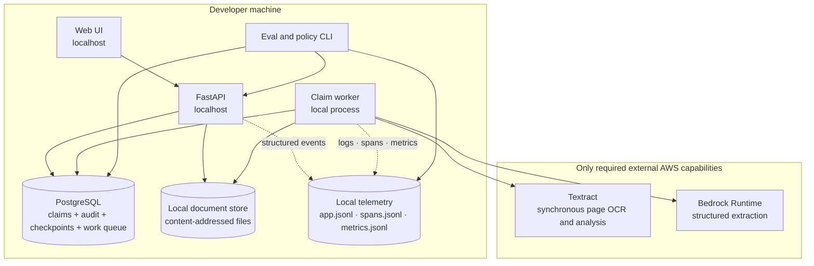

### 5.1 Local processes

| Process | Responsibility | State |
|---|---|---|
| `web` | Submission, status, correction, reviewer trace UI | No authoritative state |
| `api` | Authentication stub/local identity, validation, streaming uploads, commands, queries | PostgreSQL transactions and local files |
| `worker` | Claims workflow, PostgreSQL work polling, AWS calls, retries, checkpoint transitions | Checkpointed in PostgreSQL |
| `postgres` | Domain source of truth, work schedule, audit ledger, LangGraph checkpoint | Durable local volume |
| `local-document-store` | Immutable originals and derived page images | Local filesystem with atomic writes and hashes |
| `local-telemetry` | Rotating structured logs, spans, and metrics snapshots | Local filesystem; no business authority |
| `claimsctl` | Policy compile, fixture render, eval, replay, trace export | Uses public/application ports |

### 5.2 Local profiles

| Profile | External AWS | Use |
|---|---|---|
| `unit` | None | Pure domain and property tests |
| `recorded` | None during run | Sanitized provider recordings; deterministic integration tests |
| `local-aws` | Textract and Bedrock Runtime only | Interactive development with real OCR/models |
| `live-intelligence` | Textract and Bedrock Runtime only | Explicit cost-bearing OCR/model evaluation |

No LocalStack claim is made for Textract or Bedrock fidelity. Fakes prove contracts; live evaluation measures provider behavior. S3, SQS, SNS, and CloudWatch are not part of any profile.

---

## 6. Agent framework and agent taxonomy

### 6.1 Framework decision

Use **LangGraph** for explicit state transitions, bounded retries, checkpoints, interrupts, and resume. Hide it behind `WorkflowRuntime`, because the business architecture is the state machine and its contracts—not a framework-specific graph.

Do not use Bedrock Agents, CrewAI, AutoGen, or a free-form supervisor for the primary path. Claim processing is known, auditable, and policy-constrained. Dynamic delegation adds nondeterminism without improving the authority model.

### 6.2 What counts as an agent

The “multi-agent” design is a set of specialized, bounded evidence workers:

| Worker | Input | Output | May use model? | Authority |
|---|---|---|---|---|
| Document triage | Page previews + upload metadata | Type/readability observations | Yes | Evidence only |
| OCR layout | Local immutable page bytes | Tokens, lines, geometry, provider confidence | Textract | Evidence only |
| Expense parser | Bill/invoice | Summary fields and line items | Textract | Evidence only |
| Clinical extractor | OCR/layout + selected page images | Typed clinical observation candidates | Bedrock | Evidence only |
| Reconciler | All observations + member facts | Casefile facts/conflicts/unknowns | Optional constrained model for terminology only | Evidence only |
| Anomaly detector | Repository aggregates + casefile | Named signals with evidence | Deterministic first | Routing signal only |
| Policy adjudicator | Casefile + Policy IR | Deterministic decision proposal and rule tree | No | Decision proposal |
| Explanation renderer | Rule tree + templates | Member/ops wording | Optional | Wording only |

“Agent” is therefore a product-facing term. In code these are typed domain/application components, not independent services with open-ended goals.

### 6.3 Tool permissions

| Capability | Read | Write | Forbidden |
|---|---|---|---|
| Triage/extraction | Assigned local document version | Observation rows through repository port | Policy, decisions, member roster |
| Reconciler | Observations, member snapshot | New immutable casefile version | Source documents, policy |
| Anomaly detector | Aggregated claim history | Signal observations | Reject/approve |
| Adjudicator | Policy IR, frozen casefile | Proposed decision/rule trace | Files, OCR, model calls |
| Reviewer command handler | Claim view, reviewer identity | New decision/review version | Mutating prior audit events |

Provider credentials are scoped in the local AWS profile. A model never receives AWS credentials, database access, or arbitrary tools.

---

## 7. Claim lifecycle

### 7.1 State machine

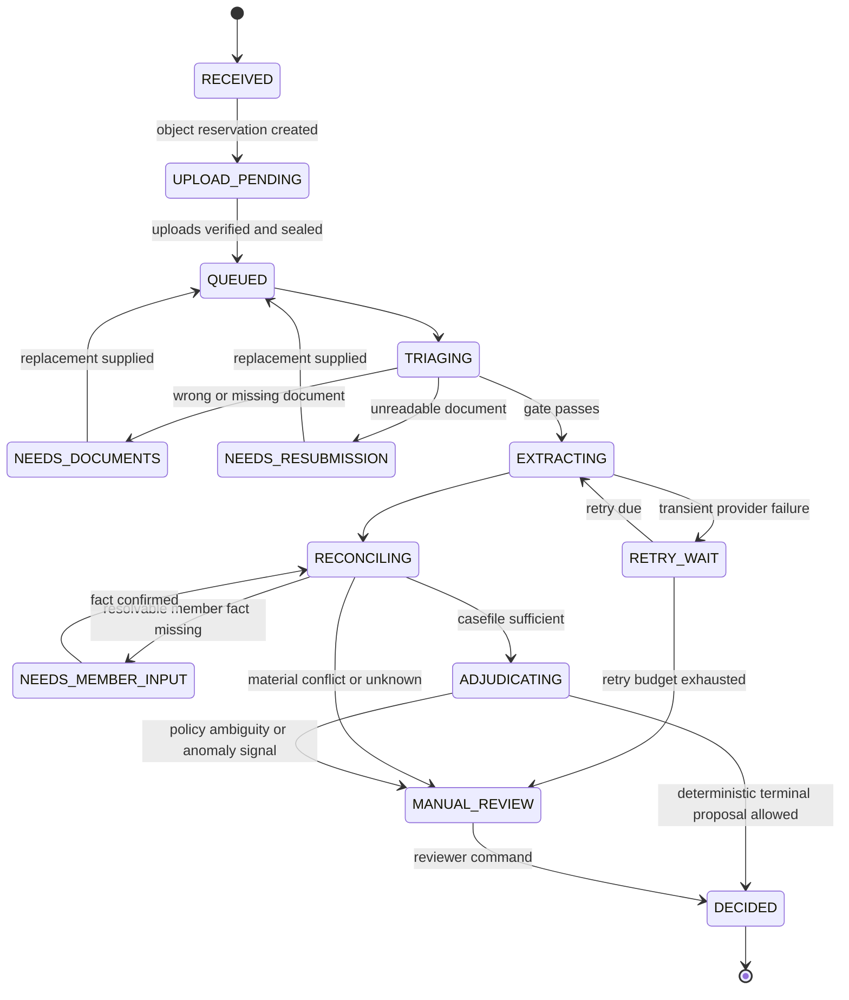

`APPROVED`, `PARTIAL`, and `REJECTED` are adjudication outcomes. `MANUAL_REVIEW`, `NEEDS_DOCUMENTS`, and `NEEDS_MEMBER_INPUT` are lifecycle states. Keeping these axes separate resolves cases such as “policy outcome approved but an anomaly requires manual review.”

### 7.2 End-to-end sequence

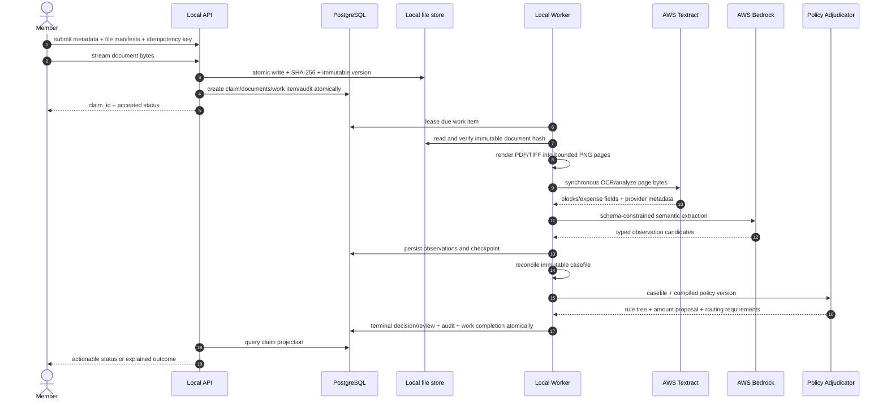

### 7.3 Graph nodes

| Node | Idempotency key | Side effect | Success result |
|---|---|---|---|
| `load_claim` | claim/version | None | Frozen work context |
| `triage_documents` | document-version + triage-profile | Observation insert | Gate result |
| `render_pages` | document hash + render profile | Immutable derived pages | Ordered page refs |
| `analyze_pages` | page hashes + feature-set | Synchronous Textract calls + observation insert | Canonical OCR artifact |
| `semantic_extract` | OCR hash + schema + model profile | Bedrock call + observation | Typed candidates |
| `build_casefile` | sorted observation hashes + member snapshot | Casefile insert | Casefile version |
| `detect_signals` | casefile + history snapshot | Signal insert | Named signals |
| `adjudicate` | casefile hash + policy IR hash | Proposal insert | Rule result tree |
| `route_or_commit` | proposal hash + claim version | State/decision transaction | Claim projection |

Every node returns one of:

```python
NodeResult = Completed[T] | Waiting[ExternalRef] | NeedsInput[Request] | Retryable[Failure] | FailedClosed[Failure]
```

Exceptions crossing a node boundary indicate programmer/infrastructure defects and are captured as sanitized failure events. Expected provider and domain outcomes use typed results.

---

## 8. Document intelligence

`DocumentIntelligence` owns the entire transformation from an immutable local document version to evidence observations. It hides safe page rendering, synchronous OCR selection, schema-constrained Bedrock calls, bounded repair, and provenance normalization.

### 8.1 Contract

```python
class DocumentIntelligence(Protocol):
    async def analyze(
        self,
        request: AnalyzeDocumentRequest,
    ) -> DocumentAnalysisResult: ...

class AnalyzeDocumentRequest(BaseModel):
    claim_id: ClaimId
    document_id: DocumentId
    document_ref: LocalDocumentRef  # relative path, version_id, sha256
    expected_roles: frozenset[DocumentRole]
    profile_version: str
    operation_key: str

class DocumentAnalysisResult(BaseModel):
    document_id: DocumentId
    media: MediaInspection
    pages: tuple[PageObservation, ...]
    role_candidates: tuple[RoleCandidate, ...]
    quality_observations: tuple[QualityObservation, ...]
    extracted_candidates: tuple[EvidenceCandidate, ...]
    provider_calls: tuple[ProviderCallRef, ...]
    outcome: Literal["COMPLETE", "DEGRADED", "ACTION_REQUIRED"]
```

Expected typed failures:

```text
UnsupportedMediaType
EncryptedDocument
ObjectChecksumMismatch
PageLimitExceeded
ProviderThrottled(retry_after)
ProviderTimeout(retryable)
ProviderRejected(permanent_code)
SchemaValidationFailed(attempts, redacted_errors)
UnsafeDocumentInstructionDetected
```

### 8.2 AWS routing

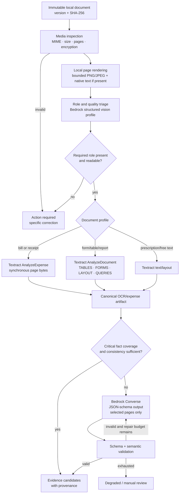

Recommended initial routes:

| Document profile | Textract route | Bedrock use |
|---|---|---|
| Prescription | Text/layout; retain handwriting geometry and provider confidence | Classify role; extract clinical fields from selected pages; normalize medicine/test terminology |
| Hospital/clinic bill | Expense analysis plus raw OCR/layout cross-check | Reconcile atypical line items, patient/provider/date fields |
| Pharmacy bill | Expense analysis plus totals validation | Map medicines and branded/generic evidence when text supports it |
| Lab/diagnostic report | Tables/forms/layout/queries | Extract ordered/performed test and clinical concepts |
| Dental report | Forms/layout/text | Extract procedures and clinical justification candidates |
| Pre-authorization | Forms/queries/layout | Extract authorization ID, scope, dates, amount constraints |
| Discharge summary | Layout/text | Clinical episode and dates; never infer unsupported treatment |

For every supported upload, render each page locally to a bounded PNG/JPEG image and call the synchronous Textract API with page bytes. This is deliberate: synchronous Textract handles single-page input, while native multipage asynchronous processing would require S3 and add job-completion machinery. The worker persists every page result and merges pages in deterministic order. Enforce page-count, pixel, and byte limits; compress/downscale a page before submission, and request a clearer/smaller document if it still exceeds the safe byte limit.

### 8.3 Bedrock model profiles

Do not embed a transient “latest” model ID in domain code. Maintain aliases:

```yaml
model_profiles:
  complex_multimodal:
    provider: aws_bedrock
    candidate_family: anthropic_claude_sonnet
    initial_candidate: claude-sonnet-4.6
    required_capabilities: [vision, converse, structured_output]
    temperature: 0
  fast_classifier:
    provider: aws_bedrock
    candidate_family: anthropic_claude_haiku
    initial_candidate: claude-haiku-4.5
    required_capabilities: [vision, converse, structured_output]
    temperature: 0
```

The exact model ID is resolved from models enabled in the configured AWS account/region, pinned in `ModelRouteVersion`, and promoted only after evaluation. The initial candidates above are starting points, not permanent claims of superiority.

Bedrock calls use Converse structured output with a versioned JSON schema. Provider output is parsed into an untrusted DTO and then validated by:

1. JSON/schema validation.
2. Field normalization.
3. Cross-field invariants.
4. OCR-grounding checks.
5. Prompt-injection screening.
6. Candidate creation with provenance.

The schema does not contain decision, approved amount, policy result, or payment fields. If a provider returns them, `extra="forbid"` rejects the response.

Fast triage additionally excludes every backend-owned provenance field. Its current
`triage-output-v3` contract contains only:

```json
{
  "schema_version": 3,
  "documents": [
    {
      "client_document_id": "doc-123",
      "role": "HOSPITAL_BILL",
      "role_evidence_refs": ["opaque-backend-observation-id"],
      "readability": "READABLE",
      "readability_evidence_refs": ["opaque-backend-observation-id"],
      "identity_observations": [
        {
          "kind": "PATIENT_NAME",
          "value": "Rajesh Kumar",
          "observation_id": "opaque-backend-observation-id"
        }
      ]
    }
  ]
}
```

The model copies observation IDs that were supplied in its input; it never generates hashes.
After schema validation, a deterministic resolver verifies that every reference exists and belongs
to the predicted document version. The resolver copies page, region, and OCR confidence from that
observation, computes the source-text SHA-256 from persisted OCR text, and copies preview provenance
from the persisted rendered-page artifact. Cross-document references and identity values not
contained in their referenced OCR text fail grounding validation.

### 8.4 Provenance

```python
class EvidenceCandidate(BaseModel):
    candidate_id: EvidenceCandidateId
    fact_path: str
    value: JsonValue
    normalized_value: JsonValue | None
    source_document_id: DocumentId
    source_document_version: str
    page_number: int | None
    bounding_regions: tuple[BoundingRegion, ...]
    source_text_hash: str | None
    producer: Literal["TEXTRACT", "BEDROCK", "MEMBER", "MEMBER_ROSTER", "REPOSITORY"]
    producer_version: str
    provider_confidence: Decimal | None
    extraction_schema_version: str
    status: Literal["OBSERVED", "INFERRED", "CONFLICTING", "REJECTED"]
```

Provider confidence is only one observation. It is not the claim confidence and is never averaged blindly across fields.

### 8.5 Early document gate

The gate runs before full extraction and adjudication. It checks:

- Required document roles are present.
- Uploaded role is plausible, not just claimed by filename.
- Each required document is readable enough for its critical fields.
- Documents plausibly concern the same patient/episode.
- File is supported, safe to process, and within configured limits.

Example result:

```json
{
  "status": "ACTION_REQUIRED",
  "code": "WRONG_DOCUMENT_ROLE",
  "document_id": "doc_02",
  "observed_role": "PRESCRIPTION",
  "expected_roles": ["HOSPITAL_BILL"],
  "message": "You uploaded a second prescription. Please upload the hospital or clinic bill showing the provider, patient, date, line items, and total."
}
```

Unreadable documents produce `NEEDS_RESUBMISSION`, not `REJECTED`. A patient-name conflict discovered at the gate requests correction and records both names and their document references.

### 8.6 Security posture for document/model calls

- Treat all document text as untrusted data, never instructions.
- Put extracted text inside delimited data fields and tell the model it cannot change its task.
- Allow only known JSON schemas; prohibit tool use for extraction.
- Send only pages needed for the extraction task.
- Verify the sealed local document/page SHA-256 before every provider operation.
- Use provider request IDs and metadata in sanitized traces.
- Keep Bedrock model invocation body/image logging disabled for medical content.
- Store raw provider bodies only in a separately controlled debug workflow if explicitly authorized; default is no retention.

---

## 9. Claim evidence casefile

The casefile is the sole input to policy evaluation. It converts a noisy set of observations into a frozen, typed, auditable snapshot without erasing disagreement.

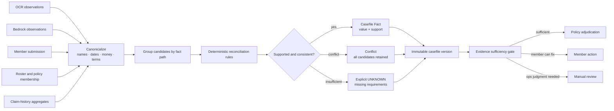

### 9.1 Core schema

```python
class Fact[T](BaseModel):
    path: str
    state: Literal["KNOWN", "UNKNOWN", "CONFLICT"]
    value: T | None
    support: tuple[EvidenceCandidateId, ...]
    conflicts: tuple[EvidenceCandidateId, ...]
    normalization_version: str
    confidence_band: Literal["HIGH", "MEDIUM", "LOW", "NOT_APPLICABLE"]

class ClaimCasefile(BaseModel):
    casefile_id: CasefileId
    version: int
    claim_snapshot_id: ClaimSnapshotId
    patient: PatientFacts
    episode: EpisodeFacts
    provider: ProviderFacts
    clinical: ClinicalFacts
    billing: BillingFacts
    authorization: AuthorizationFacts
    membership: MembershipFacts
    history: ClaimHistoryFacts
    conflicts: tuple[FactConflict, ...]
    missing_critical_facts: tuple[MissingFact, ...]
    observation_set_hash: str
```

### 9.2 Identity resolution

Identity is not a single fuzzy-name score. The reconciler evaluates:

- Member ID and roster membership.
- Normalized patient names and aliases.
- Date of birth when present.
- Relationship/dependent linkage.
- Cross-document patient consistency.
- Episode/provider/date consistency.

Deterministic exact/normalized matches are preferred. A model may suggest transliteration or spelling candidates, but deterministic thresholds and review rules accept or reject them. A conflict such as “Rajesh Kumar” versus “Arjun Mehta” is never collapsed into the higher-confidence candidate.

### 9.3 Amount reconciliation

Represent money as:

```python
@dataclass(frozen=True)
class Money:
    currency: Literal["INR"]
    paise: int
```

Rules:

- Parsed line-item amounts must sum to the stated subtotal/total within an explicitly configured document tolerance.
- Evaluation of policy amounts is exact; the expected approved amount has no tolerance.
- Claimed amount, bill total, eligible line-item total, discounts, co-pay, limits, and approved amount remain separate fields.
- A discrepancy is a fact conflict, not an invitation for a model to choose a number.
- Negative values and implausible scale/currency changes fail validation.

### 9.4 Clinical normalization

Maintain versioned synonym tables and coded concepts where useful:

- “Type II DM” → candidate for `DIABETES`, with source retained.
- “MRI LS spine” → `MRI_LUMBAR_SPINE`.
- “RCT” → `ROOT_CANAL_TREATMENT`.

Normalization produces both `raw_text` and `canonical_concept`. Exclusions and waiting periods compare canonical concepts, but the rule trace shows the raw supporting text. Unrecognized terms become `UNKNOWN` or review input; nearest-neighbor similarity cannot authorize coverage.

### 9.5 Sufficiency matrix

| Fact | Auto-approve/reject requirement | If missing/conflicting |
|---|---|---|
| Member eligibility | Known | Manual review/action |
| Patient identity | Known and consistent | Member correction or review |
| Treatment date | Known | Action/review |
| Claimed/billed amount | Known and reconciled | Action/review |
| Required document roles | Present/readable | Action |
| Covered/excluded line items | Supported for affected amount | Review ambiguous items |
| Waiting-period condition | Supported before rejecting | Review; never infer disease |
| Required pre-auth | Known before auto decision | Review/action |
| Policy version | Compiled/active | Stop processing |

---

## 10. Versioned policy adjudicator

The adjudicator is a pure domain module:

```python
class VersionedPolicyAdjudicator(Protocol):
    def evaluate(
        self,
        casefile: ClaimCasefile,
        policy: PolicyIR,
    ) -> AdjudicationProposal: ...
```

It has no AWS, database, clock, model, or HTTP dependency. Time-dependent facts are frozen in the casefile.

### 10.1 Policy lifecycle

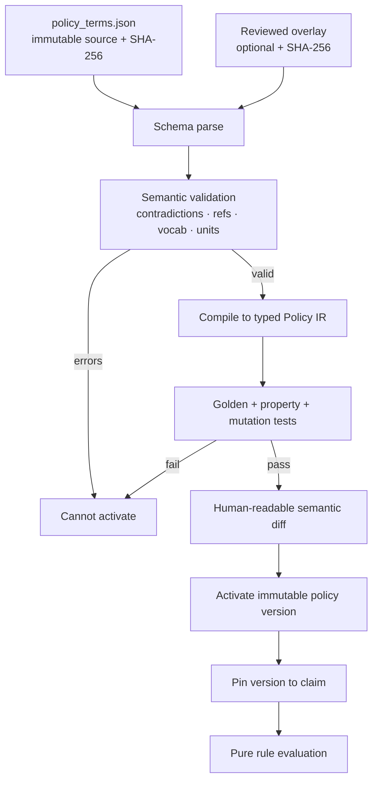

### 10.2 Policy IR

```python
class PolicyIR(BaseModel):
    policy_version_id: PolicyVersionId
    source_hash: str
    overlay_hash: str | None
    effective_period: DateRange
    currency: Literal["INR"]
    membership: MembershipRules
    document_requirements: dict[ClaimCategory, DocumentRequirementRule]
    category_rules: dict[ClaimCategory, CategoryRuleSet]
    waiting_period_rules: tuple[WaitingPeriodRule, ...]
    exclusion_rules: tuple[ExclusionRule, ...]
    pre_authorization_rules: tuple[PreAuthorizationRule, ...]
    amount_rules: AmountRuleSet
    anomaly_routing_rules: tuple[RoutingRule, ...]
    rule_order: tuple[RuleId, ...]
    engine_contract_version: str
```

Every IR rule has:

- Stable `rule_id`.
- Exact source JSON pointer.
- Inputs and their required-known status.
- Outcome behavior.
- Reason code and explanation parameters.
- Dependencies/order.
- Amount transformation, if any.

### 10.3 Rule execution

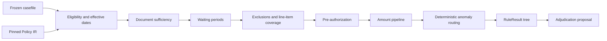

Each rule returns:

```python
class RuleResult(BaseModel):
    rule_id: RuleId
    status: Literal["PASS", "FAIL", "NOT_APPLICABLE", "UNKNOWN"]
    reason_code: str
    policy_path: str
    evidence_refs: tuple[EvidenceCandidateId, ...]
    input_values: dict[str, RedactedScalar]
    amount_before: Money | None
    adjustment: MoneyAdjustment | None
    amount_after: Money | None
    children: tuple["RuleResult", ...]
```

`UNKNOWN` never coerces to `PASS`. The routing policy decides whether the user can supply information or an operator must review it.

### 10.4 Amount order

The compiler requires a declared order. A defensible starting order, subject to product-owner confirmation, is:

1. Reconcile billed and claimed amounts.
2. Remove excluded/non-covered line items.
3. Apply provider/network discount if the policy defines it as a payable adjustment.
4. Apply category/sub-limit.
5. Apply per-claim limit according to explicit `REJECT` or `CAP` semantics.
6. Apply remaining annual/family limits from repository-derived snapshots.
7. Apply co-pay to eligible amount.
8. Apply final rounding to paise.
9. Assert `0 ≤ approved ≤ claimed`.

Example amount trace:

```json
{
  "currency": "INR",
  "claimed_paise": 150000,
  "steps": [
    {"rule_id": "consultation.covered_items", "before": 150000, "delta": 0, "after": 150000},
    {"rule_id": "consultation.copay.10_percent", "before": 150000, "delta": -15000, "after": 135000}
  ],
  "approved_paise": 135000
}
```

### 10.5 Anomaly signals

Anomaly/fraud detection is conservative:

- Same-day claim count.
- Monthly claim count.
- Duplicate document/content hash.
- Duplicate provider/date/amount patterns.
- High-value threshold.
- Conflicting provider or patient data.

Signals can route to manual review; they cannot create a rejection reason unless a versioned policy rule explicitly grants that authority with supported facts. Avoid opaque model “fraud scores” until a labeled and governed model exists.

---

## 11. Decision record and audit

### 11.1 Stored axes

```python
class DecisionRecord(BaseModel):
    decision_record_id: DecisionRecordId
    claim_id: ClaimId
    claim_version: int
    system_recommendation: Literal["APPROVED", "PARTIAL", "REJECTED"] | None
    lifecycle_status: Literal["ACTION_REQUIRED", "IN_REVIEW", "DECIDED"]
    release_status: Literal["NOT_READY", "HELD", "ELIGIBLE"]
    approved_amount: Money | None
    policy_version_id: PolicyVersionId
    casefile_id: CasefileId
    rule_trace_root_id: RuleResultId | None
    routing_reasons: tuple[str, ...]
    degraded_capabilities: tuple[DegradedCapability, ...]
    engine_version: str
    canonical_hash: str
```

The assignment-compatible projection maps `IN_REVIEW` to `MANUAL_REVIEW`. It does not destroy the underlying system recommendation.

### 11.2 Atomic terminal commit

In one database transaction:

1. Lock the current claim version.
2. Verify operation key and expected state.
3. Insert immutable decision record.
4. Insert rule result tree and amount steps.
5. Insert evidence/casefile references.
6. Append domain audit events.
7. Update claim projection and version.
8. Mark the current work item complete.
9. Commit.

If any audit write fails, the terminal state does not commit. Engineering telemetry failure does not block the transaction because telemetry is not the business audit.

### 11.3 Human review

A review task contains:

- Exact unresolved facts or policy ambiguity.
- Relevant evidence snippets and page regions.
- Machine recommendation, if one exists.
- Rule trace and amount breakdown.
- Allowed actions for this task.
- Claim version for optimistic concurrency.

Reviewer actions create append-only `HumanDecisionRecord` or `EvidenceResolution` rows. Required fields include actor, role, reason code, note, before/after values, and timestamp. Two actions against the same `expected_version` cannot both win.

### 11.4 Member and operations explanations

Member explanations are deterministic templates parameterized by the rule trace. A model may improve prose only if it cannot alter codes, amounts, dates, or required actions and the output passes a fact-consistency validator.

Operations sees:

- Timeline of workflow steps.
- Documents with evidence bounding regions.
- Fact candidates/conflicts/unknowns.
- Rule-by-rule checks with policy paths.
- Amount waterfall.
- Provider failures and retries.
- Pinned versions and canonical hashes.
- Reviewer actions and overrides.

Operations does **not** see unrestricted raw model prompts/responses by default.

---

## 12. Data architecture

### 12.1 Why PostgreSQL

PostgreSQL holds:

- Claims and versioned projections.
- Member/policy snapshots used by this assignment.
- Document metadata and immutable local-file references.
- Provider job metadata.
- Observations, casefiles, and conflicts.
- Policy source, compiler findings, IR versions, and activation records.
- Decision/rule/amount records.
- Review tasks/actions.
- Idempotency, durable work leases, and attempts.
- LangGraph checkpoints.
- Append-only domain audit events.

It is preferable to Redis for durable workflow state because claim state, audit, checkpoints, and transitions need relational transactions. JSONB is useful for versioned provider-neutral payloads, but important query and integrity fields remain typed columns.

Document bytes stay under one configured local data root. A database row references an opaque relative path, immutable version ID, content hash, size, and media type. Absolute paths never enter domain records.

### 12.2 Entity model

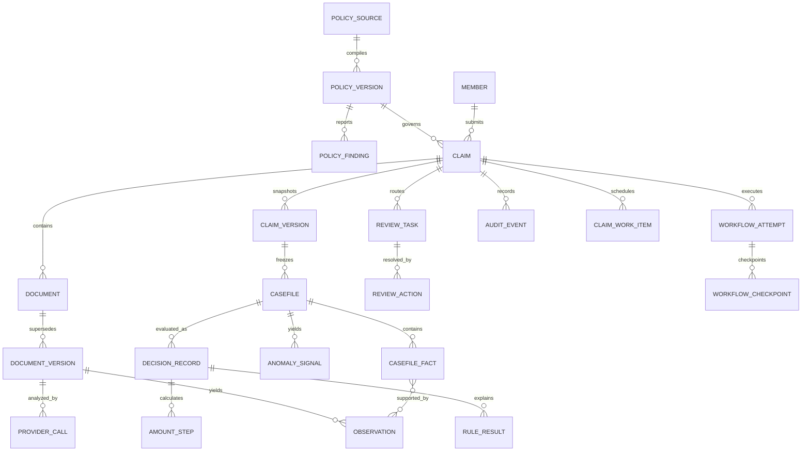

### 12.3 Core tables

| Table | Important columns and constraints |
|---|---|
| `claims` | `id`, member/policy/category, claimed paise, lifecycle, current_version, current_decision_id; check nonnegative money |
| `claim_versions` | immutable canonical request/snapshot hash; unique `(claim_id, version)` |
| `documents` | logical document and current version; no bytes |
| `document_versions` | relative path, local version, SHA-256, media, size, supersedes; unique immutable file ref |
| `provider_calls` | provider, operation, request fingerprint, request ID, status, attempts, sanitized error |
| `observations` | fact path, value JSONB, provenance, producer/profile versions, confidence, status |
| `casefiles` | immutable content hash and typed JSONB snapshot |
| `casefile_fact_support` | many-to-many fact/observation links |
| `policy_sources` | exact JSON source, source hash, import metadata |
| `policy_versions` | compiled IR JSONB/hash, overlay, compiler version, activation status |
| `policy_findings` | severity/code/path/message/resolution |
| `decision_records` | axes, approved paise, pinned hashes/versions, canonical hash |
| `rule_results` | tree path/order/status/reason/policy path/amounts/evidence refs |
| `amount_steps` | sequence, rule ID, before/delta/after paise |
| `review_tasks` | kind/status/allowed actions/claim version/lease |
| `review_actions` | actor, command ID, expected version, structured reason, immutable payload |
| `workflow_attempts` | operation key, graph version, status, retry budget |
| `workflow_checkpoints` | LangGraph checkpoint namespace/id/payload/version |
| `idempotency_keys` | scope/key/request hash/response ref; unique `(scope, key)` |
| `claim_work_items` | operation key, status, `available_at`, lease owner/expiry, attempts, failure class |
| `audit_events` | append-only sequence, actor/action/object/before/after hashes/correlation |

### 12.4 Indexes

```sql
CREATE INDEX claims_member_created_idx
    ON claims (member_id, created_at DESC);

CREATE INDEX claims_action_queue_idx
    ON claims (lifecycle_status, updated_at)
    WHERE lifecycle_status IN ('QUEUED', 'ACTION_REQUIRED', 'IN_REVIEW');

CREATE INDEX documents_claim_idx
    ON documents (claim_id, created_at);

CREATE UNIQUE INDEX document_local_version_uq
    ON document_versions (relative_path, local_version_id);

CREATE INDEX observations_fact_path_idx
    ON observations (claim_id, fact_path, created_at);

CREATE INDEX review_open_queue_idx
    ON review_tasks (priority DESC, created_at)
    WHERE status = 'OPEN';

CREATE UNIQUE INDEX workflow_operation_uq
    ON workflow_attempts (operation_key);

CREATE INDEX claim_work_due_idx
    ON claim_work_items (status, available_at)
    WHERE status IN ('READY', 'WAITING_RETRY', 'RUNNING');

CREATE INDEX audit_claim_sequence_idx
    ON audit_events (claim_id, sequence_no);

CREATE UNIQUE INDEX active_policy_period_uq
    ON policy_versions (policy_id, effective_from, effective_to)
    WHERE activation_status = 'ACTIVE';
```

Avoid speculative indexes on every JSONB field. Add them when recorded query plans justify the write/storage cost.

### 12.5 Audit immutability

Application roles receive `INSERT`/`SELECT` on `audit_events`, not `UPDATE`/`DELETE`. Each event contains previous-event hash and its own canonical hash, creating a tamper-evident chain per claim. This is not a blockchain and does not substitute for backups; it detects accidental/unauthorized mutation.

---

## 13. Consistency, idempotency, and concurrency

### 13.1 Submission

Canonicalize the request excluding streams, include the server-computed file hashes, and hash the result. Within one transaction:

- Insert or retrieve `(principal, idempotency_key)`.
- Reject the same key with a different request hash.
- Insert claim/document metadata.
- Append `CLAIM_RECEIVED`.
- Insert a `claim_work_items` row.
- Persist the canonical response reference.

A retry returns the original receipt.

### 13.2 PostgreSQL work scheduling

SQS is unnecessary for a single local worker. PostgreSQL already owns acceptance, checkpoints, retries, and audit, so the job can be created in the same transaction as the claim:

```sql
CREATE TABLE claim_work_items (
    id uuid PRIMARY KEY,
    claim_id uuid NOT NULL REFERENCES claims(id),
    operation_key text NOT NULL UNIQUE,
    status text NOT NULL,
    available_at timestamptz NOT NULL,
    lease_owner text,
    lease_until timestamptz,
    attempt_count integer NOT NULL DEFAULT 0,
    max_attempts integer NOT NULL,
    last_failure_code text,
    created_at timestamptz NOT NULL,
    updated_at timestamptz NOT NULL
);
```

The worker claims a due row with `SELECT ... FOR UPDATE SKIP LOCKED`, assigns a short lease, then releases the transaction before doing provider work. Each successful node result and LangGraph checkpoint commits before the job advances. A crashed worker's expired lease becomes claimable; retries set a future `available_at` with bounded backoff. `LISTEN/NOTIFY` may reduce polling latency, but the table row—not the notification—is durable.

Do not use FastAPI `BackgroundTasks` or an in-memory queue as the durable mechanism: a process restart would lose work.

### 13.3 Provider idempotency

Build a request fingerprint from:

```text
provider + operation + local document hash + rendered page hash + feature/schema version + route version
```

Reuse a completed provider result for the same fingerprint. Synchronous Textract and Bedrock calls can repeat after a crash between provider response and database commit, so persist every attempt metadata and accept only the first schema-valid result for the unique operation key.

### 13.4 Reviewer concurrency

All mutation commands carry `expected_version`. Update:

```sql
UPDATE claims
SET current_version = current_version + 1, ...
WHERE id = :claim_id AND current_version = :expected_version;
```

Zero rows means `STALE_CLAIM_VERSION`. Reviewer command idempotency prevents a client retry from creating two override records.

### 13.5 Reprocessing

Never overwrite. Replacement upload creates `document_version N+1`; reconciliation creates a new casefile; evaluation creates a new decision record. The trace links `supersedes_id` and the trigger: new document, policy correction, reviewer resolution, or explicit replay.

---

## 14. Failure model

### 14.1 Failure taxonomy

```python
Failure = (
    InvalidInput
    | ActionRequired
    | RetryableProviderFailure
    | PermanentProviderFailure
    | EvidenceInsufficient
    | PolicyInvalid
    | ConcurrencyConflict
    | PersistenceFailure
    | TelemetryFailure
    | ProgrammerDefect
)
```

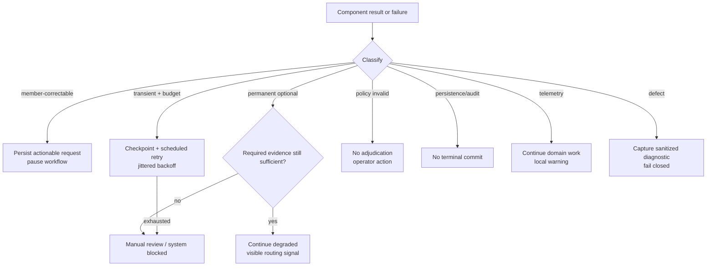

### 14.2 Criticality matrix

| Failure | Continue? | Result |
|---|---|---|
| Required-document triage unavailable | No auto path | Retry, then action/review |
| Required-document unreadable | No | Specific replacement request |
| Optional document unreadable | If required facts sufficient | Degraded trace |
| Textract throttled/timeout | After bounded retry | Alternate approved AWS route or review |
| Bedrock malformed output | After one bounded schema repair | Alternate configured route or review |
| Identity conflict | No auto path | Correction/review |
| History repository unavailable | No default-zero behavior | Review/system blocked |
| Anomaly enrichment failure | Policy proposal may be computed | Release held/review routing |
| Policy compiler/evaluator failure | No | No decision |
| Explanation enhancement failure | Yes | Deterministic template |
| Audit/decision transaction failure | No | No terminal result |
| Telemetry export failure | Yes | Domain audit remains authoritative |

### 14.3 Retry policy

Retry only errors classified as transient by the adapter: throttling, selected 5xx responses, connection reset, or timeout. Use exponential backoff with full jitter and provider-specific `Retry-After` when present. Configuration records maximum attempts and elapsed time per operation.

Never retry:

- Schema-invalid source input.
- Unsupported/encrypted media.
- Policy contradiction.
- Authorization failure.
- Prompt-injection validation failure without changing the route/input.
- A deterministic policy defect.

Retry counts are budgets measured in provider calls and elapsed time, not arbitrary confidence deductions.

### 14.4 Circuit breaking and backpressure

The PostgreSQL scheduler exposes due/running/retry work age; the worker exposes active work and provider throttling. Locally:

- Bound claim concurrency.
- Bound concurrent pages and Bedrock requests separately.
- Pause new provider starts when throttling exceeds a measured threshold.
- Keep work in PostgreSQL rows/checkpoints rather than RAM.
- Continue accepting submissions only while database and object-store acceptance paths are healthy.

Do not silently route required Textract/Bedrock failures to another provider.

---

## 15. Confidence and routing

Store three distinct measures:

1. **Evidence confidence:** calibration of a particular fact candidate.
2. **Workflow completeness:** required components/facts completed successfully.
3. **Decision confidence:** empirical likelihood that the deterministic proposal matches a reviewed gold outcome, conditioned on evidence quality and policy coverage.

Do not publish a weighted-average formula invented upfront. Begin with interpretable features:

- Critical fact known/conflict counts.
- Required role/readability outcomes.
- OCR confidence distribution for supporting regions.
- Agreement among independent evidence sources.
- Amount reconciliation residual.
- Model/schema repair count.
- Degraded component classes.
- Whether a rule used `UNKNOWN`.

Fit/calibrate only with labeled reviewer outcomes. Report reliability diagrams, expected calibration error, Brier score, coverage at auto-decision thresholds, and error severity by decision class.

Routing uses policy-owned thresholds:

```text
if any critical fact UNKNOWN/CONFLICT -> no auto decision
elif required component degraded -> hold/review according to criticality
elif anomaly route triggered -> manual review
elif calibrated threshold not met -> manual review
else -> permit automatic recommendation
```

The displayed confidence includes a version and semantic label. A raw `0.87` without calibration/version is not meaningful.

---

## 16. Observability and explainability

Complete observability does not require a cloud product. Keep the authoritative business trace in PostgreSQL and write privacy-safe engineering events to rotating local files.

### 16.1 Two independent records

| Record | Store | Purpose | Contains |
|---|---|---|---|
| Domain audit/decision trace | PostgreSQL | Reconstruct why the claim has its state/outcome | Evidence refs, rules, amounts, commands, versions, actor |
| Engineering telemetry | Local rotating JSONL files | Diagnose latency, errors, retries, saturation, cost | Sanitized logs, span events, metrics, provider metadata |

Deleting every engineering log must still leave enough PostgreSQL data to reconstruct the decision. Conversely, the audit table is not a substitute for latency, retry, and worker-health diagnostics.

### 16.2 Trace topology

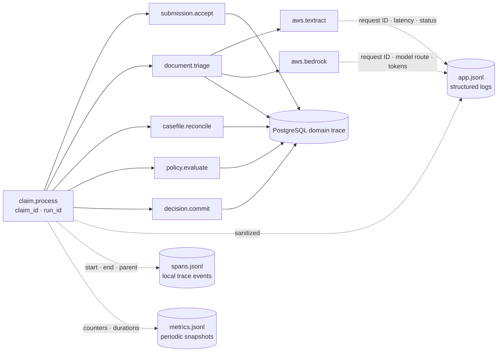

### 16.3 Correlation keys

Allowed operational correlation:

```text
claim_id
claim_version
workflow_run_id
workflow_attempt_id
operation_key hash
document_id
policy_version_id
casefile_id
decision_record_id
provider
provider_request_id
model_route_version
schema_version
prompt_version
```

Do not add patient name, diagnosis, source text, local file path, member phone/email, raw model body, prompt/response, or credentials to span attributes/logs.

### 16.4 Metrics

Workflow:

- claims by lifecycle state.
- state age and due-work age.
- action-required/review rates by reason.
- completion duration by phase.
- retry/exhaustion counts.

Document intelligence:

- page counts and latency by route.
- role/readability confusion matrix in eval.
- critical-fact coverage.
- schema validation and repair rate.
- Textract/Bedrock throttling and error class.
- tokens/pages/cost units tagged by model route, not PHI.

Policy:

- proposal distribution.
- amount-adjustment distribution by rule.
- `UNKNOWN` and contradiction rate.
- replay mismatch count.
- policy compiler findings.

Safety:

- auto-decision coverage.
- human override rate and reason.
- false approval/rejection/partial rates on labeled eval.
- PHI log scanner findings.
- prompt-injection rejection events.

### 16.5 Local telemetry implementation

Use Python logging with a JSON formatter and `RotatingFileHandler`. Separate files avoid multi-process write contention:

```text
var/log/claims/api.jsonl
var/log/claims/worker.jsonl
var/log/claims/eval.jsonl
var/log/claims/spans.jsonl
var/log/claims/metrics.jsonl
```

Each event contains:

```text
timestamp · level · event_name · component
trace_id · span_id · parent_span_id
claim_id · claim_version · workflow_run_id · operation_key_hash
attempt · duration_ms · outcome · error_class
provider · provider_request_id · model_route_version · schema_version
```

Use size-based rotation with a configurable file count, owner-only permissions, and stderr fallback. The PostgreSQL domain audit remains mandatory; engineering-file failure must be visible but cannot alter a valid decision.

OpenTelemetry may remain as an instrumentation **library** if it writes spans directly through a local JSONL exporter. Do not run an OpenTelemetry Collector, CloudWatch exporter, X-Ray backend, LangSmith project, Prometheus server, or Grafana. A simpler local `Telemetry.span()` context manager that emits start/end/error JSON events is also acceptable. Keep the `Telemetry` port so this choice does not leak into domain code.

Metrics are counters/histograms held by each process and periodically appended to `metrics.jsonl`; a local `/internal/metrics` endpoint or `claimsctl diagnostics summary` can expose the current snapshot. Reset-on-restart is acceptable and documented because domain/eval measurements remain durable in PostgreSQL.

Bedrock model-invocation logging stays disabled because the local JSON logs already contain sanitized provider metadata and invocation logging can capture full requests, responses, images, and documents.

### 16.6 Trace UI

The local operations UI provides:

- Claim summary and pinned versions.
- Horizontal workflow timeline.
- Expandable document cards with evidence overlays.
- Fact table with known/conflict/unknown states.
- Policy rule tree and exact policy paths.
- Amount waterfall.
- Confidence/completeness explanation.
- Retry/degradation timeline.
- Replay comparison between immutable attempts.

Replay is a new attempt; it never mutates the original trace.

### 16.7 Local diagnostics

```bash
claimsctl trace show <claim_id>
claimsctl trace export <claim_id> --sanitized
claimsctl diagnostics summary --run <run_id>
jq 'select(.level == "ERROR")' var/log/claims/worker.jsonl
```

The trace commands query PostgreSQL. The diagnostics command correlates local logs through IDs; it never needs raw medical content.

---

## 17. Evaluation architecture

Evaluation is a first-class module, not a script that only compares final labels.

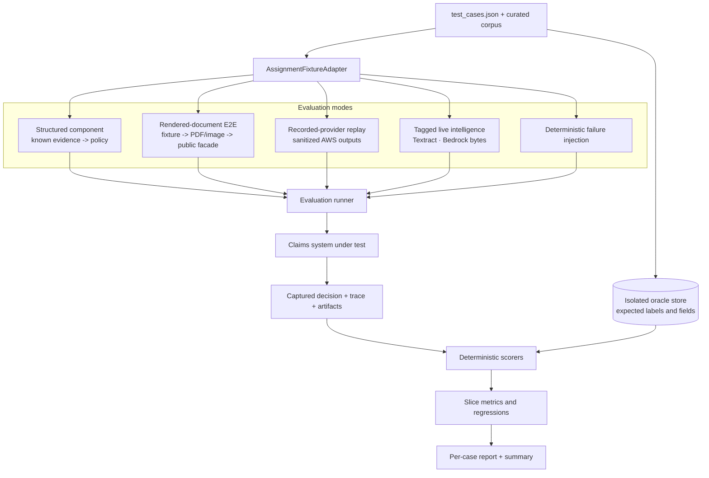

The oracle becomes accessible only after the system produces its result. Code running the claim cannot import or query it.

### 17.1 Evaluation modes

#### A. Pure domain

Inputs are frozen casefiles and Policy IR. Tests policy compilation, rule order, amounts, reason codes, and determinism. No OCR/model accuracy claims.

#### B. Structured component

Fixture `content` is converted into privileged observation/casefile fixtures. Tests reconciliation, routing, and adjudication. Report label must say **structured component**, never E2E.

#### C. Rendered-document E2E

Render fixture content into representative Indian prescription/bill/report images and PDFs. Apply deterministic quality transforms. Upload through the same facade as the UI. This tests triage, OCR, semantic extraction, reconciliation, policy, trace, and member action.

#### D. Recorded-provider replay

Use sanitized/versioned Textract and Bedrock responses to catch parser/schema and workflow regressions without variable cost or provider drift.

#### E. Live Textract/Bedrock

An explicit tagged suite sends locally stored synthetic page bytes to the configured Textract and Bedrock Runtime clients. It measures current provider behavior, latency, schema adherence, and cost units. It provisions or calls no S3, SQS, SNS, or CloudWatch resources and is not the default test command.

### 17.2 Dataset layers and slices

| Layer | Examples |
|---|---|
| Assignment golden | TC001–TC012 |
| Document-role corpus | Right/wrong/duplicate/missing roles |
| Quality corpus | Blur, glare, skew, occlusion, low contrast, handwriting, stamps |
| Extraction corpus | Patient, doctor, dates, diagnoses, tests, line items, totals |
| Reconciliation corpus | Name variants, cross-document conflicts, total mismatch |
| Policy boundaries | Day 29/30/31, ₹499/₹500, thresholds, sub/per-claim/annual limits |
| Adversarial corpus | Prompt injection in document, impossible totals, hidden text, malformed PDF |
| Failure corpus | Timeout, throttle, bad schema, missing/reordered page, expired lease, DB conflict |
| Drift corpus | Provider/model/prompt/OCR route changes |

Every example records source/license/synthetic status, document profile, language/script, quality labels, privacy treatment, and expected provenance—not only expected fields.

### 17.3 Metrics

Early gate:

- Required-role precision/recall/F1.
- Readability action precision/recall.
- Patient-conflict recall.
- Action-message structured correctness: observed type, required type, affected file, concrete instruction.
- False-stop rate on valid submissions.

Extraction:

- Exact/normalized match per field.
- Character/word error rate for OCR slices where ground truth exists.
- Line-item precision/recall/F1.
- Money exact match.
- Critical-fact coverage.
- Provenance region intersection/coverage.
- Schema failure/repair rate.

Casefile:

- Known/conflict/unknown classification accuracy.
- Entity resolution precision/recall.
- Amount reconciliation correctness.
- Unsupported-fact/hallucination rate.

Adjudication:

- Decision accuracy and macro F1.
- Exact approved amount.
- Reason-code precision/recall.
- Rule-path correctness.
- Manual-review routing recall for unsafe cases.
- Automation coverage at safety thresholds.

Reliability:

- Crash-free case rate.
- Retry recovery and duplicate-suppression rate.
- Deterministic replay hash match.
- Audit completeness.
- PHI log scan findings.

Confidence:

- Brier score.
- Expected calibration error.
- Reliability by document/profile/decision slices.
- Risk-coverage curve.

### 17.4 Test-case mapping

| Case | Primary proof | Expected architectural path | Known caveat |
|---|---|---|---|
| TC001 | Wrong-role gate/message | `TRIAGING → NEEDS_DOCUMENTS`; no policy trace | Fixture role must be rendered, not injected |
| TC002 | Readability gate | `TRIAGING → NEEDS_RESUBMISSION`; no rejection | Quality transform/corpus needed |
| TC003 | Identity conflict | Conflicting names retained; correction/review | Must show both names and sources |
| TC004 | Clean calculation | Full evidence → policy; ₹1,350 exact | 10% co-pay |
| TC005 | Waiting period | Reject with eligibility date and evidence | Condition and join/treatment dates required |
| TC006 | Line-item exclusion | Partial; root canal covered, whitening excluded | Conflicts with ₹5,000 global limit and dental-report rule |
| TC007 | Conditional pre-auth | Reject with missing-preauth reason/action | Source flags conflict; IR must clarify |
| TC008 | Limit behavior | Reject and show ₹5,000 vs ₹7,500 | Reject-vs-cap semantics must be explicit |
| TC009 | Velocity signal | Manual review; list same-day signals | History seeded server-side |
| TC010 | Calculation order | Discount then co-pay; ₹3,240 exact | Conflicts with ₹2,000 consultation sub-limit |
| TC011 | Graceful degradation | Approved proposal may coexist with review recommendation/hold | Named non-critical failure only |
| TC012 | Exclusion | Reject obesity/bariatric treatment | Requires supported clinical evidence |

The initial report should show conflicting-policy cases as `BLOCKED_POLICY_AMBIGUITY` until an explicit overlay is approved. A test can be “assignment expected matched under overlay” while separately reporting “base policy ambiguous.” That is more truthful than hiding assumptions.

### 17.5 LLM-as-judge policy

Use deterministic scoring for decisions, amounts, reason codes, field values, provenance, trace completeness, and message slots. An LLM judge may assess clarity/style of member-facing explanations only as a secondary metric with:

- Frozen rubric and examples.
- Pinned model/prompt.
- Blinded candidate order.
- Periodic human agreement measurement.
- No power to pass a safety/release gate.

### 17.6 Evaluation report schema

```json
{
  "run": {
    "mode": "RENDERED_DOCUMENT_E2E",
    "policy_version": "...",
    "capability_catalog_hash": "...",
    "engine_version": "...",
    "model_routes": {"...": "..."},
    "dataset_hash": "..."
  },
  "cases": [{
    "case_id": "TC004",
    "expected": {"decision": "APPROVED", "approved_paise": 135000},
    "actual": {"decision": "APPROVED", "approved_paise": 135000},
    "matched": true,
    "trace_completeness": 1.0,
    "artifact_refs": ["..."],
    "policy_assumptions": [],
    "failures": []
  }],
  "summary": {
    "decision_accuracy": 0.0,
    "exact_amount_rate": 0.0,
    "unsafe_auto_decisions": 0,
    "policy_blocked_cases": []
  }
}
```

### 17.7 Eval promotion gates

A model route, schema, prompt, normalizer, or Policy IR compiler change is promotable only if:

- No increase in unsafe auto-decisions.
- No regression on early-gate critical recall beyond an approved bound.
- No exact-money regression.
- No deterministic replay mismatch for pure policy cases.
- No new unsupported facts.
- Trace/provenance completeness remains 100% for material facts.
- Slice regressions are reviewed, not hidden by aggregate improvement.

Threshold values must be based on a sufficiently sized, representative corpus; the twelve supplied cases are demonstrations, not statistical validation.

---

## 18. Testing strategy

### 18.1 Test pyramid

| Layer | Scope | Examples |
|---|---|---|
| Property tests | Pure policy/money/date functions | limits, order, monotonicity, boundary dates |
| Unit tests | Domain modules | normalization, sufficiency, rule results |
| Contract tests | Ports/adapters | Local files, Textract bytes, Bedrock bytes, and provider-error mapping |
| Repository tests | Real local PostgreSQL | constraints, locks, idempotency, atomic audit |
| Workflow tests | Recorded/fake providers | state/resume/retry/degradation |
| Rendered E2E | Public facade + generated documents | assignment and quality slices |
| Live AWS smoke/eval | Selected fixtures | provider integration and drift |
| UI tests | Local web against API | submit, correction, trace, reviewer resolution |

### 18.2 Mandatory boundary tests

1. Production DTO rejects every oracle-only fixture field.
2. Same idempotency key/body returns the original receipt; changed body conflicts.
3. Upload streams are hashed and bounded without buffering an entire PDF.
4. Local document/page checksum mismatch or missing sealed file fails closed.
5. Local PDF rendering and per-page Textract aggregation cannot silently drop or reorder a page.
6. Bedrock output containing `decision` or `approved_amount` is rejected.
7. Document prompt injection cannot change schema/task or invoke tools.
8. Conflicting patient names remain a conflict.
9. Missing history never becomes zero utilization.
10. Pure adjudication is byte-equivalent for identical pinned inputs.
11. Policy JSON key order does not change IR hash.
12. Contradictory policy cannot activate without a reviewed overlay.
13. Approved amount cannot exceed claimed or eligible amount.
14. Every deduction has a reason code, policy path, and amount step.
15. Duplicate work insertion, expired leases, and repeated node execution produce one logical result.
16. Worker death resumes from checkpoint.
17. Required evidence/provider failure never auto-approves.
18. Optional enrichment degradation is visible and routes according to policy.
19. Audit failure prevents terminal commit; telemetry failure does not.
20. Two reviewer commands on one version yield one success and one stale conflict.
21. Replacement documents produce new immutable document/casefile/decision versions.
22. Member view cannot expose raw OCR/prompt/risk internals.
23. Operations view includes evidence, rule, degradation, and override trace.
24. Structured fixture runs cannot be labeled OCR E2E.

### 18.3 Policy properties

For all generated valid inputs:

```text
0 <= approved_paise <= claimed_paise
approved_paise <= sum(eligible_line_items_paise)
excluded_line_item.approved_paise == 0
adding an excluded item cannot increase approved_paise
increasing copay cannot increase approved_paise
decreasing a coverage limit cannot increase approved_paise
same inputs + versions => same canonical decision hash
FAIL/UNKNOWN critical eligibility => no automatic approval
```

Use mutation testing on rule conditions and order to prove golden/property tests detect broken policy behavior.

---

## 19. Security, privacy, and threat model

### 19.1 Trust boundaries

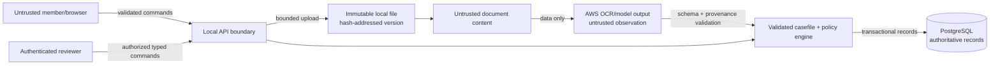

### 19.2 Controls

- Validate MIME using content signatures, not extension.
- Reject encrypted/active-content documents until a safe path exists.
- Limit bytes/pages/pixels and decompression ratio.
- Compute SHA-256 while streaming, `fsync`, and atomically rename before sealing.
- Resolve every stored relative path beneath one configured root; reject path traversal and symlinks.
- Scope the local AWS principal to Textract and Bedrock Runtime operations only.
- Keep secrets in the AWS credential chain/environment, never repository files.
- Use owner-only permissions for local documents/logs; keep their directories out of Git.
- Authorize every claim by principal/tenant/member relationship.
- Use role-derived member/operations projections; callers cannot select their own privilege view.
- Redact PHI before telemetry export.
- Keep provider/model body logging off by default.
- Apply least privilege to PostgreSQL roles; audit table is append-only to the app.
- Record every reviewer access/action in the domain audit.
- Use synthetic/de-identified documents for normal development and evaluation.

### 19.3 Prompt injection

Attacks may appear in visible text, PDF metadata, hidden layers, QR codes, or OCR artifacts. Defenses:

- System prompt fixes one extraction task and says document content is untrusted.
- No tools are exposed to extraction calls.
- Schema excludes authority-bearing fields.
- Output grounding requires source regions/text hashes.
- Suspicious instruction-like content is recorded as an observation/security signal.
- Policy engine never consumes prose instructions, only typed canonical facts.
- Explanations are generated from rule results, not raw documents.

### 19.4 Data retention and governance

Retention periods, data residency, insurer obligations, and Indian regulatory/legal requirements need explicit owner/legal validation. Do not assert an arbitrary retention duration. Implement retention as versioned configuration by data class, with legal holds and an auditable deletion workflow when requirements are known.

---

## 20. API and UI

### 20.1 HTTP surface

```text
POST /v1/claims
GET  /v1/claims/{claim_id}
POST /v1/claims/{claim_id}/actions

GET  /v1/operations/review-tasks
GET  /v1/operations/claims/{claim_id}/trace
GET  /v1/operations/claims/{claim_id}/evidence/{evidence_id}

POST /v1/policies/compile
GET  /v1/policies/{policy_version_id}/findings
GET  /v1/policies/{policy_version_id}/semantic-diff
```

The first three map directly to `ClaimProcessing`. Policy mutation is an operator/development surface, never a claim request.

### 20.2 Response envelope

```json
{
  "claim_id": "clm_...",
  "version": 4,
  "lifecycle": "ACTION_REQUIRED",
  "progress": {
    "current_stage": "DOCUMENT_GATE",
    "completed_stages": ["ACCEPTANCE", "TRIAGE"]
  },
  "adjudication": null,
  "handling": "MEMBER_ACTION_REQUIRED",
  "next_action": {
    "type": "SUPPLY_REPLACEMENT_DOCUMENT",
    "action_id": "act_...",
    "document_id": "doc_...",
    "issue": "WRONG_TYPE",
    "observed_type": "PRESCRIPTION",
    "required_type": "HOSPITAL_BILL",
    "message": "You uploaded a second prescription. Please upload the hospital or clinic bill showing the provider, patient, date, line items, and total."
  },
  "degraded_components": [],
  "timeline": []
}
```

Request-level errors use stable codes and request IDs. Wrong/missing/unreadable documents are persisted claim states, not thrown HTTP errors.

### 20.3 Local member UI

1. Claim form with member, policy, category, date, amount.
2. Streaming upload with file role hints and checksum progress.
3. Status stepper driven by claim view.
4. Specific action card for replacement/missing documents.
5. Explained decision:
   - label and approved amount;
   - line-item results;
   - limit/discount/co-pay waterfall;
   - plain-language reasons;
   - review status/degradation notice.

### 20.4 Local operations UI

1. Review queue with reason, age, category, amount, and degraded capability.
2. Claim casefile with document/evidence split view.
3. Evidence conflict resolution with provenance.
4. Policy rule tree and source paths.
5. Amount calculation.
6. Retry/provider metadata without raw PHI payload.
7. Reviewer actions with required structured reason.
8. Immutable replay comparison.

Polling `GET /claims/{id}` is sufficient initially. Server-sent events can later project read-only updates without changing the domain interface.

---

## 21. External-service decisions and capability ports

Only Textract and Bedrock Runtime are external services in the baseline. Everything else is local.

### 21.1 Retain, remove, and replace

| Service or dependency | Decision | Why it would normally be used | Why this project retains/removes it | Replacement or consequence |
|---|---|---|---|---|
| AWS Textract | **Retain** | OCR, geometry, tables, forms, queries, expense fields | It is the required AWS OCR capability and separates document perception from model reasoning | Synchronous page-byte adapter; recorded fake in tests |
| AWS Bedrock Runtime | **Retain** | Multimodal classification and schema-constrained semantic extraction | It is the required AWS model provider and handles meaning beyond OCR | Pinned model ID and structured-output adapter; recorded fake in tests |
| AWS S3 | **Remove** | Shared object storage and required input for native multipage asynchronous Textract | One machine does not need shared remote objects, bucket/IAM/versioning, or presigned uploads | Content-addressed local document store with SHA-256 and atomic writes |
| AWS SQS | **Remove** | Durable distributed buffering, independent worker fleets, visibility leases, DLQs | One local worker plus PostgreSQL already provides durability, leases, retries, and checkpoints | PostgreSQL `claim_work_items` scheduler |
| AWS SNS | **Remove** | Textract asynchronous completion notifications | Baseline uses synchronous per-page Textract calls | No replacement needed |
| AWS CloudWatch | **Remove** | Centralized logs/metrics across cloud hosts | There are no remote hosts to aggregate | Rotating JSONL logs/spans/metrics and PostgreSQL domain trace |
| AWS X-Ray or hosted trace backend | **Remove** | Cross-host distributed tracing | The runtime is one local machine | Correlated local span events plus durable domain trace |
| OpenTelemetry Collector | **Remove as a service** | Batch/export telemetry to a backend | No backend exists | Optional OTel SDK as a library writing local JSONL, or a small local telemetry abstraction |
| Bedrock model-catalog calls | **Remove from runtime** | Dynamic discovery of available model IDs | Adds startup drift and another control-plane dependency | Pin evaluated model IDs in local config; explicit setup smoke command |
| AWS Secrets Manager | **Do not add** | Central secret storage/rotation | Single-developer local execution | AWS SDK credential profile/chain; no credentials in `.env` |
| Redis/Kafka | **Do not add** | Cache/streaming/distributed coordination | Duplicate PostgreSQL capability at this scale | PostgreSQL plus bounded local concurrency |
| LangSmith/Prometheus/Grafana | **Do not add** | Hosted traces/metrics/dashboards | Extra processes/accounts without assignment value | Local trace UI, JSONL, `/internal/metrics`, CLI diagnostics |
| Local PostgreSQL | **Retain** | Claims, decisions, checkpoints, audit, concurrency | One durable local system greatly simplifies correctness | Named local volume; not a hosted service |
| LangGraph | **Retain as a library** | Explicit workflow, interrupts, checkpoints | Supports the agentic workflow without being infrastructure | Hidden behind `WorkflowRuntime` |

### 21.2 Why SQS is not needed

SQS becomes valuable when producers and consumers run on different machines, a fleet of workers scales independently, work must remain available while the claims database is unavailable, or queue throughput/retention must be operated separately. None is true here.

Adding it would require:

- AWS queue/DLQ configuration and credentials.
- At-least-once duplicate and out-of-order handling.
- Visibility-timeout extension.
- An outbox to keep queue publication consistent with the claim transaction.
- Another network failure and retry surface.

The PostgreSQL scheduler has fewer failure boundaries and still survives process restarts. Submission, audit event, and job creation commit together. The worker leases due rows, checkpoints each node, reschedules retryable failures through `available_at`, and reclaims expired leases. A bounded semaphore supplies local backpressure.

Retain a small `WorkScheduler` port so the implementation is not coupled to SQL mechanics:

```python
class WorkScheduler(Protocol):
    async def enqueue(self, request: WorkRequest) -> WorkRef: ...
    async def lease(self, worker_id: str, limit: int, ttl: timedelta) -> tuple[WorkLease, ...]: ...
    async def complete(self, lease: WorkLease) -> None: ...
    async def retry(self, lease: WorkLease, failure: TypedFailure, available_at: datetime) -> None: ...
```

The only concrete baseline adapter is `PostgresWorkScheduler`.

### 21.3 Why S3 is not needed

Synchronous Textract accepts document bytes through the SDK and processes a single page at a time. Bedrock Converse accepts image/document bytes. Therefore:

1. Store the upload locally.
2. Render PDF/TIFF files into ordered PNG/JPEG pages locally.
3. Keep each page below a conservative 5 MiB byte limit.
4. Call synchronous Textract once per page.
5. Persist each page artifact immediately.
6. Merge pages deterministically and reconcile cross-page totals.

Native Textract multipage asynchronous operations would require an S3 `DocumentLocation`. They are intentionally excluded because the supplied examples are small documents and the extra object/job lifecycle does not improve the demo. If future measured inputs exceed the local page limits, reconsider a distinct large-document adapter; do not keep dormant S3 code/config in the baseline.

Local layout:

```text
var/documents/
  blobs/<sha256-prefix>/<sha256>/original
  derived/<source-sha>/<render-profile>/0001.png
  derived/<source-sha>/<render-profile>/0002.png
```

```python
class LocalDocumentRef(BaseModel):
    document_version_id: DocumentVersionId
    relative_path: str
    sha256: str
    byte_length: int
    media_type: str
    page_count: int | None
```

The local adapter streams to a temporary file, computes hash/size, validates MIME, calls `fsync`, atomically renames, and seals the version. It rejects traversal, symlinks, encryption, unsafe archives, and configured size/page limits. Originals are never overwritten.

### 21.4 Port map

| Port | Concrete baseline adapter | Operation | Domain result |
|---|---|---|---|
| `DocumentStore` | `LocalContentAddressedStore` | put/open/verify immutable local file | `LocalDocumentRef` |
| `PageRenderer` | local PDF/TIFF renderer | bounded ordered PNG/JPEG pages | `PageImage[]` |
| `DocumentAnalysis` | `TextractSyncPageAnalyzer` | detect/analyze/expense on page bytes | `CanonicalPageArtifact` |
| `StructuredModel` | `BedrockConverseExtractor` | structured extraction from selected bytes/text | `EvidenceCandidate[]` |
| `WorkScheduler` | `PostgresWorkScheduler` | enqueue/lease/retry/complete | `WorkLease` |
| `Telemetry` | `LocalJsonTelemetry` | local spans/events/metrics | No domain value |

All paths, Boto3 responses, SQL rows, and logger types terminate inside adapters.

### 21.5 Textract byte adapter

Responsibilities:

- Accept only verified, bounded PNG/JPEG page bytes.
- Select `DetectDocumentText`, `AnalyzeDocument`, or `AnalyzeExpense` by profile.
- Map tables/forms/queries/layout/expense output into one canonical page model.
- Preserve page number, block relationships, geometry, confidence, request ID, operation, and adapter version.
- Convert AWS errors to retryable/permanent typed failures.
- Assert one canonical output for every rendered page; no silent loss/reordering.

```python
class CanonicalPageArtifact(BaseModel):
    document_version_id: DocumentVersionId
    page_number: int
    rendered_page_sha256: str
    fields: tuple[CanonicalField, ...]
    tables: tuple[CanonicalTable, ...]
    expense_fields: tuple[CanonicalExpenseField, ...]
    provider: Literal["AWS_TEXTRACT"]
    operation: str
    provider_request_id: str
    adapter_version: str
    canonical_hash: str
```

### 21.6 Bedrock byte adapter

Responsibilities:

- Use a model ID pinned in validated local configuration.
- Send selected local page bytes and OCR text through Converse structured output.
- Bound page/image size, input/output tokens, timeout, and attempts.
- Reject unknown fields and authority-bearing output.
- Capture model/route/schema/prompt versions, request ID, latency, token metadata, and stop reason.
- Never log prompt, source text, image, or response body.
- Turn refusals, schema failures, throttles, and timeouts into typed results.

Structured-output schemas should be warmed explicitly before a demo rather than discovered dynamically at runtime.

### 21.7 AWS error metadata

Store sanitized:

```text
aws_service
operation
region
http_status
aws_error_code
request_id
retry_attempt
elapsed_ms
```

Do not store response bodies that may include extracted medical content in general error logs.

---

## 22. Internal capability catalog

The public interface remains small, but extension registration is versioned at startup.

```python
class CapabilityCatalogSnapshot(BaseModel):
    catalog_hash: str
    document_profiles: dict[DocumentProfileId, DocumentProfileVersion]
    extraction_schemas: dict[SchemaId, SchemaVersion]
    model_routes: dict[RouteId, ModelRouteVersion]
    policy_rule_types: dict[RuleTypeId, RuleContractVersion]
    review_policies: dict[ReviewPolicyId, ReviewPolicyVersion]
    eval_suites: dict[EvalSuiteId, EvalSuiteVersion]
```

A document profile defines:

- Role discriminator and supported media.
- Required facts by claim category.
- Textract features/queries.
- Bedrock schema/route, if needed.
- Evidence mapping.
- Quality and sufficiency policy.
- Golden and rendered fixtures.

A new document type is added through a profile/schema/mapper/test bundle, not a new public agent or service. Runtime registration is forbidden; in-flight claims pin the catalog hash so a local restart with changed configuration cannot silently alter them.

Startup compilation rejects:

- Duplicate IDs/discriminators.
- Unsupported contract versions.
- Missing extraction schemas.
- Policy rule dependency cycles.
- Model routes not restricted to allowed AWS providers.
- Review-policy conflicts.
- Missing eval fixtures for a new critical profile.

---

## 23. Repository structure

```text
plumhq/
├── apps/
│   ├── api/                       # FastAPI inbound adapter
│   ├── worker/                    # local worker entrypoint
│   ├── web/                       # local member/ops UI
│   └── claimsctl/                 # policy/eval/replay CLI
├── src/claims/
│   ├── domain/
│   │   ├── money.py
│   │   ├── identifiers.py
│   │   ├── claim.py
│   │   ├── evidence.py
│   │   ├── casefile.py
│   │   ├── policy_ir.py
│   │   ├── rules/
│   │   ├── decision.py
│   │   └── failures.py
│   ├── application/
│   │   ├── claim_processing.py
│   │   ├── submission.py
│   │   ├── document_intelligence.py
│   │   ├── reconciliation.py
│   │   ├── adjudication.py
│   │   ├── manual_review.py
│   │   ├── decision_record.py
│   │   └── projections.py
│   ├── workflow/
│   │   ├── state.py
│   │   ├── graph.py
│   │   ├── nodes.py
│   │   ├── routing.py
│   │   └── migrations.py
│   ├── ports/
│   │   ├── repositories.py
│   │   ├── document_store.py
│   │   ├── page_renderer.py
│   │   ├── document_analysis.py
│   │   ├── structured_model.py
│   │   ├── work_scheduler.py
│   │   ├── telemetry.py
│   │   └── runtime.py
│   ├── infrastructure/
│   │   ├── postgres/
│   │   │   └── work_scheduler.py
│   │   ├── local_files/
│   │   │   ├── content_store.py
│   │   │   └── page_renderer.py
│   │   ├── aws/
│   │   │   ├── textract.py
│   │   │   ├── bedrock.py
│   │   │   └── error_mapping.py
│   │   ├── langgraph/
│   │   └── local_telemetry/
│   ├── capabilities/
│   │   ├── catalog.py
│   │   ├── documents/
│   │   ├── model_routes/
│   │   └── policy_rules/
│   └── composition/
│       ├── settings.py
│       ├── unit.py
│       ├── recorded.py
│       ├── local_aws.py
│       └── live_eval.py
├── evals/
│   ├── assignment_adapter.py
│   ├── oracle_store.py
│   ├── renderers/
│   ├── transforms/
│   ├── scorers/
│   ├── suites/
│   └── reports/
├── policies/
│   ├── sources/
│   ├── overlays/
│   ├── compiled/
│   └── schemas/
├── migrations/
├── tests/
│   ├── property/
│   ├── unit/
│   ├── architecture/
│   ├── contract/
│   ├── repository/
│   ├── workflow/
│   ├── rendered_e2e/
│   └── live_intelligence/
├── compose.yaml                     # local processes only
├── pyproject.toml
└── final_arch.md
```

Architecture tests enforce forbidden imports. The `evals` package can depend on the application facade and privileged test builders; `src/claims` cannot depend on `evals`.

---

## 24. Local development workflow

### 24.1 Prerequisites

- Python and Node versions pinned by project files.
- Docker/compatible runtime for local PostgreSQL.
- AWS developer credentials limited to Textract and Bedrock Runtime.
- Region where the selected Bedrock model routes are enabled.
- Dedicated synthetic-data AWS resources.

### 24.2 Configuration

```env
CLAIMS_PROFILE=local-aws
POSTGRES_DSN=postgresql+...
CLAIMS_DATA_DIR=var/documents
CLAIMS_LOG_DIR=var/log/claims
AWS_REGION=...
BEDROCK_COMPLEX_MODEL_ID=...
BEDROCK_FAST_MODEL_ID=...
TEXTRACT_MODE=sync_pages
MAX_DOCUMENT_PAGES=10
MAX_RENDERED_PAGE_BYTES=5242880
WORKER_CONCURRENCY=2
LOG_MAX_BYTES=10485760
LOG_BACKUP_COUNT=5
```

Do not put credentials in `.env`; use the AWS SDK credential chain. Validate settings at startup and print only non-secret resource identifiers.

### 24.3 Commands

Illustrative commands the implementation should provide:

```bash
docker compose up postgres
claimsctl db migrate
claimsctl policy compile problem_statement/policy_terms.json
claimsctl policy findings PLUM_GHI_2024
claimsctl aws verify-capabilities
claimsctl models warm-schemas
claimsctl eval run assignment --mode recorded
claimsctl eval run assignment --mode rendered-e2e
claimsctl eval run assignment --mode live-intelligence --confirm-cost
claimsctl diagnostics summary
uvicorn apps.api.main:app --reload
python -m apps.worker
npm run dev --workspace apps/web
```

The live-intelligence command requires an explicit flag because Textract and Bedrock calls incur network usage and cost. Recorded/unit modes make no AWS calls.

### 24.4 Local quality gate

Before demo/review:

1. Format/lint/type check.
2. Architecture import-boundary tests.
3. Unit/property tests.
4. PostgreSQL repository/migration tests.
5. AWS adapter contract tests.
6. Recorded workflow/failure tests.
7. Rendered assignment E2E.
8. Tagged live Textract/Bedrock smoke on a small synthetic subset.
9. Full eval report generation.
10. PHI/secrets/log scan.
11. Mermaid/document validation.

---

## 25. Scalability without changing the architecture

This section describes logical capacity and module seams while the application still runs locally.

### 25.1 Unit of work and bounded fan-out

The natural work units are:

```text
claim
  -> document
     -> page
        -> provider operation
```

Each claim pins bounded limits for files, pages, bytes, provider calls, retries, and model tokens. Per-document analysis can execute concurrently; casefile reconciliation waits for a deterministic fan-in. Do not put image bytes or OCR bodies in graph state—store references.

### 25.2 Backpressure

Capacity variables:

- Due/running/retry work age and count.
- Active claims.
- Active Textract jobs/pages.
- Active Bedrock requests/tokens.
- PostgreSQL connection/lock time.
- Average pages and provider calls per claim.
- Manual-review arrival/completion rates.

Controls:

- Separate semaphores by provider/operation.
- Fair work scheduling by tenant/category/age.
- Maximum in-flight pages per claim.
- Retry budgets and circuit breaking.
- PostgreSQL work leases and bounded polling.
- Member-visible queued state.
- Explicit high-watermark rejection/pause of new heavy work rather than RAM growth.

### 25.3 Extraction seams

If measured load eventually requires process separation, existing deep-module ports allow:

- Document intelligence worker separation at `AnalyzeDocumentRequest/Result`.
- Evaluation runner separation from interactive work.
- Read projection optimization independent of decision writes.

Do not split policy evaluation and terminal decision recording until a transaction-safe protocol exists. Do not create one network service per “agent.” The current local architecture is designed so separation is possible, not required.

### 25.4 Ten-times-load reasoning

At 10× claims, first measure:

1. Document/page distribution and OCR concurrency.
2. Provider throttle/error/cost curves.
3. PostgreSQL write/lock/query plans.
4. Due-work age by phase.
5. Review rate and reviewer throughput.

Likely engineering responses are batching safe metadata queries, tuning indexes/connection pools, reducing duplicate provider work through fingerprints, page-selective model calls, separate concurrency pools, and improving auto-decision calibration. A new orchestration framework or agent microservices do not solve these constraints.

---

## 26. Architecture decisions and rejected alternatives

### ADR-001: deterministic policy authority

**Decision:** models create evidence candidates only; Policy IR evaluator creates system recommendations.  
**Why:** reproducible money, exact rules, property testing, and auditability.  
**Rejected:** LLM decision synthesizer, debate/voting agents, policy RAG.

### ADR-002: three-operation deep facade

**Decision:** `submit`, `get`, `resume` with a closed command union.  
**Why:** caller simplicity and invariant ownership.  
**Tradeoff:** the facade needs disciplined private submodules to avoid becoming an unstructured god object.

### ADR-003: internal capability catalog

**Decision:** document profiles, extraction schemas, model routes, rules, reviews, and eval suites compile into an immutable catalog snapshot.  
**Why:** extensibility and replay without exposing generic runtime registration.  
**Rejected:** public plugin service locator and dynamic per-claim agent creation.

### ADR-004: LangGraph behind a workflow port

**Decision:** LangGraph is an infrastructure adapter for checkpoints/interrupts/transitions.  
**Why:** useful lifecycle mechanics without framework leakage.  
**Rejected:** autonomous supervisors, framework objects in domain DTOs, graph state as the database of record.

### ADR-005: PostgreSQL durable truth

**Decision:** one relational transaction boundary for claim, decision, audit, idempotency, and durable work item; PostgreSQL checkpointer.
**Why:** consistency and replay.  
**Rejected:** Redis as durable workflow state, SQLite parity claims, multiple write authorities.

### ADR-006: only essential AWS intelligence

**Decision:** retain Textract and Bedrock Runtime behind ports; keep files, work scheduling, audit, and telemetry local.
**Why:** meets the selected OCR/model-provider constraint without adding unrelated cloud infrastructure.
**Rejected:** Tesseract fallback, direct non-AWS model endpoints, provider-specific domain types.

### ADR-007: OCR and semantic extraction are layered

**Decision:** Textract supplies OCR/layout/expense structures; Bedrock resolves semantic fields only where routing/evals justify it.  
**Why:** preserves geometry/provenance and avoids the unsupported claim that a vision model universally replaces OCR.  
**Rejected:** vision-LLM-only OCR pipeline.

### ADR-008: business audit differs from telemetry

**Decision:** append-only PostgreSQL domain trace plus rotating JSONL logs/spans/metrics.
**Why:** complete local reconstruction with no hosted dependency.
**Rejected:** CloudWatch, X-Ray, hosted tracing, and raw unstructured logs.

### ADR-009: lifecycle, recommendation, and release are separate

**Decision:** store three axes and derive assignment-compatible `MANUAL_REVIEW`.  
**Why:** prevents contradictory semantics and represents TC011 safely.  
**Rejected:** one overloaded status enum.

### ADR-010: test oracles stay outside production

**Decision:** a dedicated fixture adapter renders documents, seeds history, and installs named eval faults.  
**Why:** prevents leakage/cheating and makes eval-layer claims honest.  
**Rejected:** accepting `actual_type`, structured content, history, YTD, or failure flags in claim submission.

### Rejected technology summary

| Alternative | Why rejected now |
|---|---|
| One microservice per agent | Shallow modules, network failure surface, broken transaction boundary |
| CrewAI/AutoGen/free-form supervisor | Workflow is known; autonomy reduces reproducibility |
| Bedrock Agents | Tool-planning is unnecessary for fixed evidence/policy flow |
| Vector database for policy | Authoritative rules require exact paths/versions, not semantic retrieval |
| Redis | No measured need; PostgreSQL already owns durable coordination |
| Kafka | No event volume/replay requirement that justifies its operating model locally |
| Raw prompts in ops UI | PHI/security exposure and poor domain abstraction |
| Arbitrary confidence formula | Uncalibrated numbers create false safety |
| Default-zero history on DB error | Can cause unsafe approvals |
| Silent provider fallback | Changes evidence behavior without an explicit evaluated route |

---

## 27. Implementation plan

The architecture is broad; the implementation should be tracer-bullet vertical slices.

### Phase 0 — policy and safety foundation

- Define `Money`, IDs, lifecycle/recommendation/release axes.
- Add production submission DTO and oracle-field rejection tests.
- Implement policy schema/compiler/findings and contradiction report.
- Decide/document assignment overlay for C-01/C-02/C-03/C-07.
- Implement pure rule tree and money properties.

**Proof gate:** policy cannot activate with unresolved errors; TC004/TC005/TC008/TC012 structured cases produce deterministic traces under an explicit policy version.

### Phase 1 — claim facade and durable skeleton

- PostgreSQL schema/migrations.
- `submit/get/resume`.
- Idempotency, PostgreSQL work leases, audit events.
- LangGraph workflow adapter/checkpoints.
- In-memory/recorded ports.

**Proof gate:** duplicate submission/job, expired lease, and worker-restart tests pass; a terminal audit failure cannot commit.

### Phase 2 — early document gate

- Content-addressed local document-store adapter.
- Safe local PDF/TIFF page renderer and limits.
- Media inspection/rendering.
- Document profiles for prescription, hospital bill, pharmacy bill.
- Textract and Bedrock triage adapters.
- Specific `next_action` responses.

**Proof gate:** TC001–TC003 rendered cases stop before policy with correct evidence-linked messages.

### Phase 3 — extraction and casefile

- Textract text/layout/expense canonicalizer.
- Bedrock structured schemas.
- Provenance, identity/date/amount reconciliation.
- Casefile sufficiency routing.

**Proof gate:** every critical fact has provenance/unknown/conflict; injection and model-authority tests pass.

### Phase 4 — full adjudication and review

- Remaining category profiles.
- Category/exclusion/pre-auth/waiting/discount/co-pay rules.
- Anomaly signal router.
- Review task/action workflow and optimistic locking.
- Member/ops explanation projections.

**Proof gate:** structured TC004–TC012 outcomes and exact amounts are reported, with ambiguous base-policy cases explicitly separated from overlay results.

### Phase 5 — evaluation and observability

- Fixture renderer and deterministic transforms.
- Recorded/live Textract-and-Bedrock modes.
- Metrics/scorers/report.
- Local JSONL logs/spans/metrics and PHI sanitization.
- Local trace UI and replay view.

**Proof gate:** full eval report contains decision, trace, exact amount, failure/degradation, pinned versions, and per-case match/ambiguity status; all Mermaid diagrams render.

### Assignment-sized cut line

For a 2–3 day implementation:

- One local FastAPI app, worker, UI, PostgreSQL.
- Local document storage plus real Textract/Bedrock integration for representative documents.
- Three facade methods.
- Early gate, casefile, deterministic policy, audit trace.
- Recorded plus a small live Textract/Bedrock eval.
- Explicitly document unsupported document slices and policy contradictions.

Do not simulate a broad platform while leaving the authority boundary, trace, or tests shallow.

---

## 28. Risk register and limitations

| Risk | Consequence | Mitigation |
|---|---|---|
| Source policy contradictions | Incorrect “golden” behavior | Compiler findings and approved overlay |
| Sparse real document corpus | Inflated OCR claims | Label synthetic vs real; expand representative corpus |
| Handwriting/stamp variability | Critical facts unknown | Route by slice, preserve provenance, request/review |
| Bedrock/Textract region/account drift | Local failures/model changes | Capability verification, pinned routes, live tagged eval |
| Model structured-output drift | Schema failures | Strict validation, recorded regression, bounded repair |
| Provider throttling | Long work backlog/retries | Concurrency budgets/backpressure |
| Local disk corruption/loss | Missing evidence | Atomic sealed versions, hash verification, visible failure |
| Local disk full | Submission/render failure | Preflight, limits, log rotation, actionable error |
| PHI in logs/model logging | Privacy breach | Redaction, body logging disabled, scanners |
| Prompt injection in documents | Fabricated evidence/action | No tools, strict schema, grounding, deterministic authority |
| Confidence miscalibration | Unsafe automation | Separate measures; reviewed labels; risk-coverage gates |
| Worker crash/expired lease | Duplicate/repeated processing | Unique operation keys and checkpoints |
| Reviewer races | Lost/contradictory override | Optimistic versioning/idempotent commands |
| Missing dependent/member data | False eligibility result | `UNKNOWN` and review; never synthesize |
| Local AWS dependence | Cost/network friction | Recorded adapters and explicit live profile |

Known limitations of the initial implementation should be reported precisely:

- Supported document profiles/languages/scripts.
- Maximum tested page/image ranges.
- Number and composition of real versus synthetic documents.
- Policy contradictions still awaiting owner decision.
- Model route and AWS region actually evaluated.
- Confidence calibration sample size.
- Unsupported insurer/payment integrations.

---

## 29. Definition of done

### Architecture

- [ ] Core deep modules and import boundaries implemented.
- [ ] Three-operation facade is the only business entry point.
- [ ] LangGraph/AWS/provider types do not enter domain contracts.
- [ ] Source contradictions appear as structured policy findings.
- [ ] Assignment overlay is explicit and versioned; no `case_id` branching.

### Correctness and safety

- [ ] Production request rejects oracle-only fields.
- [ ] Money uses integer paise and exact invariants.
- [ ] Every material fact has provenance or explicit unknown/conflict.
- [ ] Models cannot emit decision/amount fields.
- [ ] Required evidence failure cannot auto-decide.
- [ ] Terminal decision/audit commit is atomic.
- [ ] Reviewer overrides are immutable and concurrency-safe.

### AWS integration

- [ ] Local originals/pages are atomically sealed and hash-verified.
- [ ] Textract synchronous page-byte routes and aggregation are contract-tested.
- [ ] Bedrock structured output is schema-validated.
- [ ] PostgreSQL work leases, retries, and operation-key deduplication are safe.
- [ ] Provider metadata is sanitized.
- [ ] Bedrock body/image invocation logging is off for medical data.
- [ ] Live profile can instantiate only Textract and Bedrock Runtime AWS clients.

### Local observability

- [ ] Domain decisions can be reconstructed from PostgreSQL after deleting local logs.
- [ ] API, worker, eval, span, and metrics JSONL files rotate by configured size.
- [ ] Every engineering event has correlation identifiers.
- [ ] PHI/log scanning finds no patient data, OCR text, prompts, or local document paths.
- [ ] Local log failure is visible and cannot corrupt the domain audit.

### Explainability

- [ ] Operations trace reconstructs documents, facts, rules, amounts, failures, and versions.
- [ ] Member feedback names the exact problem and required action.
- [ ] Replay creates a new immutable attempt.
- [ ] No raw prompts/responses are needed for normal review.

### Evaluation

- [ ] Pure, structured, rendered, recorded, failure, and tagged live modes are distinguished.
- [ ] TC001–TC012 have per-case outputs and full traces.
- [ ] Ambiguous-policy results are reported separately.
- [ ] Exact amount and reason-code scoring exists.
- [ ] Critical slices and unsafe auto-decisions are visible.
- [ ] Confidence metrics are calibrated or explicitly marked uncalibrated.

### Local operation

- [ ] Clear local commands and configuration example.
- [ ] PostgreSQL migrations and seed/fixture tools.
- [ ] Fast deterministic test profile without AWS.
- [ ] Explicit live Textract/Bedrock verification command.
- [ ] All inline Mermaid blocks render successfully.

---

## 30. Current technical references

The AWS adapter design should be implemented against current official documentation:

- [Amazon Textract synchronous single-page processing](https://docs.aws.amazon.com/textract/latest/dg/sync.html)
- [Passing local document bytes to Textract](https://docs.aws.amazon.com/textract/latest/APIReference/API_Document.html)
- [Amazon Textract document analysis](https://docs.aws.amazon.com/textract/latest/dg/how-it-works-analyzing.html)
- [Amazon Textract expense analysis](https://docs.aws.amazon.com/textract/latest/dg/analyzing-document-expense.html)
- [Amazon Bedrock structured outputs](https://docs.aws.amazon.com/bedrock/latest/userguide/structured-output.html)
- [Amazon Bedrock model invocation logging](https://docs.aws.amazon.com/bedrock/latest/userguide/model-invocation-logging.html)
- [Amazon Bedrock Anthropic model catalog](https://docs.aws.amazon.com/bedrock/latest/userguide/model-cards-anthropic.html)
- [Anthropic Claude Messages/vision parameters in Bedrock](https://docs.aws.amazon.com/bedrock/latest/userguide/model-parameters-anthropic-claude-messages.html)

The implementation must pin the versions it actually evaluates and record those versions in every evidence/decision trace.

---

## Final recommendation

Implement the vertical path:

```text
submit
  -> immutable content-addressed local documents
  -> PostgreSQL durable work lease
  -> local PDF/TIFF rendering to bounded page images
  -> early role/readability/patient gate
  -> Textract + schema-constrained Bedrock observations
  -> provenance-linked immutable casefile
  -> compiled deterministic Policy IR
  -> atomic decision and domain trace
  -> member action or reviewer command through resume
```

This is agentic where probabilistic perception is useful, deterministic where authority and money demand it, durable across failures, honest about the supplied policy contradictions, locally operable, and structurally capable of handling much higher volume without prematurely fragmenting into agent microservices.
