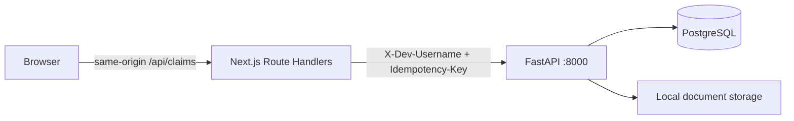

# Frontend Integration Contract

This document is the implementation contract for a Next.js frontend integrating with the Plum
Claims FastAPI backend. It is derived from the current routes, schemas, domain types, and contract
tests. The runtime OpenAPI document remains useful for exploration, but this guide also records
runtime errors and workflow behavior that OpenAPI does not fully describe.

## Integration status and constraints

The backend currently exposes eight HTTP operations:

| Method | Path | Actor | Purpose |
|---|---|---|---|
| `POST` | `/v1/claims` | Member | Submit a claim and its documents |
| `GET` | `/v1/claims/{claim_id}` | Owning member | Read current claim state |
| `POST` | `/v1/claims/{claim_id}/actions` | Owning member | Replace a requested document |
| `GET` | `/v1/review-tasks` | Reviewer | List all review tasks |
| `GET` | `/v1/review-tasks/{task_id}` | Reviewer | Read task evidence and decision trace |
| `POST` | `/v1/review-tasks/{task_id}/commands` | Reviewer | Resolve a review task |
| `GET` | `/health/live` | Any local caller | API process liveness |
| `GET` | `/health/ready` | Any local caller | Local configuration and PostgreSQL readiness |

The following capabilities do not exist yet:

- No member claim-list endpoint. The frontend must retain returned claim IDs locally or add a
  backend endpoint before implementing a reliable claims dashboard.
- No document download or preview endpoint.
- No Server-Sent Events or WebSocket stream. Poll `GET /v1/claims/{claim_id}`.
- No pagination, filtering, or sorting parameters on `GET /v1/review-tasks`.
- The worker is a separate local process. Start it with `uv run claims-worker run-loop`; claim
  submission is asynchronous and returns `202` before processing begins.
- No CORS middleware. A browser hosted on another origin cannot call FastAPI directly.
- No real authentication. `X-Dev-Username` is a local identity selector, not proof of identity.

These are current-contract limitations, not frontend workarounds to conceal.

## Start here: first frontend slice

Build a submit-and-track member flow and a separate reviewer flow. Do not begin with a member
dashboard because the backend does not yet expose `GET /v1/claims`.

```text
frontend/
├── app/
│   ├── claims/new/page.tsx            # multipart submission form
│   ├── claims/[claimId]/page.tsx      # polling status, action, or decision view
│   ├── review/page.tsx                # reviewer queue
│   ├── review/[taskId]/page.tsx       # evidence and resolution form
│   └── api/                           # same-origin BFF route handlers
│       ├── claims/route.ts
│       ├── claims/[claimId]/route.ts
│       ├── claims/[claimId]/actions/route.ts
│       └── review-tasks/
├── lib/claims-api.ts                  # server-only FastAPI client
├── lib/claims-types.ts                # contracts copied from this document
└── components/claims/                 # form, status, action, and decision UI
```

The browser calls only same-origin `/api/*` routes. Route Handlers add the local identity and
forward the request to FastAPI. Keep `CLAIMS_API_BASE_URL` and `CLAIMS_DEV_USERNAME` server-only;
do not use a `NEXT_PUBLIC_` prefix.

## Local operational startup and polling

Start the API and worker in separate terminals:

```bash
uv run uvicorn claims_backend.api.app:app --reload
uv run claims-worker run-loop
```

For one deterministic worker pass, use `uv run claims-worker run-once`. The default
`RECORDED_LOCAL` profile is cost-free and does not construct AWS clients. A submitted claim moves
from `QUEUED` to one of `ACTION_REQUIRED`, `IN_REVIEW`, `DECIDED`, or `PROCESSING_FAILED`.

Poll the returned `status_url` every 1–2 seconds while `progress.is_terminal` is `false`; back
off to 10–15 seconds after the first few polls. Stop polling when it is `true`, when the tab is
hidden, or after a UI-level timeout. Render the server-provided `progress.percent`,
`progress.current_stage`, and ordered `progress.events`; do not infer workflow order from the
lifecycle. `PROCESSING_FAILED` is terminal and is a safe processing result, not a rejection; show
`processing_failure.retry_guidance` rather than a coverage decision. `ACTION_REQUIRED` means the
member should follow the `action` payload and submit a replacement document.

Use `GET /health/live` for a process check and `GET /health/ready` before accepting local UI work.
Readiness returns `503` when PostgreSQL is unavailable. Neither endpoint invokes OCR or model
providers.

## Recommended Next.js topology

Use Next.js App Router Route Handlers as a backend-for-frontend (BFF):



The browser should call same-origin Next.js routes. The Route Handler should:

1. derive the local username on the server;
2. forward the request to FastAPI;
3. preserve FastAPI's status code and JSON error body;
4. preserve multipart bodies without manually setting `Content-Type`; and
5. keep the FastAPI base URL and development username in server-only environment variables.

Suggested frontend environment:

```dotenv
# No NEXT_PUBLIC_ prefix: these are server-only.
CLAIMS_API_BASE_URL=http://127.0.0.1:8000
CLAIMS_DEV_USERNAME=member.emp001
```

Do not accept an arbitrary `X-Dev-Username` from an untrusted browser in anything beyond a
deliberate local identity-switcher. When JWT or OAuth/OIDC is introduced, only the BFF identity
adapter should need to change.

### Generic BFF forwarding helper

```ts
// lib/claims-api.ts
const baseUrl = process.env.CLAIMS_API_BASE_URL

if (!baseUrl) {
  throw new Error("CLAIMS_API_BASE_URL is required")
}

export async function callClaimsApi(
  path: string,
  init: RequestInit = {},
  username = process.env.CLAIMS_DEV_USERNAME,
): Promise<Response> {
  if (!username) {
    throw new Error("CLAIMS_DEV_USERNAME is required")
  }

  const headers = new Headers(init.headers)
  headers.set("X-Dev-Username", username)

  return fetch(new URL(path, baseUrl), {
    ...init,
    headers,
    cache: "no-store",
  })
}

export function passThrough(response: Response): Response {
  return new Response(response.body, {
    status: response.status,
    statusText: response.statusText,
    headers: {
      "content-type":
        response.headers.get("content-type") ?? "application/json",
    },
  })
}
```

For multipart Route Handlers, either construct a new `Request` with the incoming request body or
read and forward `FormData`. Do not set `Content-Type` yourself: `fetch` must generate the
multipart boundary.

```ts
// app/api/claims/route.ts
import { callClaimsApi, passThrough } from "@/lib/claims-api"

export async function POST(request: Request) {
  const form = await request.formData()
  const idempotencyKey = request.headers.get("Idempotency-Key")

  if (!idempotencyKey) {
    return Response.json(
      {
        error: {
          code: "IDEMPOTENCY_KEY_REQUIRED",
          message: "An Idempotency-Key header is required.",
          details: [],
        },
      },
      { status: 400 },
    )
  }

  const response = await callClaimsApi("/v1/claims", {
    method: "POST",
    headers: { "Idempotency-Key": idempotencyKey },
    body: form,
  })

  return passThrough(response)
}
```

In current Next.js Route Handlers, dynamic segment parameters are asynchronous:

```ts
// app/api/claims/[claimId]/route.ts
import { callClaimsApi, passThrough } from "@/lib/claims-api"

export async function GET(
  _request: Request,
  context: { params: Promise<{ claimId: string }> },
) {
  const { claimId } = await context.params
  const response = await callClaimsApi(`/v1/claims/${claimId}`)
  return passThrough(response)
}
```

## Shared HTTP rules

### Base URL and content types

- Local FastAPI base URL: `http://127.0.0.1:8000`
- API namespace: `/v1`
- JSON requests: `Content-Type: application/json`
- Claim submission/replacement: `multipart/form-data`, with the boundary generated by the client
- JSON responses: `application/json`
- Dates: ISO `YYYY-MM-DD`
- Date-times: ISO 8601 with timezone
- IDs: UUID strings
- Money: decimal strings in rupees with two fractional digits in responses
- Currency: currently only `INR`

Never parse money into binary floating point for calculations. Keep the API string in UI state,
use a decimal library, or convert it to integer paise.

### Local identity

Every endpoint requires:

```http
X-Dev-Username: member.emp001
```

Seeded local identities are:

- `member.emp001` through `member.emp010`, mapped to `EMP001` through `EMP010`;
- `reviewer.local`, which can access review routes; and
- `operator.local`, used by setup CLI commands and not by the frontend.

Usernames are trimmed, case-folded, and must match:

```text
^[a-z0-9][a-z0-9._-]{2,63}$
```

A member may submit only for the `member_id` linked to that identity. Claim reads are owner
scoped. Reading another member's claim deliberately returns the same `404 CLAIM_NOT_FOUND` as an
unknown claim, preventing ownership discovery.

### Idempotency

All mutation endpoints require:

```http
Idempotency-Key: <stable-key-for-one-user-intent>
```

The key must match:

```text
^[A-Za-z0-9][A-Za-z0-9._:-]{0,127}$
```

Generate one key when a user begins a mutation and retain it across transport retries. Do not
generate a new key merely because a request timed out. Generate a new key when the user changes
the payload or starts a new intent. A UUID is valid.

An exact replay returns the original logical result. Reusing the same key with different fields
or file bytes returns `409`. Review command replays explicitly return `replayed: true`; claim
receipts do not include a replay flag.

### Error envelope

All application and validation failures use:

```ts
export interface ApiErrorDetail {
  location?: Array<string | number>
  message: string
  type?: string
}

export interface ApiErrorBody {
  code: string
  message: string
  details: ApiErrorDetail[]
  current_version?: number
}

export interface ApiErrorResponse {
  error: ApiErrorBody
}
```

Example:

```json
{
  "error": {
    "code": "STALE_CLAIM_VERSION",
    "message": "The claim changed before this action could be applied.",
    "details": [],
    "current_version": 2
  }
}
```

Branch UI behavior on `error.code`, not the English message. The backend OpenAPI schema currently
models the common envelope but does not enumerate every custom status/error pair.

## TypeScript contract

```ts
export type UUID = string
export type IsoDate = string
export type IsoDateTime = string
export type Money = string

export type ClaimCategory =
  | "ALTERNATIVE_MEDICINE"
  | "CONSULTATION"
  | "DENTAL"
  | "DIAGNOSTIC"
  | "PHARMACY"

export type ClaimLifecycle =
  | "RECEIVED"
  | "QUEUED"
  | "ACTION_REQUIRED"
  | "IN_REVIEW"
  | "DECIDED"
  | "PROCESSING_FAILED"

export interface DocumentManifestItem {
  upload_index: number
  client_document_id: string
}

export interface ClaimMetadata {
  member_id: string
  policy_id: string
  claim_category: ClaimCategory
  treatment_date: IsoDate
  claimed_amount: Money
  currency: "INR"
  documents: DocumentManifestItem[]
}

export interface ClaimReceipt {
  claim_id: UUID
  version: number
  lifecycle_status: ClaimLifecycle
  status_url: string
}

export interface Claim {
  claim_id: UUID
  version: number
  member_id: string
  policy_id: string
  claim_category: ClaimCategory
  treatment_date: IsoDate
  claimed_amount: Money
  currency: string
  lifecycle_status: ClaimLifecycle
  progress: {
    current_stage:
      | 'ingest_claim'
      | 'classify_documents'
      | 'render_documents'
      | 'read_documents'
      | 'extract_evidence'
      | 'check_policy'
      | 'finalize_claim'
    label: string
    percent: number
    is_terminal: boolean
    events: Array<{
      stage: string
      label: string
      status: 'PENDING' | 'RUNNING' | 'COMPLETED' | 'FAILED'
      summary: string
      attempt_number?: number
      duration_ms?: number
      completed_at?: IsoDateTime
    }>
  }
  adjudication?: {
    recommendation: string
    approved_amount: Money
    currency: string
  }
  explanation?: {
    summary: string
    deductions: Array<{
      code: string
      label: string
      amount: Money
    }>
    line_items?: Array<{
      concept: string
      label: string
      claimed_amount: Money
      approved_amount: Money
      status: string
      reason_code: string
    }>
  }
  action?: {
    code: string
    message: string
    observed_document_roles: string[]
    required_document_roles: string[]
    affected_documents?: Array<{
      client_document_id: string
      observed_role: string
      requested_action: string
    }>
    identity_conflict?: Array<{
      client_document_id: string
      patient_name: string
    }>
  }
  handling_status?: string
  processing_quality?: {
    completeness: number
    confidence: number
    degraded_components: Array<{
      component: string
      criticality: string
      attempts: number
      failure_code: string
      retryable: boolean
      effect_on_handling: string
    }>
  }
  processing_failure?: {
    code: string
    retry_guidance: string
  }
  created_at: IsoDateTime
  updated_at: IsoDateTime
}

export type ReviewAction =
  | "ACCEPT"
  | "AMEND"
  | "REJECT"
  | "REQUEST_DOCUMENT"

export interface ReviewTaskSummary {
  id: UUID
  claim_id: UUID
  claim_version: number
  status: "OPEN" | "RESOLVED"
  signal_codes: string[]
  machine_recommendation: string
  machine_approved_amount: Money
  currency: string
  allowed_actions: ReviewAction[]
  created_at: IsoDateTime
  resolved_at: IsoDateTime | null
}

export interface ReviewTaskDetail {
  task: ReviewTaskSummary
  evidence: Record<string, unknown>
  conflicts: Array<Record<string, unknown>>
  rules: Array<Record<string, unknown>>
  calculations: Array<Record<string, unknown>>
  failures: Array<Record<string, unknown>>
}

export interface ReviewCommand {
  action: ReviewAction
  expected_claim_version: number
  reason_code: string
  reason_note: string
  amended_amount?: Money
}

export interface ReviewResolution {
  id: UUID
  task_id: UUID
  action: ReviewAction
  reason_code: string
  reason_note: string
  before: Record<string, unknown>
  after: Record<string, unknown>
  actor_user_id: UUID
  actor_username: string
  created_at: IsoDateTime
  replayed: boolean
}
```

Fields omitted by FastAPI's `response_model_exclude_none` are represented as optional on `Claim`.
Review task `resolved_at` is not omitted and is explicitly `null` while open.

## Endpoint reference

### Submit claim

```http
POST /v1/claims
X-Dev-Username: member.emp001
Idempotency-Key: 48b66662-a98f-437d-ad07-2bc675229228
Content-Type: multipart/form-data; boundary=...
```

Multipart fields:

- `metadata`: one JSON string matching `ClaimMetadata`;
- `files`: one repeated file part for every manifest item.

Validation:

- `member_id` and `policy_id`: 1–64 characters;
- `claimed_amount`: greater than zero, at most 12 total digits and 2 decimal places;
- `documents`: 1–10 items;
- `upload_index`: unique, contiguous, and beginning at `0`;
- `client_document_id`: 1–128 characters and unique case-insensitively;
- uploaded file count must equal manifest length;
- file order must match `upload_index`;
- actual file signatures must identify PDF, JPEG, or PNG; filename and browser MIME type are not
  trusted;
- defaults: 20 MiB per file, 50 MiB per claim, and 10 pages per document.

Browser construction:

```ts
const metadata: ClaimMetadata = {
  member_id: "EMP001",
  policy_id: "PLUM_GHI_2024",
  claim_category: "PHARMACY",
  treatment_date: "2024-11-01",
  claimed_amount: "1500.00",
  currency: "INR",
  documents: files.map((_file, index) => ({
    upload_index: index,
    client_document_id: crypto.randomUUID(),
  })),
}

const form = new FormData()
form.set("metadata", JSON.stringify(metadata))
files.forEach((file) => form.append("files", file))

const response = await fetch("/api/claims", {
  method: "POST",
  headers: { "Idempotency-Key": crypto.randomUUID() },
  body: form,
})
```

Do not send `Content-Type` in this call.

Success: `202 ClaimReceipt`.

Expected errors:

| Status | Code | Frontend response |
|---|---|---|
| `400` | `IDEMPOTENCY_KEY_REQUIRED`, `INVALID_IDEMPOTENCY_KEY` | Fix client mutation code |
| `401` | `IDENTITY_REQUIRED`, `INVALID_IDENTITY` | Show local identity/configuration error |
| `400` | `MALFORMED_IDENTITY` | Reject invalid local username |
| `403` | `CLAIM_SUBMISSION_FORBIDDEN` | Member/identity mismatch |
| `409` | `ACTIVE_POLICY_UNAVAILABLE` | Backend setup is incomplete |
| `409` | `MEMBER_SNAPSHOT_UNAVAILABLE` | Member setup is incomplete |
| `409` | `IDEMPOTENCY_KEY_REUSED` | Do not retry changed data with the same key |
| `422` | `INVALID_CLAIM_METADATA` | Map `details[].location` to form fields |
| `422` | `DOCUMENT_MANIFEST_MISMATCH` | Rebuild manifest and file order |
| `413` | `DOCUMENT_TOO_LARGE`, `CLAIM_UPLOAD_TOO_LARGE` | Ask user to reduce files |
| `415` | `UNSUPPORTED_DOCUMENT` | Require a real PDF/JPEG/PNG |
| `422` | `TOO_MANY_DOCUMENTS`, `CORRUPT_DOCUMENT`, `ENCRYPTED_DOCUMENT`, `DOCUMENT_PAGE_LIMIT_EXCEEDED`, `UNSAFE_DOCUMENT_STORAGE`, `DOCUMENT_INGESTION_FAILED` | Display the document-level error |

When a document error has an upload index, `details[0].location` is `["files", index]`.

### Read claim

```http
GET /v1/claims/{claim_id}
X-Dev-Username: member.emp001
```

Success: `200 Claim`.

Errors: identity errors, `404 CLAIM_NOT_FOUND`, or `422 INVALID_REQUEST` for a malformed UUID.

Use the lifecycle to select the screen:

| Lifecycle | Meaning | UI action |
|---|---|---|
| `RECEIVED` | Accepted but not yet queued | Show processing |
| `QUEUED` | Waiting or processing | Poll with backoff |
| `ACTION_REQUIRED` | Member input is required | Render `action`; enable replacement when applicable |
| `IN_REVIEW` | Human reviewer owns next step | Show pending review; adjudication details are withheld |
| `DECIDED` | Terminal public result | Stop polling; show adjudication and explanation |
| `PROCESSING_FAILED` | Terminal safe processing failure | Stop polling; show retry guidance, not a coverage result |

`progress.is_terminal` is `true` for terminal public states, including `DECIDED` and
`PROCESSING_FAILED`. Keep a UI-level timeout and manual refresh control. Use the backend's
progress percentage and ordered stage events directly. The events are a frontend-safe projection:
they intentionally exclude Phoenix trace payloads, OCR text, and model input/output. Use the
existing terminal `ocr_observations` and `rule_traces` fields for the detailed evidence screens.

### Replace a document

The backend accepts replacement while a claim is `QUEUED` or `ACTION_REQUIRED`. A normal member
UI should offer it when the returned action identifies a replaceable `client_document_id`; an
advanced upload screen may also allow correcting a queued document before processing starts.

```http
POST /v1/claims/{claim_id}/actions
X-Dev-Username: member.emp001
Idempotency-Key: f370d8b4-d27a-48cb-a521-e283104ee12a
Content-Type: multipart/form-data; boundary=...
```

Multipart fields:

- `command`: JSON string:

  ```json
  {
    "type": "REPLACE_DOCUMENT",
    "expected_version": 1,
    "client_document_id": "bill-001"
  }
  ```

- `file`: one replacement PDF, JPEG, or PNG.

Use the most recently fetched claim `version` as `expected_version`.

Success `200`:

```json
{
  "action_id": "48ee2ca0-314f-42e6-a94a-a751908af236",
  "action_type": "REPLACE_DOCUMENT",
  "claim_id": "f41ae109-4c76-4af4-b6d8-f530becd2919",
  "previous_version": 1,
  "version": 2,
  "lifecycle_status": "QUEUED",
  "document": {
    "client_document_id": "bill-001",
    "version": 2
  },
  "status_url": "/v1/claims/f41ae109-4c76-4af4-b6d8-f530becd2919"
}
```

Errors include the shared identity/idempotency/document errors plus:

| Status | Code | Frontend response |
|---|---|---|
| `403` | `CLAIM_ACTION_FORBIDDEN` | Identity is not permitted |
| `404` | `CLAIM_NOT_FOUND` | Remove inaccessible claim from local state |
| `404` | `CLAIM_DOCUMENT_NOT_FOUND` | Refresh claim; action may be obsolete |
| `409` | `STALE_CLAIM_VERSION` | Refetch claim and use `current_version` |
| `409` | `CLAIM_ACTION_NOT_ALLOWED` | Refetch; lifecycle already changed |
| `409` | `ACTION_IDEMPOTENCY_KEY_REUSED` | New intent needs a new key |
| `422` | `INVALID_CLAIM_ACTION` | Fix command data |

### List review tasks

```http
GET /v1/review-tasks
X-Dev-Username: reviewer.local
```

Success: `200 ReviewTaskSummary[]`.

The list currently returns all tasks, including resolved tasks, with no query parameters or
pagination. Filter client-side only for the small local dataset. A production-sized UI requires a
new paginated backend contract.

Errors: shared identity errors and `403 REVIEW_FORBIDDEN`.

### Read review task

```http
GET /v1/review-tasks/{task_id}
X-Dev-Username: reviewer.local
```

Success: `200 ReviewTaskDetail`.

The `evidence`, `conflicts`, and `failures` structures are backend-owned open objects. Render them
defensively and preserve unknown keys. `rules` and `calculations` form the reviewer-facing
decision trace. Current rule objects can include:

```ts
interface RuleTrace {
  sequence?: number
  rule_id?: string
  status?: string
  reason_code?: string
  policy_path?: string
  evidence_refs?: string[]
  inputs?: Record<string, unknown>
  amount_before_paise?: number
  adjustment_paise?: number
  amount_after_paise?: number
}
```

Trace amounts use integer paise, unlike the formatted rupee strings in public money fields.
Display policy path and evidence references so a reviewer can reconstruct why a rule contributed
to the machine recommendation. Do not expose this reviewer evidence in member views.

Errors: shared identity errors, `403 REVIEW_FORBIDDEN`, `404 REVIEW_TASK_NOT_FOUND`, and
`422 INVALID_REQUEST` for a malformed UUID.

### Resolve review task

```http
POST /v1/review-tasks/{task_id}/commands
X-Dev-Username: reviewer.local
Idempotency-Key: c9641b7e-c078-4c60-baf2-b6d2f3d796f6
Content-Type: application/json
```

Request:

```json
{
  "action": "AMEND",
  "expected_claim_version": 1,
  "reason_code": "REVIEW_AMOUNT_CORRECTED",
  "reason_note": "The approved amount was corrected from the supporting evidence.",
  "amended_amount": "1200.00"
}
```

Validation:

- action must be present in the task's `allowed_actions`;
- `expected_claim_version` is the current task/claim version and is at least `1`;
- `reason_code` must match `^[A-Z][A-Z0-9_]{2,63}$`;
- `reason_note` is 10–1000 characters;
- `AMEND` requires `amended_amount`;
- every other action forbids `amended_amount`;
- amended amount is non-negative with at most 12 digits and 2 decimals.

Resolution semantics:

- `ACCEPT`: use the machine recommendation and amount, then decide the claim;
- `AMEND`: decide using the supplied amount;
- `REJECT`: decide with zero approved amount;
- `REQUEST_DOCUMENT`: return the member claim to `ACTION_REQUIRED` with
  `action.code = "REVIEW_DOCUMENT_REQUIRED"`.

Success: `200 ReviewResolution`.

Before rendering the form, use `allowed_actions` from the latest task response. After success,
invalidate both task and claim caches. An exact retry returns the same resolution with
`replayed: true`.

Errors:

| Status | Code | Frontend response |
|---|---|---|
| `403` | `REVIEW_FORBIDDEN` | Reviewer identity required |
| `404` | `REVIEW_TASK_NOT_FOUND` | Remove task from local cache |
| `409` | `STALE_CLAIM_VERSION` | Refetch task and claim |
| `409` | `REVIEW_TASK_NOT_OPEN` | Refetch; another command resolved it |
| `409` | `REVIEW_IDEMPOTENCY_KEY_REUSED` | Different command needs a new key |
| `422` | `INVALID_REVIEW_COMMAND` | Action conflicts with current task rules |
| `422` | `INVALID_REQUEST` | JSON/schema validation failed |

## Client state and cache rules

Recommended query keys:

```ts
["claim", claimId]
["review-tasks"]
["review-task", taskId]
```

Use `claim.version` and `task.claim_version` as optimistic-concurrency tokens, not merely display
values. On any `STALE_CLAIM_VERSION`, discard the stale form, fetch current server state, and ask
the user to reconfirm if their intended action still applies.

Do not optimistically mark a claim complete. Mutation acceptance and final workflow state are
separate facts. Only a fresh claim response with `progress.is_terminal: true` is terminal.

Because there is no member list endpoint, a temporary local UI may store claim IDs in browser
storage. Treat this as a development convenience only: it is incomplete across browsers and
devices and is not an authoritative claim index.

## Suggested screens

Member flow:

1. claim form with ordered documents;
2. accepted receipt containing claim ID;
3. status screen driven by `GET /v1/claims/{id}`;
4. action-required screen driven entirely by the returned `action`;
5. replacement upload using the returned claim version and document ID;
6. decided screen showing recommendation, approved amount, deductions, and line items.

Reviewer flow:

1. review queue from `GET /v1/review-tasks`;
2. task detail with evidence, conflicts, ordered rule trace, calculations, and failures;
3. resolution form limited to `allowed_actions`;
4. immutable before/after resolution display.

## Frontend test matrix

At minimum, cover:

- multipart file order matches manifest indexes;
- file selection rejects obvious size/count/type violations before upload;
- the client does not manually set multipart `Content-Type`;
- an idempotency key remains stable across a simulated network retry;
- changed data receives a new key;
- money remains exact through form, response, and rendering;
- optional claim fields are safe when omitted;
- polling stops only when `progress.is_terminal` is true;
- `ACTION_REQUIRED` renders missing, unreadable, identity-conflict, and reviewer-document actions;
- stale claim/review versions trigger refetch instead of silent overwrite;
- member and reviewer endpoints use the appropriate server-selected identity;
- member UI never renders reviewer-only evidence;
- unknown keys in reviewer evidence do not crash rendering;
- every non-2xx response is parsed through `ApiErrorResponse`;
- BFF preserves upstream status codes and bodies;
- API-unavailable errors are distinct from backend validation errors.

For backend contract verification, pin the cost-free recorded profile so inherited live-debug
environment variables cannot alter the run:

```bash
CLAIMS_EXECUTION_PROFILE=RECORDED_LOCAL \
CLAIMS_RUN_LIVE_AWS=0 \
CLAIMS_INJECT_ANOMALY_ENRICHMENT_FAILURE=0 \
  uv run pytest tests/contract -q
```

These tests truncate the database named by `CLAIMS_TEST_DATABASE_URL`. Do not point that setting
at a database containing manual development claims that must be preserved.

For complete recorded workflow verification:

```bash
CLAIMS_EXECUTION_PROFILE=RECORDED_LOCAL \
CLAIMS_RUN_LIVE_AWS=0 \
CLAIMS_INJECT_ANOMALY_ENRICHMENT_FAILURE=0 \
  uv run pytest tests/integration -q
```

Interactive API reference is available after starting FastAPI:

```text
http://127.0.0.1:8000/docs
http://127.0.0.1:8000/openapi.json
```

## Backend additions needed before a fuller frontend

These should be explicit backend stories rather than inferred frontend behavior:

1. `GET /v1/claims` with owner scoping, pagination, and filters;
2. authenticated identity propagation replacing `X-Dev-Username`;
3. document preview/download contracts with authorization;
4. paginated/filterable review queues;
5. SSE or another event channel if polling becomes inadequate;
6. a versioned, generated frontend client if OpenAPI is expanded to describe all custom errors; and
7. safe structured agent-decision summaries in Phoenix when richer synthetic-only trace views are
   needed. Member and reviewer UI must continue to rely on FastAPI and PostgreSQL projections,
   never Phoenix directly.
